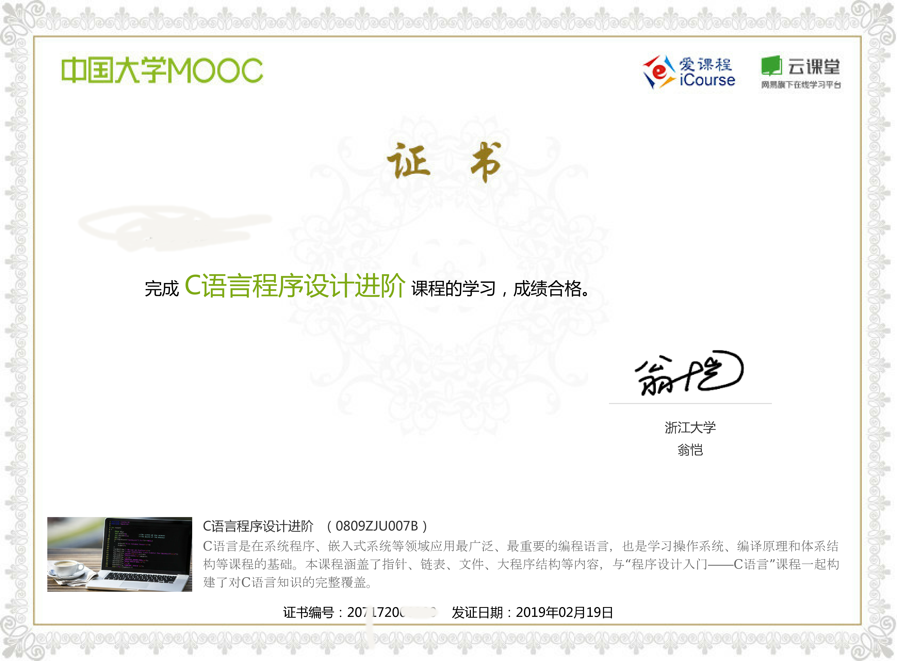

# 我的个人学习笔记

有问题发ISSUES

注意: 所有内容都是我的个人经验或者看法或者学习笔记.遵循知识共享许可协议(BY)(不是我的内容可以循原来的协议).使用wiki的图片遵循原来的协议.
由于部分图片不可公开, 所以这里我直接删除了,以后补上我自己画的.

这里的内容偏向计算机. 内容目前还需要整理.

[数学看这里](https://github.com/ZTFtrue/Math-study)

## 内容介绍

基本上, 目录名就是具体的学科分类.

- CodeSignal 只放了一道题, 是我知道答案(搜到的), 但是不知道为什么的题.

- OpenCV 只有简单的命令, 简单的代码(不是我学习的全部代码)在这里<https://github.com/ZTFtrue/OpenCV_learn>

- Other 目前没有找好分类的地方

- Python 我只会Hello World.

- service ssh 和服务器安全与配置相关的内容了

- static-resource 图片

- web-devlope  web 前端开发

## 如何自学(保护壳: 我认为的计算机知识,以及我的经验)

到这里<https://www.icourse163.org/>找翁恺老师<https://www.icourse163.org/u/wengkai?userId=318013> 的课程. 在这里翁恺老师主要教授两门语言:C和Java,  你可以在这里免费学习, 当然进度慢(我比较期望网站能把过去的课程开放出来).

学完第一个学期, 你基本上会了C和Java的基础开发. 第二个学期可以选择一些进阶的书看了, 当然入门书籍也可以看.

在这里你可以开始学习算法了. 之所以开始学习不推荐学习算法, 是因为算法需要编程知识的基础的. 在翁恺老师的课程你可以学到 `数组,链表,甚至冒泡排序`, 接下来学习算法就会非常简单.

算法我个人不推荐视频课程, 很多老师讲的不好(这也是我不推荐其它视频的原因).

同时还学习系统原理,以及网络知识.

我推荐的书籍为<<现代操作系统原理>>, <<现代操作系统和网络>>,<<算法第四版>>(声明:我还没读完),如果你感兴趣可以再看看<<操作系统导论>>. 另为算法我还推荐<<算法JavaScript 描述版>> 这本书介绍的简单, 容易入门, 也介绍了数据结构(算法书都会有的), 不过需要Javascript基础(书里边有简单的介绍).

<<现代操作系统原理>>和<<现代操作系统和网络>> 部分内容会有重叠, <<现代操作系统和网络>>更加细致, 比如他会介绍浮点数是怎么存储的, 有些十进制有限小数转成其它进制会变成无限小数; 另为他对网络的介绍也很好, 比如读完此书你就知道蓝牙连接设备数限制了,你也知道什么调制解调了;这本书还介绍了"小伙计", 非常有意思.

还有一本书叫<<计算机网络>> 也可以去读一读(声明:我还没读);

关于数据库, 网络上有一篇21分钟学会Mysql(博客园的那个), 可以去看看. 或者看一下我的笔记也可以.如果你需要深入也可以买些本书看看.

大部分程序员不会用到什么高级的数学和算法知识. 如果你想早点找工作, 可以不用看, 我刚工作的时候也没看过算法, 工作时候用到的算法都是临时想出来的,后来才有了对应算法的概念, 有些算法是非常简单.

学习语言的时候,可以以项目为基础,先了解怎么用它, 然后再了解原理,比如面向对象编程,设计模式.

到这里你基本上和计算机专业学生(我的个人经验)差不多了(其实看完翁恺老师的课程你就很强了).

<<编译原理>> 这本书我暂时还没看过. 我个人建议把它放到后边看.

## 在哪买书(中文)

纸质: 京东,多抓鱼

电子: Amzon , 图灵图书, 异步图书 (这些都可以拿别的软件看(防止向某些垃圾软件,买书送广告))

## 展示一张我的证书

