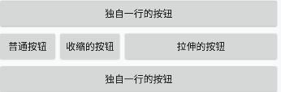

# Base knowledge of Android

通过 intent 的 bundle 的源码可以看到它们都是实现了 Parcelable，其实就是通过序列化来实现通信的. 大小限制 1M.

startActivity 携带的数据会经过 BInder 内核再传递到目标 Activity 中去，因为 binder 映射内存的限制，所以 startActivity 也就会这个限制了

一、写入临时文件或者数据库，通过 FileProvider 将该文件或者数据库通过 Uri 发送至目标. 一般适用于不同进程，比如分离进程的 UI 和后台服务，或不同的 App 之间. 之所以采用 FileProvider 是因为 7.0 以后，对分享本 App 文件存在着严格的权限检查.

二、通过设置静态类中的静态变量进行数据交换. 一般适用于同一进程内，这样本质上数据在内存中只存在一份，通过静态类进行传递. 需要注意的是进行数据校对，以防多线程操作导致的数据显示混乱.

## 组件

- TableLayout -> TableRow
  

- ToggleButton/Switch/AnalogClock

  ```xml
  <ToggleButton
   android:textOff="关"
   android:textOn="开"
   android:checked="true"/>
  <AnalogClock
  android:dial="@drawable/表盘"
  android:hand_minute="@drawable/分钟指针"/>
  ```

- AdapterViewFlipper/ViewFlipper 轮播,可以设置动画,

  Simple ViewAnimator that will animate between two or more views that have been added to it. Only one child is shown at a time.

- StackView 堆叠方式显示多个内容,支持拖拽,轮播,播放控制等.
  

- [QuickContactBadge 关联联系人](https://developer.android.com/training/contacts-provider/display-contact-badge?hl=zh-cn)

  可以给联系人添加号码/邮箱等.

  显示快速联系标志,当用户点按 QuickContactBadge 图片时，QuickContactBadge 会展开为一个对话框，其中包含以下内容： 大图像, 应用图标

### 图像

- ComposePathEffect
- DashPathEffect
- SumPathEffect
- CornerPathEffect

```java
// 缩放/角度 等
private Matrix mMatrix = new Matrix();
private Path path = new Path();
paint.setPathEffect(new CornerPathEffect(10f));
paint.setColor(colors[i]);
canvas.drawPath(path, paint);
// 文字按路径绘制
canvas.drawTextOnPath()
// 图片扭曲(波纹)
canvas.drawBitmapMesh()
// 用 Bitmap 做缓存 存储已绘制数据
Canvas cacheCanvas = new Canvas();
Bitmap cacheBitmap = Bitmap.createBitmap(width, height,Bitmap.Config.ARGB_8888)
cacheCanvas.setBitmap(cacheBitmap);
canvas.drawBitmap(cacheBitmap, ...)
```

### GestureOverlayView

addOnGesturePerformedListener 只有折线才会触发(有弯曲的线),不支持双指触摸

### WallpaperService

## Drawing on SurfaceView

```java
public class MySurfaceView extends SurfaceView implements SurfaceHolder.Callback
{
     private SurfaceThread thread = null;

 @Override
 public void surfaceCreated(SurfaceHolder holder)
 {
  thread = new SurfaceThread(surfaceHolder);
  thread.start();
 }
 class SurfaceThread extends Thread
 {
  public SurfaceHolder surfaceHolder = null;
  public boolean needStop = false;
  public SurfaceThread(SurfaceHolder holder)
  {
   this.surfaceHolder = holder;
  }

  public void run()
  {
   long t1, t2;
   Looper.prepare();
   synchronized (surfaceHolder)
   {
    // 标记退出
    while (!needStop)
    {
     try
     {
      t1 = System.currentTimeMillis();
      // 获取到canvas
      canvas = surfaceHolder.lockCanvas();
      if (canvas != null)
      {
        
      }
      t2 = System.currentTimeMillis();
      int paintTime = (int) (t2 - t1);
      long millis = SLEEP_TIME - paintTime;
      if (millis < MIN_SLEEP)
      {
       millis = MIN_SLEEP;
      }
      // 限制绘制速度
      sleep(millis);
     }
     catch (Exception e)
     {
      e.printStackTrace();
     }
     finally
     {
      try
      {
       if (canvas != null)
       {
        surfaceHolder.unlockCanvasAndPost(canvas);
       }
      }
      catch (Exception e)
      {
       e.printStackTrace();
      }
     }
    }
   }
   Looper.loop();
  }
 }
}
```

## handler

- 处理器 Handler
- 消息队列 MessageQueue
- 循环器 Looper
- epoll 是如何实现的

```java
    Handler handler = new Handler(getMainLooper(),new Handler.Callback() {
        @Override
        public boolean handleMessage(@NonNull Message msg) {
            // 如果不需要进一步处理，就返回true
            return true;
        }
    });
    handler.removeMessage()// 不用的message, 要移除不然可能有泄漏
```

### looper

```java
Looper.prepare(); ->    sThreadLocal.set(new Looper(quitAllowed));
new Handler(Looper.getMainLooper());
// if(getMyLopper !=null) {Looper.prepare();}
```

Looper 利用的是 Linux 的 pipe/epoll 机制. 在主线程的 MessageQueue 没有消息时，便阻塞在 loop 的 queue.next()中的 nativePollOnce()方法里，此时主线程会释放 CPU 资源进入休眠状态，直到下个消息到达或者有事务发生，通过往 pipe 管道写端写入数据来唤醒主线程工作.

HandlerThread 线程，该线程默认提供了 getLooper()

Looper 的 loop 方法内的 `Message msg = queue.next();` queue(MessageQueue) 会阻塞操作

handler.dispatchMessage 分发 message。

调用 Looper 的 quit 或者 quitSafely 方法，MessageQueue 的 next 方法会返回 null 消息，在 Looper 的 loop 方法内，当检测到 msg==null 时，Looper 的 loop 方法会退出，线程也会结束。

### 复用 Message

```java
Message msg = Message.obtain(mHandler);
Message msg = mHandler.obtainMessage();
```

内部使用栈 存储 Message。Message 里边有个`recycle` 方法， 发送并处理后就会 msg.recycle();

### ThreadLocal

```java
// public class ThreadLocal<T> {}
ThreadLocal threadLocal=new ThreadLocal();
// 给当前线程设置变量，而且其它线程不能修改
threadLocal.set("122");
// 完毕后通过调用remove来清理，防止因为GC回收掉key，而value无法被清理，出现内存泄漏问题。
// ThreadLocalMap 存储数据
threadLocal.remove();
```

只能存储一个 `T` 类型变量, 这个 T 可以是线程，也可以是 Looper

### MessageQueue

Android 消息的管理队列

插入消息 `enqueueMessage`
读取消息 `next`

#### 同步屏障

在所有消息中，遍历，然后优先处理异步消息，同时同步消息会被屏蔽。同步屏障在使用完毕后一定要清理，否则同步消息会无法被处理。

设置同步屏障`postSyncBarrier`
移除同步屏障`removeSyncBarrier`

异步消息和同步消息的区别是`isAsynchronous`方法返回 true 或 false。
异步消息需要手动将标记 Message 为异步，通过方法 setAsynchronous(true)将消息标记为异步(一定要清理)。

### HandlerThread

A Thread that has a Looper. The Looper can then be used to create Handlers.

HandlerThreads 在 Activity 的生命周期之外运行，因此需要正确清理，否则会出现线程泄漏。

作用是可以循环使用一个线程

```java
HandlerThread handlerThread = new HandlerThread("MyHandlerThread");
handlerThread.start();
Looper looper = handlerThread.getLooper();
Handler handler = new Handler(looper, new Handler.Callback() {
    @Override
    public boolean handleMessage(@NonNull Message msg) {
        try {
            Thread.sleep(1000);
        } catch (InterruptedException e) {
            e.printStackTrace();
        }
        if (Looper.myLooper() == null)
            Looper.prepare();
        Toast.makeText(MainActivity.this, "123", Toast.LENGTH_LONG).show();
        //   runOnUiThread(new Runnable() {});
        return true;
    }
});

@Override
protected void onPause() {
    super.onPause();
    handler.removeMessages(MSG_UPDATE_INFO);
}

@Override
protected void onDestroy(){
    super.onDestroy();
    //释放资源
    handlerThread.quit();
}
```

Looper 示例 2

```java
    static class LooperThread extends Thread {
        public Handler mHandler;
        private Looper mLooper;
        public void run() {
            Looper.prepare();
            mLooper = Looper.myLooper();
            mHandler = new Handler(new Handler.Callback() {
                @Override
                public boolean handleMessage(@NonNull Message msg) {
                    SystemClock.sleep(1000);
                    executeTask("122");// 循环执行
                   //  runOnUiThread(new Runnable() {});
                    return true;
                }
            });
            Looper.loop();
        }
        public void executeTask(String text) {
            if (mLooper == null || mHandler == null) {
               throw new RuntimeException("No init mLooper and mHandler");
            }
            Message msg = Message.obtain();
            msg.obj = text;
            mHandler.sendMessage(msg);
        }
        public void onDestroy(){
            mHandler.removeCallbacks(null);
            mLooper.quitSafely();
        }
    }
```

## CoordinatorLayout

1. 实现 Snackbar 不遮挡,FloatingActionButton
   - layout_anchor：设置 FloatingActionButton 的锚点。
   - layout_anchorGravity：设置相对锚点的位置，如 bottom|right 表示 FloatingActionButton 位于锚点的右下角
2. CoordinatorLayout 与 AppBarLayout 实现标题栏 Title 随着视图的滚动：显示和隐藏
3. CoordinatorLayout 与 CollapsingToolbarLayout Toolbar 的折叠效果(以及视差效果)

## 自定义 View

measure->layout->draw

### onMeasure()

```java
@Override
protected void onMeasure(int widthMeasureSpec, int heightMeasureSpec) {
        super.onMeasure(widthMeasureSpec, heightMeasureSpec);
        int width = getMySize(100, widthMeasureSpec);
        int height = getMySize(100, heightMeasureSpec);
        setMeasuredDimension(width, height);
}
```

如果自定义属性格式为 dimension 又支持 enum，那么我们在获取属性值的时候，必须使用 getLayoutDimension,不可使用 getDimensionPixelSize.

### onDraw()

不考虑父控件大小，在父控件为空进行测量，

## 点击事件传递

父到子, 子返回 false 最终返回到父

view.dispatchTouchEvent();// 在这里判断 enable
view.onTouch();
view.onTouchEvent();
view.onClick();

按下 View 与抬起 View，会回调两次 onTouch()

```java
@Override
public boolean dispatchTouchEvent(MotionEvent ev) {
    //请求所有父控件不要拦截Touch事件
    getParent().requestDisallowInterceptTouchEvent(true);
    return super.dispatchTouchEvent(ev);
}
```

### 安卓是如何发出 Vsync 信号，并且有哪几个接收者

## Dalivk 虚拟机和 java 虚拟机差别

就是 Dalvik 基于寄存器，而 JVM 基于栈

## 工具

Android 扫码工具 ML Kit

## 安全

okhttp 不走系统代理 OkhttpClient.Builder().proxy(Proxy.NO_PROXY);

https 自签名验证证书和双向验证证书

验证 app 证书是否正确

## View 的 invalidate\postInvalidate\requestLayout 方法

invalidate 会调用 onDraw 进行重绘，只能在主线程. 刷新当前 View，使当前 View 进行重绘，不会进行测量、布局流程，因此如果 View 只需要重绘而不需要测量，布局的时候，使用 invalidate 方法往往比 requestLayout 方法更高效

postInvalidate 可以在其他线程

requestLayout 会调用 onLayout 和 onMeasure，不一定会调用 onDraw. 如果子 View 调用了这个方法，其实会从 View 树重新进行一次测量、布局、绘制这三个流程

## 更新 UI 方式

Activity.runOnUiThread(Runnable)
View.post(Runnable),View.postDelay(Runnable,long)
Handler

## WebView

<https://github.com/mgks/Android-SmartWebView>

```java
    WebSettings webSettings = binding.webView.getSettings();
    webSettings.setJavaScriptEnabled(true);
// 允许跨域访问
    webSettings.setAllowContentAccess(true);
    webSettings.setAllowFileAccess(true);
    webSettings.setAllowFileAccessFromFileURLs(true);
    webSettings.setAllowUniversalAccessFromFileURLs(true);
    // https://stackoverflow.com/questions/32155634/android-webview-not-loading-mixed-content
    webSettings.setMixedContentMode(android.webkit.WebSettings.MIXED_CONTENT_ALWAYS_ALLOW);
// 开启访问
    webSettings.setUseWideViewPort(true);
    webSettings.setSupportZoom(true);
    webSettings.setDisplayZoomControls(true);
    webSettings.setBuiltInZoomControls(true);
    binding.webView.setInitialScale(200);
```

## gradle 本地 aar 依赖

```gradle
implementation files('libs/something_local.jar')
implementation fileTree(dir: 'libs', include: ['*.aar'])
compileOnly files('libs/ffmpeg-android-java.aar')
```

### javascript java 交互

```java
webView.evaluateJavascript("javascript:saveImage()", new ValueCallback<String>() {
```

## 线性布局 相对布局 效率哪个高

相同层次下，因为相对布局会调用两次 measure，所以线性高;
当层次较多时，建议使用相对布局

RelativeLayout 分别对所有子 View 进行两次 measure，横向纵向分别进行一次，这是为什么呢？首先 RelativeLayout 中子 View 的排列方式是基于彼此的依赖关系，而这个依赖关系可能和布局中 View 的顺序并不相同，在确定每个子 View 的位置的时候，需要先给所有的子 View 排序一下. 又因为 RelativeLayout 允许 A，B 2 个子 View，横向上 B 依赖 A，纵向上 A 依赖 B. 所以需要横向纵向分别进行一次排序测量. mSortedHorizontalChildren 和 mSortedVerticalChildren 是分别对水平方向的子控件和垂直方向的子控件进行排序后的 View 数组.

与 RelativeLayout 相比 LinearLayout 的 measure 就简单的多，只需判断线性布局是水平布局还是垂直布局即可，然后才进行测量:

## 看不到 activity 初启动异常信息

一般是 APP 启动时就奔溃了, 用 loader 加载 activity, activity 崩溃时就会有信息.

新的 Logcat 应该不用这么麻烦

## Bitmap

Android 8.0 之后 Bitmap 像素内存放在 native 堆

## Glide

发起请求->执行解码任务->加载图片
into->run->onResourceReady

fragment 控制生命周期

TargetTracker

待运行 PENDING
已清除 CLEARED
待测量 WAITING_FOR_SIZE
运行中 RUNNING
已完成 COMPLETE
失败 FAILED

## GPU 加速

```xml
android:hardwareAccelerated="true"
```

## 打包 arr , 包含依赖的 aar

添加

```gradle
plugins {
    id 'com.android.library'
}
```

按错误修改即可打包`aar`

### 添加依赖的 aar

参考: <https://stackoverflow.com/a/52720958/6631835>

```gradle
configurations {
    customConfig.extendsFrom implementation
}
dependencies {
    implementation 'androidx.appcompat:appcompat:1.2.0'
    implementation 'com.google.android.material:material:1.3.0'
    implementation 'androidx.constraintlayout:constraintlayout:2.0.4'
    implementation 'androidx.navigation:navigation-fragment:2.3.5'
    implementation 'androidx.navigation:navigation-ui:2.3.5'
    testImplementation 'junit:junit:4.+'
    androidTestImplementation 'androidx.test.ext:junit:1.1.2'
    androidTestImplementation 'androidx.test.espresso:espresso-core:3.3.0'
    implementation fileTree( include: ['*.jar','*.aar'],dir: 'libs')
}

// 执行这这
task copyLibs(type: Copy) {
    print(configurations.customConfig)
    from configurations.customConfig
    into 'libs'
}
```

## Okhttp 双向验证

### 证书制作

客户端持有服务端的公钥证书，并持有自己的私钥
服务端持有客户的公钥证书，并持有自己私钥

生成客户端 keystore,证书(cer)

```sh
keytool -genkeypair -alias client -keyalg RSA -validity 3650 -keypass 123456 -storepass 123456 -keystore client.jks
keytool -export -alias client -file client.cer -keystore client.jks -storepass 123456
```

生成服务端 keystore,证书(cer)

```sh
keytool -genkeypair -alias server -keyalg RSA -validity 3650 -keypass 123456 -storepass 123456 -keystore server.keystore
keytool -export -alias server -file server.cer -keystore server.keystore -storepass 123456
```

交换证书  
将客户端证书导入服务端 keystore 中，再将服务端证书导入客户端 keystore 中， 一个 keystore 可以导入多个证书，生成证书列表。

```sh
# 服务端证书导入Android
keytool -import -v -alias server -file server.cer -keystore server.jks -storepass 123456
# 客户端导入服务端
keytool -import -v -alias client -file client.cer -keystore server.keystore -storepass 123456
```

生成 Android 使用的 BKS 库文件 , 工具下载地址<https://sourceforge.net/projects/portecle/>

将证书放在 android 客户端 assert 目录(能读取到的目录就可以)

```java
OkHttpClient okHttpClient = new OkHttpClient.Builder()
    .sslSocketFactory(getSSLCertifcation(context))//为OkHttp对象设置SocketFactory用于双向认证
    .hostnameVerifier(new HostnameVerifier() {
            @Override
            public boolean verify(String hostname, SSLSession session) {
                // TODO 根据实际情况返回
                return true;
            }
        })
    .build();

private final static String CLIENT_PRI_KEY = "client.bks";
private final static String TRUSTSTORE_PUB_KEY = "serve.bks";
private final static String CLIENT_BKS_PASSWORD = "123456";
private final static String TRUSTSTORE_BKS_PASSWORD = "123456";
private final static String KEYSTORE_TYPE = "BKS";
private final static String PROTOCOL_TYPE = "TLS";
private final static String CERTIFICATE_FORMAT = "X509";

public static SSLSocketFactory getSSLCertifcation(Context context) {
  SSLSocketFactory sslSocketFactory = null;
  try {
    // 服务器端需要验证的客户端证书，其实就是客户端的keystore
    KeyStore keyStore = KeyStore.getInstance(KEYSTORE_TYPE);// 客户端信任的服务器端证书
    KeyStore trustStore = KeyStore.getInstance(KEYSTORE_TYPE);//读取证书
    InputStream ksIn = context.getAssets().open(CLIENT_PRI_KEY);
    InputStream tsIn = context.getAssets().open(TRUSTSTORE_PUB_KEY);//加载证书
    keyStore.load(ksIn, CLIENT_BKS_PASSWORD.toCharArray());
    trustStore.load(tsIn, TRUSTSTORE_BKS_PASSWORD.toCharArray());
    ksIn.close();
    tsIn.close();
    //初始化SSLContext
    SSLContext sslContext = SSLContext.getInstance(PROTOCOL_TYPE);
    TrustManagerFactory trustManagerFactory = TrustManagerFactory.getInstance(CERTIFICATE_FORMAT);
    KeyManagerFactory keyManagerFactory = KeyManagerFactory.getInstance(CERTIFICATE_FORMAT);
    trustManagerFactory.init(trustStore);
    keyManagerFactory.init(keyStore, CLIENT_BKS_PASSWORD.toCharArray());
    sslContext.init(keyManagerFactory.getKeyManagers(), trustManagerFactory.getTrustManagers(), null);
    sslSocketFactory = sslContext.getSocketFactory();
  } catch (KeyStoreException e) {
      // TODO 处理异常
  }
  return sslSocketFactory;
}
```

## android 单元测试

构建有效的单元测试:
<https://developer.android.google.cn/training/testing/unit-testing?hl=zh-cn>

测试代码存储目录

```gradle
    app/src
    ├── androidTest/java (仪器化单元测试、UI测试)
    ├── main/java (业务代码)
    └── test/java  (本地单元测试)
```

### 构建本地单元测试

<https://developer.android.google.cn/training/testing/unit-testing/local-unit-tests?hl=zh-cn>

1. 设置依赖

   ```gradle
       dependencies {
           // Required -- JUnit 4 framework
           testImplementation 'junit:junit:4.12'
           // Optional -- Robolectric environment
           testImplementation 'androidx.test:core:1.0.0'
           // Optional -- Mockito framework
           testImplementation 'org.mockito:mockito-core:1.10.19'
       }
   ```

2. 使用`AndroidStudio`创建测试类
   1. 代码页面右击
   2. 选择`Generate...`
   3. 选择`Test...`
   4. 选择 `JUnit4`
      勾选`setUp/@Before`会生成一个带`@Before`注解的`setUp()`空方法，
      勾选`tearDown/@After`会生成一个带`@After`的`tearDown()`空方法
   5. 在对应目录就可以看到测试类
   6. 在我的项目里边, `AndroidStudio`自动生成的类在`androidTest`目录
3. 示例

   ```java
   import com.google.common.truth.Truth.assertThat;
   import org.junit.Test;
   public class EmailValidatorTest {
       @Test
       public void emailValidator_CorrectEmailSimple_ReturnsTrue() {
           assertNotNull(Service.getInstance());
           assertThat(EmailValidator.isValidEmail("name@email.com")).isTrue();
       }
   }
   ```

4. 在类上有运行箭头, 或者, 选择包,然后 run.

5. 有些方法 JVM 就可以提供运行环境, 有些需要 Android 框架提供的方法, 如: Android context. 可以使用`mockito`, 官方文档另外说的`Robolectric`我这里必须在真机运行(...)

   ```java
   @RunWith(MockitoJUnitRunner.class)
   public class ServiceTest {
       @Mock
       Context mMockContext;
       public void Test{
           Mockito.when(mMockContext.getString(R.string.app_name)).thenReturn("");
           assertEquals(mMockContext.getString(R.string.app_name), "");
           Mockito.when(mMockContext.getPackageName()).thenReturn("");
       }
   }
   ```

### 构建插桩单元测试

<https://developer.android.google.cn/training/testing/unit-testing/instrumented-unit-tests?hl=zh-cn>

添加依赖

```gradle
    dependencies {
        androidTestImplementation 'androidx.test:runner:1.1.0'
        androidTestImplementation 'androidx.test:rules:1.1.0'
        // Optional -- Hamcrest library
        androidTestImplementation 'org.hamcrest:hamcrest-library:1.3'
        // Optional -- UI testing with Espresso
        androidTestImplementation 'androidx.test.espresso:espresso-core:3.1.0'
        // Optional -- UI testing with UI Automator
        androidTestImplementation 'androidx.test.uiautomator:uiautomator:2.2.0'
    }
```

```gradle
    android {
        defaultConfig {
            testInstrumentationRunner "androidx.test.runner.AndroidJUnitRunner"
        }
    }
```

```gradle
  android {
        // ...
        testOptions {
            unitTests.includeAndroidResources = true
        }
    }
```

使用`AndroidStudio`创建测试类

```java
@RunWith(AndroidJUnit4.class)
@SmallTest
public class ServiceTest {
    private Context context = ApplicationProvider.getApplicationContext();

    @Before
    public void setUp() throws Exception {

    }

    @After
    public void tearDown() throws Exception {
    }

    @Test
    public void getInstance() {
        assertNotNull(Service.getInstance());
    }
}

```

如果您要创建在 `Robolectric` 环境中或真实设备上运行的本地单元测试，则可以使用 AndroidX Test 为几个常见框架类提供的构建程序。这些构建程序可让您创建以下类的实例，而无需使用模拟或反射：

```java
    ApplicationInfo
    PackageInfo
    MotionEvent
    MotionEvent.PointerCoords
    MotionEvent.PointerProperties
```

## 使用 Android user-feature 限定设备

<https://developer.android.com/guide/topics/manifest/uses-feature-element>

```xml
<uses-feature android:name="android.hardware.bluetooth" />
<uses-feature android:name="android.hardware.camera" />

<uses-feature
android:name="string"
android:required=["true" | "false"]
android:glEsVersion="integer" />
```

## activiyResult

```java
  ActivityResultLauncher<String[]> locationPermissionRequest =
            registerForActivityResult(new ActivityResultContracts
                            .RequestMultiplePermissions(), result -> {


                    }
            );

   locationPermissionRequest.launch(PERMISSIONS_REQUIRED);
// Manifest.permission.READ_MEDIA_AUDIO,Manifest.permission.READ_MEDIA_VIDEO
// 接收类型: intent, string, string array

    androidx.activity.result.ActivityResultLauncher<Intent> scanQrcodeRequest =
            registerForActivityResult(
                    new ActivityResultContracts.StartActivityForResult(),
                    result -> {
                        String data = "";
                        if (result.getData() != null) {
                            data = result.getData().getStringExtra("data");
                        }
                    }
            );
```

## FileProvider 打开文件

```java
    // new File(activity.getExternalCacheDir(), "").getPath()
    public static void open(String path, String minType, Activity activity) {
        Uri imageUri;
        File outputImage = new File(path);
        if (Build.VERSION.SDK_INT >= Build.VERSION_CODES.N) {
            imageUri = FileProvider.getUriForFile(activity, activity.getPackageName() + ".activity.fileprovider", outputImage);
        } else {
            imageUri = Uri.fromFile(outputImage);
        }
        /*
         *  对于微信
         *  Uri imageUri = FileProvider.getUriForFile(context, context.getPackageName() + ".activity.fileprovider", file);
         *  String contentPath = imageUri.toString();
         *  activity.grantUriPermission("com.tencent.mm", imageUri, Intent.FLAG_GRANT_READ_URI_PERMISSION);
         *  imgObj.setImagePath(contentPath);
        */
        Intent intent = new Intent(Intent.ACTION_VIEW);
        intent.addFlags(Intent.FLAG_ACTIVITY_NEW_TASK);
        intent.addFlags(Intent.FLAG_GRANT_READ_URI_PERMISSION);
        if (TextUtils.isEmpty(minType)) {
            intent.setData(imageUri);
        } else {
            intent.setDataAndType(imageUri, minType);
        }
        activity.startActivity(intent);
    }
```

manifests 定义

```xml
    <application>
        <provider
            android:name="androidx.core.content.FileProvider"
            android:authorities="com.ztftrue.activity.fileprovider"
            android:enabled="true"
            android:exported="false"
            android:grantUriPermissions="true">
            <meta-data
                android:name="android.support.FILE_PROVIDER_PATHS"
                android:resource="@xml/file_paths"
                android:value="androidx.startup" />
        </provider>
    </application>
```

file_paths.xml 放置 xml 目录, google 文档有解释

```xml

<?xml version="1.0" encoding="utf-8"?>
<paths>
    <external-path
        name="external_files"
        path="." />

    <external-path
        name="camera_photos"
        path="." />
    <external-cache-path
        name="share"
        path="/" />

    <!-- 1.<root-path/> 代表设备的根目录new File("/");
    2.<files-path/> 代表context.getFilesDir()
    3.<cache-path/> 代表context.getCacheDir()
    4.<external-path/> 代表Environment.getExternalStorageDirectory()
    5.<external-files-path>代表context.getExternalFilesDirs()
    6.<external-cache-path>代表getExternalCacheDirs()-->

    <files-path
        name="files"
        path="." />

    <cache-path
        name="cache"
        path="." />

    <external-path
        name="external"
        path="." />

    <external-files-path
        name="external_file_path"
        path="." />

    <external-cache-path
        name="external_cache_path"
        path="." />
</paths>

```

## Gradle 配置 和 打包

## APK 打包流程

gradle 打包

`gradlew assembleRelease` 命令打包

### 多 apk 打包

```gradle
 productFlavors {
      aaa {
            applicationId 'com.aaa'
            minSdkVersion 21
            targetSdkVersion 30
            versionCode 1
            versionName "1.0.0"
        }
        bbb {
            applicationId 'com.bbb'
            minSdkVersion 21
            targetSdkVersion 30
            versionCode 1
            versionName "1.0.0"
        }
 }
```

通过下面的步骤创建源集目录:

1. 打开 Project 窗格并从窗格顶端的下拉菜单中选择 Project 视图.
2. 导航至 MyProject/app/src/.
3. 右键点击 src 目录并选择 New > Folder > Java Folder.
4. 从 Target Source Set 旁边的下拉菜单中，选择需要创建源集的 build flavor 名称.
5. 点击 Finish.

Android Studio 将会为我们选择的构建类型创建源集目录，然后在该目录内部创建 java 目录. 或者，也可以让 Android Studio 创建相关目录.

例如:

1. 在该 Project 窗格中，右键点击 src 目录并选择 New > XML > Values XML File; 输入名称
2. 从 **Target Source Set** 旁边的下拉菜单中，选择 aaa.
3. 点击 Finish.

### 多渠道打包

```xml
<meta-data android:value="Channel ID" android:name="UMENG_CHANNEL"/>
<meta-data android:name="UMENG_CHANNEL" android:value="${UMENG_CHANNEL_VALUE}" />
```

```gradle
//可以批量修改打包渠道配置
android {
    // store 表示上架商店, ad 表示广告, 默认必须有一个维度
    flavorDimensions = ['store', 'ad']
    productFlavors {
        huawei {
            dimension 'store' // 这个维度表示商店维度
            // ShopUrl 可以在代码里使用 BuildConfig.ShopUrl
            buildConfigField 'String', 'ShopUrl',"huawei"
            // 根据需求自行修改
            manifestPlaceholders = [UMENG_CHANNEL_VALUE: "huawei"]
        }
        xiaomi {
            dimension 'store' // 这个维度表示商店维度
            buildConfigField 'String', 'ShopUrl',"huawei"
        }
        baidu {
            dimension 'store' // 这个维度表示商店维度
            buildConfigField 'String', 'ShopUrl',"huawei"
        }
        googleAD{
            dimension 'ad' // 这个维度表示广告维度
        }
        baiduAD{
             dimension 'ad' // 这个维度表示广告维度
        }
    }
    // productFlavors.all {
    //     flavor -> flavor.manifestPlaceholders = [UMENG_CHANNEL_VALUE: name]
    // }
}
```

运行渠道包, 点击(默认左边栏) BuildVariants, 可以看到有很多包.
例如 huaweigoogleAD , huaweibaiduAD 等, 选择对应的 Variant 即可.

### 包名字重命名

打包设置 apk 名字

```gradle
    android.applicationVariants.all {
        variant ->
            variant.outputs.all {
                outputFileName = "${variant.name}-${variant.versionName}.apk"
            }
    }
```

或者

```gradle
     defaultConfig {
          setProperty("archivesBaseName", "${android.defaultConfig.versionCode}-${android.defaultConfig.applicationId}-v${android.defaultConfig.versionName}")
      }
```

### 默认语言配置

```gradle
android{
    defaultConfig {
        resConfigs "zh-rCN"
    }
}
```

## Databinding

```gradle
    buildFeatures {
        viewBinding = true
        dataBinding = true
    }
```

### RecycleView 示例

item 布局文件

```xml
<?xml version="1.0" encoding="utf-8"?>
<layout xmlns:android="http://schemas.android.com/apk/res/android">

    <data>

        <import type="android.view.View" />

        <import type="android.text.TextUtils" />

        <variable
            name="data"
            type="com.ztftrue.MaterialItem" />
    </data>

    <LinearLayout
        android:layout_width="match_parent"
        android:layout_height="wrap_content"
        android:orientation="vertical">
        <TextView
            android:layout_width="match_parent"
            android:layout_height="wrap_content"
            android:background="#f5f9fc"
            android:padding="@dimen/dp_10"
            android:text="@{data.name}"
            android:textSize="10sp"
            android:visibility="@{data.type!=0?View.VISIBLE:View.GONE}" />
        </LinearLayout>
    </LinearLayout>
</layout>
```

```java
public class MaterialItem extends BaseObservable{
    @Bindable
    String name;
    @Bindable
    int type = 0;
    public void setType(int type) {
        this.type = type;
        this.notifyPropertyChanged(BR.type);
    }
    // 其它参考生成模板
}

public class MaterialAdapter extends RecyclerView.Adapter<MaterialAdapter.ViewHolder>{

    @Override
    public void onBindViewHolder(@NonNull ViewHolder holder, int position) {
        holder.binding.setData(arrayList.get(position));
    }

    public static class ViewHolder extends RecyclerView.ViewHolder {
        MaterialAdapterBinding binding;
        public ViewHolder(@NonNull View itemView) {
            super(itemView);
            binding = DataBindingUtil.bind(itemView);
        }
    }
}
/**
MaterialAdapter adapter = new MaterialAdapter();
adapter.setArrayList(arrayList);
binding.setMyAdapter(adapter);
 */
```

Activity 布局文件

```xml
<?xml version="1.0" encoding="utf-8"?>
<layout xmlns:android="http://schemas.android.com/apk/res/android"
    xmlns:app="http://schemas.android.com/apk/res-auto">
    <data>

        <variable
            name="myAdapter"
            type="com.ztftrue.MaterialAdapter" />

        <variable
            name="viewmodel"
            type="com.ztftrue.MaterialViewModel" />
    </data>

    <LinearLayout
        android:layout_width="match_parent"
        android:layout_height="match_parent"
        android:orientation="vertical">

        <TextView
            android:id="@+id/textView"
            android:layout_width="match_parent"
            android:layout_height="10dp"
            android:onClick="@{viewmodel::clickView}"
            android:text="@{viewmodel.materialData.name}"
        />

        <androidx.recyclerview.widget.RecyclerView
            android:id="@+id/recyclerView"
            android:layout_width="match_parent"
            android:layout_height="match_parent"
            app:adapter="@{myAdapter}"
            app:layoutManager="androidx.recyclerview.widget.LinearLayoutManager" />
    </LinearLayout>
</layout>
```

ViewModel 定义:

```java
public class MaterialViewModel extends ViewModel{
    public final MutableLiveData<MaterialData> materialData = new MutableLiveData<>();
    public void clickView(View view) {
        if (view.getId() == R.id.textView) {
            view.setClickable(false);
        }
    }
}
// activity 绑定  viewDataBinding.setViewmodel(viewModel);
```

## IDE AndroidStudio get and set 模板

针对 null 做了处理

### Set

```java
@Bindable
#set($paramName = $helper.getParamName($field, $project))
#if($field.modifierStatic)
static ##
#end
void set$StringUtil.capitalizeWithJavaBeanConvention($StringUtil.sanitizeJavaIdentifier($helper.getPropertyName($field, $project)))($field.type $paramName) {
  #if ($field.name == $paramName)
    #if (!$field.modifierStatic)
      this.##
    #else
      $classname.##
    #end
  #end
  $field.name = $paramName;
  this.notifyPropertyChanged(BR.$field.name);
}
```

### Get

```java
@Bindable
#if($field.modifierStatic)
static ##
#end
$field.type ##
#if($field.recordComponent)
  ${field.name}##
#else
#set($name = $StringUtil.capitalizeWithJavaBeanConvention($StringUtil.sanitizeJavaIdentifier($helper.getPropertyName($field, $project))))
#if ($field.boolean && $field.primitive)
  is##
#else
  get##
#end
${name}##
#end
() {
#if ($field.string)
    return $field.name == null ? "" : $field.name;
#else
#if ($field.list)
    if ($field.name == null) {
        return new ArrayList<>();
    }
    return $field.name;
#else
    return $field.name;
#end
#end
}
```

## 布局或按钮缩放

```java
this.setOnTouchListener((view, event) -> {
    if (event.getAction() == MotionEvent.ACTION_DOWN) {
        float scalingFactor = 0.9f; // scale down to half the size
        view.setScaleX(scalingFactor);
        view.setScaleY(scalingFactor);
    } else if (event.getAction() == MotionEvent.ACTION_UP) {
        float scalingFactor = 1f; // scale down to half the size
        view.setScaleX(scalingFactor);
        view.setScaleY(scalingFactor);
    }
        return false;
    });
} else {
    this.setOnTouchListener(null);
}
```

## 判断用户所在国际

获取时区

## AppCompatSpinner 简单设置下拉

```xml
<androidx.appcompat.widget.AppCompatSpinner
    android:id="@+id/spinner"
    android:layout_width="match_parent"
    android:layout_height="40dp"
    style="@style/SpinnerTheme"
    android:dropDownVerticalOffset="45dp"
    android:spinnerMode="dropdown" />
```

```java
ArrayAdapter<String> adapter = new ArrayAdapter(context,
                        android.R.layout.simple_spinner_item);
List<String> stringList =new ArrayList<>();
adapter.add("全选选项");
adapter.addAll(stringList);
// Specify the layout to use when the list of choices appears
adapter.setDropDownViewResource(android.R.layout.simple_spinner_dropdown_item);
tsSearchEditText.setPrompt("这里设置提示");
tsSearchEditText.setAdapter(adapter);
tsSearchEditText.setOnItemSelectedListener(new AdapterView.OnItemSelectedListener() {
    @Override
    public void onItemSelected(AdapterView<?> parent, View view, int position, long id) {
        String.valueOf(parent.getItemAtPosition(position));
    }
    @Override
    public void onNothingSelected(AdapterView<?> parent) {
    }
});
```

下拉按钮设置 来自 stackoverflow

styles.xml

```xml
   <style name="SpinnerTheme" parent="android:Widget.Spinner">
        <item name="android:background">@drawable/bg_spinner</item>
    </style>
```

bg_spinner.xml

```xml
<?xml version="1.0" encoding="utf-8"?>
<selector xmlns:android="http://schemas.android.com/apk/res/android">
    <item>
        <layer-list>
            <item>
                <shape>
                    <gradient android:angle="90" android:endColor="#ffffff" android:startColor="#ffffff" android:type="linear" />
                    <stroke android:width="0.33dp" android:color="#0fb1fa" />
                    <corners android:radius="0dp" />
                    <padding android:bottom="3dp" android:left="3dp" android:right="3dp" android:top="3dp" />
                </shape>
            </item>
            <item android:right="5dp">
                // 找个下拉图片
                <bitmap android:gravity="center_vertical|right" android:src="@drawable/arrow_down_gray" />
            </item>
        </layer-list>
    </item>
</selector>
```

## indeterminateDrawable

xml 动画, progress 动画, 自定义动画

```xml
<!-- shap -->
<?xml version="1.0" encoding="utf-8"?>
<shape
    xmlns:android="http://schemas.android.com/apk/res/android"
    android:shape="ring"
    android:thickness="3dp"
    android:useLevel="false">
    <!-- 渐变 -->
    <gradient
        android:angle="135"
        android:centerColor="#cc868686"
        android:endColor="#cc616161"
        android:startColor="#cce3e3e3"
        android:type="sweep"
        />
</shape>
```

```xml
<!-- roate -->
<?xml version="1.0" encoding="utf-8"?>
<rotate xmlns:android="http://schemas.android.com/apk/res/android"
    >
    <rotate
        android:drawable="@drawable/shape"
        android:duration="1500"
        android:fromDegrees="0"
        android:interpolator="@android:anim/linear_interpolator"
        android:pivotX="50%"
        android:pivotY="50%"
        android:repeatCount="-1"
        android:toDegrees="+359"
        />
</rotate>
```

```xml
    <style name="progres">
        <item name="android:indeterminateDuration">1500</item>
        <item name="android:indeterminateBehavior">repeat</item>
        <item name="android:indeterminateDrawable">@drawable/roate</item>
        <item name="android:indeterminate">true</item>
    </style>
```

## AMS (ActivityManagerService)、WMS(WindowManagerService)、PMS (PackageManagerService)

### AMS

在 Android 系统中只有一个 AMS 的实例，负责管理管理、调度系统中所有的 Activity 的生命周期。

1. ActivityManagerServices 简称 AMS, 负责管理 Activity 的生命周期，使用 ActivityStack 存放所有的 Activity。
2. ActivityThread 当开启 App 之后，调用 main()开始运行，开启消息循环队列，也就是 UI 线程`public final class ActivityThread extends ClientTransactionHandler        implements ActivityThreadInternal`
3. ApplicationThread 用来实现 `ActivityManagerServie` 与 `ActivityThread` 之间的交互。 AMS 通过`ApplicationThreadProxy`与 `ActivityThread` 进行通信的
4. Instrumentation 每一个应用程序只有一个 Instrumetation 对象，每个 Activity 内都持有一个对该对象的引用；ActivityThread 需要通过 Instrumentation 来进行具体的操作，如：创建暂停。
5. ActivityStack，
6. ActivityRecord 在启动 activity 时候创建，存储关于 Activity 组件的相关信息
7. TaskRecord 记录 ActivityRecord，每一个`TaskRecord`对应一个 app，每一个 App 是可以有多个 TaskRecord， 可以通过启动模式设置。
   - AndroidManifest: standard(A->B->A->A)，singleTop(A->B->A,onNewIntent())，singleTask(B->A, onNewIntent(),只会启动一个, 每次都会清除其它 activity), singleInstance(A or B,每个 activity 只有一个栈)
   - Flag:
     - FLAG_ACTIVITY_NEW_TASK == singleTask
     - FLAG_ACTIVITY_SINGLE_TOP == singleTop
     - FLAG_ACTIVITY_REORDER_TO_FRONT
     - ~~FLAG_ACTIVITY_CLEAR_WHEN_TASK_RESET~~
     - FLAG_ACTIVITY_CLEAR_TOP , 原：`A->B->C->D` ， 再次启动 B 添加该 Flag, 先 销毁 B/C/D, 然后重新创建 B, 变成 `A->B`. 如果同时添加 `FLAG_ACTIVITY_SINGLE_TOP`，则不销毁 B,只销毁 C/D,并出发 B 的`onNewIntent`
     - <https://developer.android.com/reference/android/content/Intent>
   - android:allowTaskReparenting <https://developer.android.com/guide/topics/manifest/activity-element>
   - android:clearTaskOnLaunch 启动时清除其它任务
   - android:alwaysRetainTaskState Task 切换到后台后太久时，系统会对 Task 进行清理，设为 ture 会阻止清理
   - android:autoRemoveFromRecents
   - android:noHistory
8. `AcitivtyStack`包含`TaskRecord`，包含`ActivityRecord`

位置`/com/android/server/am/ActivityManagerService.java`

### WMS

WindowManagerService 负责管理系统中所有的窗口，包括 Activity 的窗口、壁纸窗口、输入法窗口、弹窗窗口等，即管理屏幕上展示上的一切窗口。

在 Android 系统系统的过程中，在 SystemServer 进程中也把 WMS 服务启动起来，注册到 ServiceManager 中。

### PMS

管理着所有跟 package 相关的工作，常见的比如安装、卸载应用。

#### 安装 APK 步骤

1. 解析 Apk, DefaultContainerService.getMinimalPackageInfo. 得到 APK 的少量信息, 确认安装位置
2. 复制 APK 到 /data/app/pkg/
3. dexopt
4. 注册 4 大组件（PackageManagerService）
5. 安装完毕发送广播

### 总结

在 Android 系统系统的过程中，在 SystemServer 进程中把 AMS 服务启动起来，注册到 ServiceManager 中。

#### `SystemServer.java`

```java
public final class SystemServer implements Dumpable {

    /**
    *zygote 启动 systemserver：java入层口：
    */
    public static void main(String[] args) {
        new SystemServer().run();
    }

    public SystemServer() {
       // 源码位置 com/android/server/SystemServe.java
    }

     private void run() {
        TimingsTraceAndSlog t = new TimingsTraceAndSlog();
        try {
            // Default to FULL within the system server.
            SQLiteGlobal.sDefaultSyncMode = SQLiteGlobal.SYNC_MODE_FULL;
            // Deactivate SQLiteCompatibilityWalFlags until settings provider is initialized
            SQLiteCompatibilityWalFlags.init(null);
            // Increase the number of binder threads in system_server
            BinderInternal.setMaxThreads(sMaxBinderThreads);

            // Prepare the main looper thread (this thread).
            // 准备SystemServer运行环境:设置线程优先级 ActivityThread
            android.os.Process.setThreadPriority(
                    android.os.Process.THREAD_PRIORITY_FOREGROUND);
            android.os.Process.setCanSelfBackground(false);
            // 创建主线层Looper
            Looper.prepareMainLooper();
            Looper.getMainLooper().setSlowLogThresholdMs(
                    SLOW_DISPATCH_THRESHOLD_MS, SLOW_DELIVERY_THRESHOLD_MS);
            // Initialize native services.
            System.loadLibrary("android_servers");
            // Allow heap / perf profiling.
            initZygoteChildHeapProfiling();
            // Initialize the system context.
            //  创建Systemserver进程上的ActivityThread和SystemContext
            createSystemContext();
            // Call per-process mainline module initialization.
            // ActivityThread，App 的真正入口。当开启 App 之后，调用 main()开始运行， 开启消息循环队列， 也就是 UI 线程或主线程
            ActivityThread.initializeMainlineModules();
            // Sets the dumper service
            ServiceManager.addService("system_server_dumper", mDumper);
            mDumper.addDumpable(this);

            // Create the system service manager.
            mSystemServiceManager = new SystemServiceManager(mSystemContext);
            mSystemServiceManager.setStartInfo(mRuntimeRestart,
                    mRuntimeStartElapsedTime, mRuntimeStartUptime);
            mDumper.addDumpable(mSystemServiceManager);

            LocalServices.addService(SystemServiceManager.class, mSystemServiceManager);
            // Prepare the thread pool for init tasks that can be parallelized
            SystemServerInitThreadPool tp = SystemServerInitThreadPool.start();
            mDumper.addDumpable(tp);


            startBootstrapServices(t);
            startCoreServices(t);
            startOtherServices(t);
            startApexServices(t);
        } finally {
            t.traceEnd();  // InitBeforeStartServices
        }
        // Loop forever.
        Looper.loop();
        throw new RuntimeException("Main thread loop unexpectedly exited");
    }

}
```

启动服务

```java
private void startBootstrapServices(@NonNull TimingsTraceAndSlog t) {
    // 启动看门狗
    final Watchdog watchdog = Watchdog.getInstance();
    watchdog.start();
       // Platform compat service is used by ActivityManagerService, PackageManagerService, and
        // possibly others in the future. b/135010838.
          // 将服务加入到ServiceManager中
         PlatformCompat platformCompat = new PlatformCompat(mSystemContext);
        ServiceManager.addService(Context.PLATFORM_COMPAT_SERVICE, platformCompat);
        ServiceManager.addService(Context.PLATFORM_COMPAT_NATIVE_SERVICE,
                new PlatformCompatNative(platformCompat));
        AppCompatCallbacks.install(new long[0]);
    Installer installer = mSystemServiceManager.startService(Installer.class);
    ActivityTaskManagerService atm = mSystemServiceManager.startService(
                ActivityTaskManagerService.Lifecycle.class).getService();
    // 启动AMS
    mActivityManagerService = ActivityManagerService.Lifecycle.startService(
                mSystemServiceManager, atm);
    // ...
    mWindowManagerGlobalLock = atm.getGlobalLock();
    mDataLoaderManagerService = mSystemServiceManager.startService(
                DataLoaderManagerService.class);
    // ...
    // Power manager needs to be started early because other services need it.
    mPowerManagerService = mSystemServiceManager.startService(PowerManagerService.class);
    // ...
    // Start the package manager service 启动PMS
    mPackageManagerService = PackageManagerService.main();
    // ...
    // Set up the Application instance for the system process and get started.
    // 将SystemServer进程可加到AMS中调度管理
    mActivityManagerService.setSystemProcess();
    // 将相关provider运行在systemserver进程中：SettingsProvider
    mActivityManagerService.getContentProviderHelper().installSystemProviders();
    SQLiteCompatibilityWalFlags.reset();
    Watchdog.getInstance().registerSettingsObserver(context);
    mSystemServiceManager.startService(DropBoxManagerService.class);
    // 启动wms
    mSystemServiceManager.startBootPhase(t, SystemService.PHASE_WAIT_FOR_SENSOR_SERVICE);
    wm = WindowManagerService.main(context, inputManager, !mFirstBoot, mOnlyCore,
                    new PhoneWindowManager(), mActivityManagerService.mActivityTaskManager);
    // 给AMS 设置 WMS对象，与WMS交互
    // AMS和WMS在同一个进程
    mActivityManagerService.setWindowManager(wm);
    inputManager.setWindowManagerCallbacks(wm.getInputManagerCallback());
    mDisplayManagerService.windowManagerAndInputReady();
    wm.displayReady();
    networkPolicy = new NetworkPolicyManagerService(context, mActivityManagerService,
                        networkManagement);
    ServiceManager.addService(Context.NETWORK_POLICY_SERVICE, networkPolicy);
    // 开始启动应用层，和对AMS有依赖的服务
    mActivityManagerService.systemReady(() -> {
        // 准备webview
        // No dependency on Webview preparation in system server. But this should
        // be completed before allowing 3rd party
        final String WEBVIEW_PREPARATION = "WebViewFactoryPreparation";
        Future<?> webviewPrep = null;
        if (!mOnlyCore && mWebViewUpdateService != null) {
            webviewPrep = SystemServerInitThreadPool.submit(() -> {
                Slog.i(TAG, WEBVIEW_PREPARATION);
                TimingsTraceAndSlog traceLog = TimingsTraceAndSlog.newAsyncLog();
                traceLog.traceBegin(WEBVIEW_PREPARATION);
                ConcurrentUtils.waitForFutureNoInterrupt(mZygotePreload, "Zygote preload");
                mZygotePreload = null;
                mWebViewUpdateService.prepareWebViewInSystemServer();
                traceLog.traceEnd();
            }, WEBVIEW_PREPARATION);
        }
        // 启动SystemUI ，c, wms
        startSystemUi(context, windowManagerF);
    });
}
  private void startOtherServices(@NonNull TimingsTraceAndSlog t) {


  }
```

`ActivityManagerService.java` 代码， 3 个组件是这里初始化

```java

public ActivityManagerService(Context systemContext, ActivityTaskManagerService atm) {

        LockGuard.installLock(this, LockGuard.INDEX_ACTIVITY);
        mInjector = new Injector(systemContext);
        // 系统Context 和 ActivityThread （将systemserver进程作为应用进程管理）
        mContext = systemContext;
        mFactoryTest = FactoryTest.getMode();
        mSystemThread = ActivityThread.currentActivityThread();
        mUiContext = mSystemThread.getSystemUiContext();
        // AMS工作的线程和Handler，处理显示相关的UiHandler
        mHandlerThread = new ServiceThread(TAG,
                THREAD_PRIORITY_FOREGROUND, false /*allowIo*/);
        mHandlerThread.start();
        mHandler = new MainHandler(mHandlerThread.getLooper());
        mUiHandler = mInjector.getUiHandler(this);
        // 组件 Broadcast
        // 广播队列BroadcastQueue初始化：前台广播队列和后台广播队列
        ...
        //  Service 和 Provider 管理
        mServices = new ActiveServices(this);
        // Provider
        mCpHelper = new ContentProviderHelper(this, true);
        mPackageWatchdog = PackageWatchdog.getInstance(mUiContext);
        // 系统数据存放目录
        final File systemDir = SystemServiceManager.ensureSystemDir();
        // 电池状态信息，进程状态 和 应用权限管理
        // TODO: Move creation of battery stats service outside of activity manager service.
        ...
        mProcessStats = new ProcessStatsService(this, new File(systemDir, "procstats"));
        mAppOpsService = mInjector.getAppOpsService(new File(systemDir, "appops.xml"), mHandler);
        // UriGrantsManagerInternal
        mUgmInternal = LocalServices.getService(UriGrantsManagerInternal.class);
        // 用户管理
        mUserController = new UserController(this);
        // 至少33 版本， 已经将一些内容放到了 SystemServer ActivityTaskManagerService
        Watchdog.getInstance().addMonitor(this);
        Watchdog.getInstance().addThread(mHandler);
```

));
```

这些配置还可以告诉系统或者别的应用, 自己的应用有哪些功能, 比如浏览器.

关键词: intent, filter , intent-filter ,category, 浏览器, 默认应用, action,mimeType, scheme,host

常见: action

```java
android.intent.action.MAIN
android.intent.action.CALL
action.intent.action.DIAL
andriod.intent.action.ALL_APPS
android.intent.action.ANSWER
android.action.ATTCH_DATA
android.intent.action.BUG_REPORT
android.intent.action.VIEW
Uri uri = Uri.parse("http://www.google.com");  // 浏览器
Intent it =  new Intent(Intent.ACTION_VIEW,uri);
startActivity(it);
```

## 访问应用专属文件

文档中的内部存储文件是指放置`/data/data/package/*` 目录下的文件

<https://developer.android.google.cn/training/data-storage/app-specific?hl=zh-cn>

```java
File file = new File(context.getFilesDir(), filename);
// 使用信息流存储文件
String filename = "myfile";
String fileContents = "Hello world!";
try (FileOutputStream fos = context.openFileOutput(filename, Context.MODE_PRIVATE)) {
    fos.write(fileContents.toByteArray());
}
// 使用信息流访问文件
FileInputStream fis = context.openFileInput(filename);
InputStreamReader inputStreamReader =
        new InputStreamReader(fis, StandardCharsets.UTF_8);
StringBuilder stringBuilder = new StringBuilder();
try (BufferedReader reader = new BufferedReader(inputStreamReader)) {
    String line = reader.readLine();
    while (line != null) {
        stringBuilder.append(line).append('\n');
        line = reader.readLine();
    }
} catch (IOException e) {
    // Error occurred when opening raw file for reading.
} finally {
    String contents = stringBuilder.toString();
}
// 查看文件列表
Array<String> files = context.fileList();
// 创建嵌套目录
File directory = context.getFilesDir();
File file = new File(directory, filename);
// 创建缓存文件
/**
此缓存目录旨在存储应用的少量敏感数据。如需确定应用当前可用的缓存空间大小，请调用 getCacheQuotaBytes()。
 */
File.createTempFile(filename, null, context.getCacheDir());
// 访问缓存文件
File cacheFile = new File(context.getCacheDir(), filename);
// 移除缓存文件
cacheFile.delete();
// or
context.deleteFile(cacheFileName);
```

外部存储空间访问

```java
// 确定存储空间的可用性
private boolean isExternalStorageWritable() {
    return Environment.getExternalStorageState().equals(Environment.MEDIA_MOUNTED);
}
// Checks if a volume containing external storage is available to at least read.
private boolean isExternalStorageReadable() {
     return Environment.getExternalStorageState().equals(Environment.MEDIA_MOUNTED) ||
            Environment.getExternalStorageState().equals(Environment.MEDIA_MOUNTED_READ_ONLY);
}
// 选择物理存储位置
// 分配内部存储分区作为外部存储空间的设备也会提供 SD 卡插槽
File[] externalStorageVolumes =
        ContextCompat.getExternalFilesDirs(getApplicationContext(), null);
File primaryExternalStorage = externalStorageVolumes[0];
// 访问持久性文件
File appSpecificExternalDir = new File(context.getExternalFilesDir(null), filename);
// 创建缓存文件
File externalCacheFile = new File(context.getExternalCacheDir(), filename);
// 媒体内容
@Nullable
File getAppSpecificAlbumStorageDir(Context context, String albumName) {
    // Get the pictures directory that's inside the app-specific directory on
    // external storage.
    File file = new File(context.getExternalFilesDir(
            Environment.DIRECTORY_PICTURES), albumName);
    if (file == null || !file.mkdirs()) {
        Log.e(LOG_TAG, "Directory not created");
    }
    return file;
}
// 查询可用空间
// App needs 10 MB within internal storage.
private static final long NUM_BYTES_NEEDED_FOR_MY_APP = 1024 * 1024 * 10L;

StorageManager storageManager =
        getApplicationContext().getSystemService(StorageManager.class);
UUID appSpecificInternalDirUuid = storageManager.getUuidForPath(getFilesDir());
long availableBytes =
        storageManager.getAllocatableBytes(appSpecificInternalDirUuid);
if (availableBytes >= NUM_BYTES_NEEDED_FOR_MY_APP) {
    storageManager.allocateBytes(
            appSpecificInternalDirUuid, NUM_BYTES_NEEDED_FOR_MY_APP);
} else {
    // To request that the user remove all app cache files instead, set
    // "action" to ACTION_CLEAR_APP_CACHE.
    Intent storageIntent = new Intent();
    storageIntent.setAction(ACTION_MANAGE_STORAGE);
}

```

## AndridStudio 导出 jar

到这个目录下找 app/build/intermediates/aar_main_jar

或者 <https://stackoverflow.com/questions/16763090/how-to-export-library-to-jar-in-android-studio>

## Android 进程通信

### Interprocess Communication 进程间通信

binder，使用文件共享，使用 Messenger，通过 ALDL，ConetentProvider 方式，Socket 方式，广播方式，匿名共享内存

### binder 的原理

Binder 通信机制采用 C/S 架构

- Binder 框架中主要涉及到 4 个角色 Client、Server、Service Manager 及 Binder 驱动，其中 Client、Server、Service Manager 运行在用户空间，Binder 驱动运行在内核空间
- Client 代表客户端进程，Server 代表客户端进程提供各种服务，如音视频等
- Service Manager 用来管理各种系统服务
- Binder 驱动提供进程间通信的能力
- 用户空间的 Client、Server、ServiceManager 通过 open、mmap 和 ioctl 等标准文件操作(详见 Unix 环境编程)来访问/dev/binder，进而实现进程间通信

首先 Binder 驱动在内核空间创建一个数据接收缓存区；
接着在内核空间开辟一块内核缓存区，建立内核缓存区和内核中数据接收缓存区之间的映射关系，以及内核中数据接收缓存区和接收进程用户空间地址的映射关系；
发送方进程通过系统调用 copyfromuser() 将数据 copy 到内核中的内核缓存区，由于内核缓存区和接收进程的用户空间存在内存映射，因此也就相当于 **把数据发送到了接收进程的用户空间** ，这样便完成了一次进程间的通信.

有大小限制 1M(全局限制)

### AIDL Service Binder

<https://developer.android.com/guide/components/aidl>

AndroidStudio `New` -> `AIDL`

```java
class MyService extends Service{
    IMyAidlInterface.Stub binder = new IMyAidlInterface.Stub() {
       @Override
       public void basicTypes(int anInt, long aLong, boolean aBoolean, float aFloat, double aDouble, String aString) throws RemoteException {
       }
    };
    @Override
    public IBinder onBind(Intent intent) {
          return binder;
          // return localBinder;
    }
    public class LocalBinder extends Binder {
        public MainService getService() {
            return MainService.this;
        }
    }
    LocalBinder localBinder = new LocalBinder();
}
```

```java
    if(binder==null){
            Intent intent1 = new Intent(context, MyService.class);
            context.bindService(intent1, mConnection, Context.BIND_AUTO_CREATE);
    }else{
        try {
            binder.handleMessage(customMessage.message);
        } catch (RemoteException e) {
            e.printStackTrace();
        }
    }
    MyService.LocalBinder mService;
    IMyAidlInterface binder;
    private final ServiceConnection mConnection = new ServiceConnection() {
        public void onServiceConnected(ComponentName className,
                                       IBinder service) {
            binder=IMyAidlInterface.Stub.asInterface(service);
            mService=(MyService)service;
            try {
               binder.basicTypes();
            } catch (RemoteException e) {
                e.printStackTrace();
            }
        }

        public void onServiceDisconnected(ComponentName className) {
            mService = null;
        }
    };
```

## 打开高德 百度 地图

```java
public class UtilsMap {

    //百度
    public static void goToBaidu(Context context, double lat, double lon) {
        if (!checkApkExist(context, "com.baidu.BaiduMap")) {
            Toast.makeText(context, "请先安装百度地图", Toast.LENGTH_LONG).show();
        }
        Intent intent = new Intent();
        intent.setAction(Intent.ACTION_VIEW);
        intent.addCategory(Intent.CATEGORY_DEFAULT);
        intent.addFlags(Intent.FLAG_ACTIVITY_NEW_TASK);
        //将功能Scheme以URI的方式传入data
        Uri uri = Uri.parse("baidumap://map/direction?destination=name:|latlng:" + lat + "," + lon + "&coord_type=wgs84&src=andr.ztftrue");
        intent.setData(uri);
        try {
            context.startActivity(intent);
        } catch (Exception e) {
            e.printStackTrace();
        }
    }

    //高德
    public static void goToGaode(Context context, double lat, double lon) {
        if (!checkApkExist(context, "com.autonavi.minimap")) {
            Toast.makeText(context, "请先安装高德地图", Toast.LENGTH_LONG).show();
        }
        Intent intent = new Intent();
        intent.setAction(Intent.ACTION_VIEW);
        intent.addFlags(Intent.FLAG_ACTIVITY_NEW_TASK);
        intent.addCategory(Intent.CATEGORY_DEFAULT);
        //将功能Scheme以URI的方式传入data
        Uri uri = Uri.parse("androidamap://viewMap?sourceApplication=z&lat=" + lat + "&lon=" + lon + "&dev=1");
        intent.setData(uri);
        try {
            context.startActivity(intent);
        } catch (Exception e) {
            e.printStackTrace();
        }
    }

    private static boolean checkApkExist(Context context, String packageName) {
        if (packageName == null || "".equals(packageName))
            return false;
        try {
            ApplicationInfo info = context.getPackageManager().getApplicationInfo(packageName,
                    PackageManager.GET_UNINSTALLED_PACKAGES);
            return true;
        } catch (PackageManager.NameNotFoundException e) {
            return false;
        }
    }
}
```

Mainfest

```xml
<manifest>
    <queries>
        <package android:name="com.baidu.BaiduMap" />
        <package android:name="com.autonavi.minimap" />
    </queries>
</manifest>
```

### 检查 app 是否安装

```java
    private boolean checkApkExist(Context context, String packageName) {
        if (packageName == null || "".equals(packageName))
            return false;
        try {
            ApplicationInfo info = context.getPackageManager().getApplicationInfo(packageName,
                    PackageManager.GET_UNINSTALLED_PACKAGES);
            return true;
        } catch (PackageManager.NameNotFoundException e) {
            return false;
        }
    }
```

## 减小 APP 体积

<https://developer.android.com/studio/build/shrink-code>

android.buildTypes.release.ndk.debugSymbolLevel = { SYMBOL_TABLE | FULL }

## JetPack

<https://developer.android.google.cn/jetpack/androidx/explorer?hl=zh-cn>

[演示 https://github.com/android/sunflower](https://github.com/android/sunflower)

## Activity

访问基于 Activity 构建的可组合 API。

onCreate()->onStart()->onResume()->onPause()->onStop()->onRestart()->->onStart()
onDestroy()

## 自定义权限控制其他人访问这个 activity

```xml
//应用A
<manifest
  xmlns:android="http://schemas.android.com/apk/res/android"
  package="com.test.myapp" >

    <permission
      android:name="com.test.myapp.permission.DEADLY_ACTIVITY"
      android:permissionGroup="android.permission-group.COST_MONEY"
      android:protectionLevel="dangerous" />

     <activity
            android:name="MainActivity"
            android:exported="true"
            android:permission="com.test.myapp.permission.DEADLY_ACTIVITY">
       </activity>
</manifest>

//应用B
<manifest
  xmlns:android="http://schemas.android.com/apk/res/android"
  package="com.test.otherapp" >

    <uses-permission android:name="com.test.myapp.permission.DEADLY_ACTIVITY" />
</manifest>
```

## 视图绑定

```java
viewBinding {
          enabled = true
      }
tools:viewBindingIgnore="true"
binding = ResultProfileBinding.inflate(getLayoutInflater());
binding = ResultProfileBinding.inflate(inflater, container, false);
```

## 数据绑定

```xml
  buildFeatures {
        dataBinding = true
    }
android:text="@={viewmodel.text}"
android:onClick="@{(view)->viewmodel.viewClick(view)}"
<import type="android.view.View" />
<import type="android.text.TextUtils" />
```

## appcompat

允许在平台旧版 API 上访问新 API

`AppCompatActivity` 带标题栏的 Activity

ShareActionProvider 在菜单栏集成分享功能。
通过 setShareIntent(Intent intent)方法可以在 Menu 里设置要分享的内容

## camera

构建移动相机应用。

## databinding 和 MutableLiveData, ViewModel

使用声明性格式将布局中的界面组件绑定到应用中的数据源。

`MutableLiveData` 可以直接应用. 不再需要`ObserveFiled`

避免在 ViewModel 中引用 View 或 Activity 上下文。如果 ViewModel 存在的时间比 Activity 更长（在配置更改的情况下），Activity 将泄漏并且不会获得垃圾回收器的妥善处置。

## compose

<https://developer.android.google.cn/jetpack/compose/tutorial?hl=zh-cn>

compose.animation 在 Jetpack Compose 应用中构建动画，丰富用户的体验

compose.compiler 借助 Kotlin 编译器插件，转换 @Composable functions（可组合函数）并启用优化功能。

compose.foundation 使用现成可用的构建块编写 Jetpack Compose 应用，还可扩展 Foundation 以构建您自己的设计系统元素。

compose.material 使用现成可用的 Material Design 组件构建 Jetpack Compose UI。这是更高层级的 Compose 入口点，旨在提供与 <www.material.io> 上描述的组件一致的组件。

compose.runtime Compose 的编程模型和状态管理的基本构建块，以及 Compose 编译器插件针对的核心运行时。

compose.ui 与设备互动所需的 Compose UI 的基本组件，包括布局、绘图和输入。

```kotlin
class MainActivity : ComponentActivity() {
    override fun onCreate(savedInstanceState: Bundle?) {
        super.onCreate(savedInstanceState)
        setContent {
            Greeting("Android")
        }
    }
}

@Composable
fun Greeting(name: String) {
    Text (text = "Hello $name!")
}
```

## Fragment

## hilt

Hilt 通过为项目中的每个 Android 类提供容器并自动管理其生命周期，提供了一种在应用中使用 DI（依赖项注入）的标准方法

<https://developer.android.google.cn/training/dependency-injection/hilt-android?hl=zh-cn>

## lifecycle

```java
public class MyObserver implements LifecycleObserver {
    @OnLifecycleEvent(Lifecycle.Event.ON_RESUME)
    public void connectListener() {
        ...
    }

    @OnLifecycleEvent(Lifecycle.Event.ON_PAUSE)
    public void disconnectListener() {
        ...
    }
}

myLifecycleOwner.getLifecycle().addObserver(new MyObserver());
```

```kotlin
   override fun onCreate(savedInstanceState: Bundle?) {
        super.onCreate(savedInstanceState)

        myLocationListener = MyLocationListener(this) { location ->
            // update UI
        }
       lifecycle.addObserver(myLocationListener)
    }


    internal class MyLocationListener (
            private val context: Context,
            private val callback: (Location) -> Unit
    ): LifecycleObserver {

        @OnLifecycleEvent(Lifecycle.Event.ON_START)
        fun start() {

        }

        @OnLifecycleEvent(Lifecycle.Event.ON_STOP)
        fun stop() {
            // disconnect if connected
        }
    }
```

避免在 ViewModel 中引用 View 或 Activity 上下文。如果 ViewModel 存在的时间比 Activity 更长（在配置更改的情况下），Activity 将泄漏并且不会获得垃圾回收器的妥善处置。

## room

创建、存储和管理由 SQLite 数据库支持的持久性数据(JPA)
<https://developer.android.google.cn/training/data-storage/room?hl=zh-cn>

## test

在 Android 中进行测试

## car

为支持 Android 技术的汽车开发驾驶友好型应用。

<https://developer.android.google.cn/training/cars?hl=zh-cn>

## media-compat , media2

媒体应用架构

media2

## Autofill 自动填写密码, 自动填写短信验证码

通过扩展提示提高输入框自动填充的准确性。

```java
setAutofillHints(HintConstants.AUTOFILL_HINT_SMS_OTP)// 自动填写短信验证码
```

```groovy
dependencies {
    implementation "androidx.autofill:autofill:1.1.0"
}
```

## browser 在用户的默认浏览器中显示网页

tag:用外部浏览器打开网页

```kt
implementation("androidx.browser:browser:1.7.0")
```

```kt
val baidu="https://www.baidu.com/"
val intent = CustomTabsIntent.Builder().build()
intent.launchUrl(this@MainActivity, Uri.parse(baidu))
```

## security

安全地管理密钥并对文件和 sharedpreferences 进行加密 , 对文件进行加密

## TV

tvprovider 提供 Android TV 频道。

recommendation 将内容推送到 Android TV 启动器的主屏幕。

leanback 使用适合 dpad 的微件和模板 Fragment 为 Android TV 设备编写应用。

## Navigation

Navigation 会销毁 fragment

## WorkManager

后台定时运行任务, 我试了几次不能成功, 可能是不是原生的问题.

## DownloadManager

## [Preference](https://developer.android.google.cn/guide/topics/ui/settings?hl=zh-cn)

无需与设备存储空间交互，也不需要管理界面，便能构建交互式设置画面.

设置界面

## DataStore

如果您当前在使用 SharedPreferences 存储数据，请考虑迁移到 DataStore。

```java
RxDataStore<Preferences> dataStore =
  new RxPreferenceDataStoreBuilder(context, /*name=*/ "settings").build();
  Flowable<Integer> exampleCounterFlow =
  dataStore.data().map(prefs -> prefs.get(EXAMPLE_COUNTER));
  // write
  Single<Preferences> updateResult =  dataStore.updateDataAsync(prefsIn -> {
  MutablePreferences mutablePreferences = prefsIn.toMutablePreferences();
  Integer currentInt = prefsIn.get(INTEGER_KEY);
  mutablePreferences.set(INTEGER_KEY, currentInt != null ? currentInt + 1 : 1);
  return Single.just(mutablePreferences);
});
```

## 共享

```xml
    val sendIntent: Intent = Intent().apply {
        action = Intent.ACTION_SEND
        putExtra(Intent.EXTRA_TEXT, "This is text to send.")
        type = "text/plain"
    }

    val shareIntent = Intent.createChooser(sendIntent, null)
    startActivity(shareIntent)


    <activity android:name=".ui.MyActivity" >
        <intent-filter>
            <action android:name="android.intent.action.SEND" />
            <category android:name="android.intent.category.DEFAULT" />
            <data android:mimeType="text/plain" />
        </intent-filter>
    </activity>


    public static void share(String path, String minType, Activity activity) {
        Uri uri;
        File outputImage = new File(path);
        //第一步：使用FileProvider将file的绝对路径包装为URI格式的路径，URI格式路径会隐藏其中的子路径，起到安全作用
        uri = FileProvider.getUriForFile(activity, activity.getPackageName() + ".activity.fileprovider", outputImage);
        Intent shareIntent = new Intent();
        shareIntent.setAction(Intent.ACTION_SEND);
        shareIntent.addFlags(Intent.FLAG_ACTIVITY_NEW_TASK);
        shareIntent.addFlags(Intent.FLAG_GRANT_READ_URI_PERMISSION);
        shareIntent.setDataAndType(uri, "*/*");
        shareIntent.putExtra(Intent.EXTRA_STREAM, uri);
        activity.startActivity(Intent.createChooser(shareIntent, "分享"));
    }
```

## Slice

在应用外显示模板化界面元素。

Slice 是一种界面模板，可以在 Google 搜索应用中以及 Google 助理中等其他位置显示您应用中的丰富而动态的互动内容。Slice 支持全屏应用体验之外的互动，可以帮助用户更快地执行任务。您可以将 Slice 构建成为与应用有关的 Action 的增强功能。

在 Google 助理中可以显示你的应用提供的内容

## Emoji

<https://developer.android.google.cn/guide/topics/ui/look-and-feel/emoji-compat?hl=zh-cn>

EmojiCompat 支持库旨在让 Android 设备及时兼容最新的表情符号。它可防止您的应用以`☐`的形式显示缺少的表情符号字符，该符号表示您的设备没有用于显示文字的相应字体。通过使用 EmojiCompat 支持库，您的应用用户无需等到 Android OS 更新即可获取最新的表情符号。

## Palette

获取 图片中的暗色，亮色，鲜艳颜色，柔和色，文字颜色，主色调

## ConstraintLayout 关系布局 CoordinatorLayout , CollapsingToolbarLayout

Framlayout->linearLayout->ConstraintLayout

在 `ConstraintLayout` 中，您可以使用 `ConstraintSet` 和 `TransitionManager` 为尺寸和位置元素的变化添加动画效果。]

ConstraintSet 仅对子元素的大小和位置设置动画。它们不会为其他属性（如颜色）设置动画。

需要指定初始布局和结束布局

## MotionLayout 动画布局

<https://developer.android.google.cn/training/constraint-layout/motionlayout/examples?hl=zh-cn>

## 动画

帧动画 ，补间动画

属性动画
AnimationDrawable 加载一系列可绘制资源以创建动画

AnimatedVectorDrawable,VectorDrawable 支持 SVG

### 基于物理特性的动画

[运用弹簧物理学原理为图形运动添加动画](https://developer.android.google.cn/guide/topics/graphics/spring-animation?hl=zh-cn)

## ADB

ADB 获取 log

```bash
adb bugreport
```

adb 直接获取 ANR log

```bash
adb pull /data/anr/traces.txt # 试了,不行
```

## Android 事件通知 使用 ObservableField

```java
  public static final ObservableField<Integer> event = new ObservableField<>(0);
```

## 解压 zip 文件

不用担心空文件夹

```java
    public static void UnZipFolder(String source, String outPath, Charset charset) throws IOException {
        java.util.zip.ZipFile zipFile = new ZipFile(source);
        Enumeration<? extends ZipEntry> entries = zipFile.entries();
        while (entries.hasMoreElements()) {
            ZipEntry entry = entries.nextElement();
            File entryDestination = new File(outPath, entry.getName());
            if (entry.isDirectory()) {
                entryDestination.mkdirs();
            } else {
                entryDestination.getParentFile().mkdirs();
                try (InputStream in = zipFile.getInputStream(entry);
                     OutputStream out = new FileOutputStream(entryDestination)) {
                     IOUtils.copy(in, out);
                }
            }
        }
    }
```

## 证书获取

遍历所有证书

```kt
    fun PrintInstalledCertificates() {
        val l = Security.getProviders()
        l.forEach { Log.d("TAG", it.name) }
        val ks = KeyStore.getInstance("AndroidCAStore");
        ks.load(null, null);
        val aliases = ks.aliases();
        while (aliases.hasMoreElements()) {
            val alias = aliases.nextElement()
            val cert = ks.getCertificate(alias) as X509Certificate
            if (cert.getIssuerDN().getName().contains("system")) {
                System.out.println(cert.getIssuerDN().getName());
            }
            if (cert.getIssuerDN().getName().contains("user")) {
                System.out.println(cert.getIssuerDN().getName());
            }
            System.out.println(cert.getIssuerDN().getName());
        }
    }
```

用自己的证书, 加解密

```kt
   /*
         * Load the Android KeyStore instance using the
         * AndroidKeyStore provider to list the currently stored entries.
         * https://stackoverflow.com/questions/27320610/how-can-i-use-the-android-keystore-to-securely-store-arbitrary-strings
         * 官网这个是摘要算法
         * https://developer.android.com/training/articles/keystore#kotlin
         */
        val aliasName = "oneKey"
        val ks: KeyStore = KeyStore.getInstance("AndroidKeyStore").apply {
            load(null)
        }
        if (!ks.containsAlias(aliasName)) {
            val notBefore: Calendar = Calendar.getInstance()
            val notAfter: Calendar = Calendar.getInstance()
            notAfter.add(Calendar.YEAR, 1)
            // 生成密钥
            val kpg: KeyPairGenerator = KeyPairGenerator.getInstance(
                KeyProperties.KEY_ALGORITHM_RSA,
                "AndroidKeyStore"
            )
            val parameterSpec: KeyGenParameterSpec = KeyGenParameterSpec.Builder(
                aliasName, KeyProperties.PURPOSE_DECRYPT or KeyProperties.PURPOSE_ENCRYPT
            )
                .setEncryptionPaddings(KeyProperties.ENCRYPTION_PADDING_RSA_PKCS1) //  RSA/ECB/PKCS1Padding
                .setKeySize(2048) // *** Replaced: setStartDate
                .setKeyValidityStart(notBefore.time) // *** Replaced: setEndDate
                .setKeyValidityEnd(notAfter.time) // *** Replaced: setSubject
                .setCertificateSubject(X500Principal("CN=test")) // *** Replaced: setSerialNumber
                .setCertificateSerialNumber(BigInteger.ONE)
                .build()
            kpg.initialize(parameterSpec)
            val kp = kpg.generateKeyPair()
            Log.i("TAG", kp.toString())
        }
        val privateKeyEntry = ks.getEntry(aliasName, null) as KeyStore.PrivateKeyEntry
        val privateKey = privateKeyEntry.privateKey
        val publicKey = privateKeyEntry.certificate.publicKey
        // *** Changed the padding type here and changed to AndroidKeyStoreBCWorkaround
        // *** Changed the padding type here and changed to AndroidKeyStoreBCWorkaround
        val inCipher = Cipher.getInstance("RSA/ECB/PKCS1Padding", "AndroidKeyStoreBCWorkaround")
        inCipher.init(Cipher.ENCRYPT_MODE, publicKey)

        // *** Changed the padding type here and changed to AndroidKeyStoreBCWorkaround

        // *** Changed the padding type here and changed to AndroidKeyStoreBCWorkaround
        val outCipher = Cipher.getInstance("RSA/ECB/PKCS1Padding", "AndroidKeyStoreBCWorkaround")
        outCipher.init(Cipher.DECRYPT_MODE, privateKey)

        // Encrypt the text
        val plainText = "This text is supposed to be a secret!"
        val dataDirectory = applicationInfo.dataDir
        val filesDirectory = filesDir.absolutePath
        val encryptedDataFilePath = filesDirectory + File.separator + "keep_yer_secrets_here"

        val cipherOutputStream = CipherOutputStream(
            FileOutputStream(encryptedDataFilePath), inCipher
        )
        cipherOutputStream.write(plainText.toByteArray(Charsets.UTF_8))
        cipherOutputStream.close()

        val cipherInputStream = CipherInputStream(
            FileInputStream(encryptedDataFilePath),
            outCipher
        )
        val roundTrippedBytes = ByteArray(1000) // TODO: dynamically resize as we get more data


        var index = 0
        var nextByte: Int
        while (cipherInputStream.read().also { nextByte = it } != -1) {
            roundTrippedBytes[index] = nextByte.toByte()
            index++
        }
        val roundTrippedString = String(roundTrippedBytes, 0, index, Charsets.UTF_8)
        Log.v("解密结果", "round tripped string = " + roundTrippedString)


        /**
         * 遍历别名
         */
        val aliases: Enumeration<String> = ks.aliases()
        aliases.iterator().forEach { alias ->
            Log.d("TAG", alias)
            val entry: KeyStore.Entry = ks.getEntry(alias, null)
            if (entry !is KeyStore.PrivateKeyEntry) {
                Log.w("", "Not an instance of a PrivateKeyEntry")
            }
        }
```

## SD 卡读取权限

Android 11 开始`MANAGE_EXTERNAL_STORAGE`

在清单中声明 MANAGE_EXTERNAL_STORAGE 权限

使用 ACTION_MANAGE_ALL_FILES_ACCESS_PERMISSION intent 操作将用户引导至一个系统设置页面，在该页面上，用户可以为您的应用启用以下选项：授予所有文件的管理权限。

```java
if(sdk>=30){
    if(!Environment.isExternalStorageManager()){
Intent intent=new Intent(Settings.ACTION_MANAGE_ALL_FILES_ACCESS_PERMISSION);
intent.addFlags(Intent.FLAG_ACTIVITY_NEW_TASK);
startActivity(intent);
    }
}
```

<https://developer.android.com/training/data-storage/manage-all-files?hl=zh-cn>

## 共享存储空间

<https://developer.android.com/training/data-storage/shared/media?hl=zh-cn>

## Kotlin 回调

Java 回调

```java
v.setOnClickListener(new View.OnClickListener() {
 @Override
 public void onClick(View v) {
 }
});
i.addTextChangedListener(new TextWatcher() {
 @Override
 public void beforeTextChanged(CharSequence s, int start, int count, int after) {
 }

 @Override
 public void onTextChanged(CharSequence s, int start, int before, int count) {
 }

 @Override
 public void afterTextChanged(Editable s) {
 }
});
```

使用对应工具转换后

```kt
v.setOnClickListener(View.OnClickListener {
        it.isActivated
})

i.addTextChangedListener(object : TextWatcher {
        override fun beforeTextChanged(s: CharSequence, start: Int, count: Int, after: Int) {}
        override fun onTextChanged(s: CharSequence, start: Int, before: Int, count: Int) {}
        override fun afterTextChanged(s: Editable) {}
})
```

KT DSL 回调

其它示例: <https://github.com/zsmb13/MaterialDrawerKt>
<https://github.com/zsmb13/MaterialDrawerKt/blob/main/library/src/main/java/co/zsmb/materialdrawerkt/imageloader/DrawerImageLoaderKt.kt>

定义回调

```kt
public class DrawerImageLoaderKt {

    private var setFunc: ((ImageView, Uri, Drawable, String?) -> Unit)? = null
    private var cancelFunc: ((ImageView) -> Unit)? = null
    private var placeholderFunc: ((Context, String?) -> Drawable)? = null

    internal fun build() = object : AbstractDrawerImageLoader() {

        private val setFunction: (ImageView, Uri, Drawable, String?) -> Unit = setFunc
                ?: throw IllegalStateException("DrawerImageLoader has to have a set function")

        private val cancelFunction: (ImageView) -> Unit = cancelFunc
                ?: throw IllegalStateException("DrawerImageLoader has to have a cancel function")

        private val placeholderFunction = placeholderFunc
                ?: { ctx, tag -> super.placeholder(ctx, tag) }

        override fun set(imageView: ImageView, uri: Uri, placeholder: Drawable, tag: String?) = setFunction(imageView, uri, placeholder, tag)

        override fun cancel(imageView: ImageView) = cancelFunction(imageView)

        override fun placeholder(ctx: Context, tag: String?) = placeholderFunction(ctx, tag)

    }

    // 暴露给外部的回调函数
    public fun set(setFunction: (imageView: ImageView, uri: Uri, placeholder: Drawable, tag: String?) -> Unit) {
        this.setFunc = setFunction
    }
    // 暴露给外部的回调函数
    public fun cancel(cancelFunction: (imageView: ImageView) -> Unit) {
        this.cancelFunc = cancelFunction
    }
    // 暴露给外部的回调函数
    public fun placeholder(placeholderFunction: (ctx: Context, tag: String?) -> Drawable) {
        this.placeholderFunc = placeholderFunction
    }

}
```

使用回调

```kt
drawerImageLoader {
    set { imageView, uri, placeholder, _ ->
        Picasso.get()
                .load(uri)
                .placeholder(placeholder)
                .into(imageView)
    }
    cancel { imageView ->
        Picasso.get()
                .cancelRequest(imageView)
    }
}
```

## Firefox view, gecko view

```gradle
    maven { url "https://maven.mozilla.org/maven2/" }
    implementation "org.mozilla.geckoview:geckoview:100.0.20220425210429"
```

```xml
    <org.mozilla.geckoview.GeckoView
        android:id="@+id/webview"
        android:layout_width="match_parent"
        android:layout_height="match_parent" />
```

```kt
    val geckoSession = GeckoSession()
    val geckoRuntime = GeckoRuntime.create(this)
    val settings = GeckoSessionSettings.Builder()
        .usePrivateMode(true)
        .useTrackingProtection(true)
        .userAgentMode(USER_AGENT_MODE_MOBILE)
        .userAgentOverride(",CustomAPPAndroid")
        .suspendMediaWhenInactive(true)
        .allowJavascript(true)
    geckoSession.open(geckoRuntime)
    webView.setSession(geckoSession)
    geckoSession.loadUri(BuildConfig.UrlPath)
    geckoSession.setNavigationDelegate(navigationDelegate);
    onBackPressedDispatcher.addCallback(
    this /* lifecycle owner */,
    object : OnBackPressedCallback(true) {
        override fun handleOnBackPressed() {
            if (navigationDelegate.canGoBack) {
                geckoSession.goBack()
                return
            } else {
                finish()
            }
        }
    })
```

## Dropbox

系统日志记录工具,包括 ANR，Crash 等

```java
DropBoxManager dropBoxManager = (DropBoxManager) context.getSystemService(Context.DROPBOX_SERVICE);
if (dropBoxManager != null) {
    dropBoxManager.addData("my_tag", myParcelableData);
    DropBoxManager.Entry entry = dropBoxManager.getNextEntry("my_tag", 0);
    if (entry != null) {
        // Process the entry, e.g., extract data and analyze it
        Parcelable data = entry.get();
        // Close the entry to release resources
        entry.close();
    }
}
```

Dropbaox 在存储日志时会发送 广播`android.intent.action.DROPBOX_ENTRY_ADDED`

监听这个广播 可以用来分析一些错误， 如 ANR。

## ANR 分析

### ANR 在事件分发的那一层处理的。系统层如何进行监听的

对于 input 来说即使某次事件执行事件超过 timeout 时长，只要用户后续没有再生成输入事件，则不会触发 ANR

自定义 ANR 监视器

```java
/**
 * 来源: <a href="https://blog.csdn.net/rzleilei/article/details/123252533">来自这里</a>
 * https://github.com/bytebeats/Anr-Monitor
 */
public class ANRMonitor {

    final static String TAG = "anr";

    public static void init(Context context) {
        //开关
        if (true) {
            return;
        }
        ANRMonitor anrMonitor = new ANRMonitor();
        anrMonitor.start(context);
        Log.i(TAG, "ANRMonitor init");
    }

    private void start(Context context) {
        Looper mainLooper = Looper.getMainLooper();
        // 这样设置开始执行消息开始的时候才进行 监测
        mainLooper.setMessageLogging(printer);
        // 新建一个自带 handler 的线程.
        HandlerThread handlerThread = new HandlerThread(ANRMonitor.class.getSimpleName());
        handlerThread.start();
        //获取 新建的 HandlerThread 的 handler
        threadHandler = new Handler(handlerThread.getLooper());
        // 获取当前线程, 也就是调用这个代码的线程.
        mCurrentThread = Thread.currentThread();
    }

    private long lastFrameTime = 0L;
    private Handler threadHandler;
    private long mSampleInterval = 40;
    private Thread mCurrentThread; // 获取当前线程, 也就是调用这个代码的线程.
    private final Map<String, String> mStackMap = new HashMap<>();

    private final Printer printer = new Printer() {
        @Override
        public void println(String it) {
            long currentTimeMillis = System.currentTimeMillis();
//            Looper 执行消息前输出 Dispatching , 执行消息后输出"<<<<< Finished to "
            //其实这里应该是一一对应判断的，但是由于是运行主线程中，所以Dispatching之后一定是Finished，依次执行
            if (it.contains("Dispatching")) {
                lastFrameTime = currentTimeMillis;// 记录开始记录时间
                //开始进行记录,
                threadHandler.postDelayed(mRunnable, mSampleInterval);
                synchronized (mStackMap) {
                    mStackMap.clear();
                }
                return;
            }
            if (it.contains("Finished")) {
                long useTime = currentTimeMillis - lastFrameTime;
                //记录时间
                if (useTime > 20) {
                    //todo 要判断哪里耗时操作导致的
                    Log.i(TAG, "ANR:" + it + ", useTime:" + useTime);
                    // 如果Map中存在两个一摸一样堆栈结构，则说明这个堆栈所对应的方法至少执行了mSampleInterval毫秒
                    //大于100毫秒，则打印出来卡顿日志
                    if (useTime > 100) {
                        synchronized (mStackMap) {
                            Log.i(TAG, "mStackMap.size:" + mStackMap.size());
                            for (String key : mStackMap.keySet()) {
                                Log.i(TAG, "key:" + key + ",state:" + mStackMap.get(key));
                            }
                            mStackMap.clear();
                        }
                    }
                }
                // 依次定时任务
                threadHandler.removeCallbacks(mRunnable);
            }
        }
    };


    // 定时任务
    private final Runnable mRunnable = new Runnable() {
        @Override
        public void run() {
            getStackTrace();
            // 创建一个循环定时mSampleInterval获取。
            threadHandler
                    .postDelayed(mRunnable, mSampleInterval);
        }
    };

    /**
     * 获取方法栈
     */
    protected void getStackTrace() {
        StringBuilder stringBuilder = new StringBuilder();
        for (StackTraceElement stackTraceElement : mCurrentThread.getStackTrace()) {
            stringBuilder
                    .append(stackTraceElement.toString())
                    .append("\n");
        }
        synchronized (mStackMap) {
        // 将 线程信息（堆栈结构）存储到Map中
            mStackMap.put(mStackMap.size() + "", stringBuilder.toString());
        }
    }
}
```

## 内存泄漏分析

## Google 官方虚拟机、Root

在Android开发和测试过程中，不同的虚拟设备镜像（Images）有不同的用途和功能。了解这些镜像的区别对于选择合适的开发环境至关重要。以下是关于Google APIs、Google Play和Android Test Device（ATD）镜像的详细解释：

### 1. Google APIs 镜像 , 可以ADB root

#### 功能和用途

- **包含Google服务**：这些镜像内置了Google的核心服务和API，例如Google Maps API、Google Cloud Messaging等。这些API对于需要集成Google服务的应用开发非常重要。
- **开发和测试Google服务集成**：如果你的应用需要使用Google提供的服务，比如地图、定位、Firebase等，这些镜像是必不可少的。

#### 适用场景

- 开发和测试需要使用Google服务的应用。
- 测试与Google API的集成。
- 使用Google Maps、Google Sign-In等服务。

### 2. Google Play 镜像

#### 功能和用途

- **包含Google Play商店**：这些镜像不仅包含Google APIs，还预装了Google Play商店。通过Google Play商店，开发者可以下载和安装真实的应用，包括那些依赖Google Play服务的应用。
- **测试应用在真实环境中的表现**：这些镜像允许你像在真实设备上一样进行操作，可以进行应用内购买测试、广告测试等。
- **应用发布测试**：在提交应用到Google Play商店之前，可以在这个环境中进行测试，确保一切正常。

#### 适用场景

- 测试应用在包含Google Play服务的真实环境中的行为。
- 进行应用内购买、广告、和其他依赖Google Play服务的功能测试。
- 验证应用在正式发布之前的兼容性。

### 3. Android Test Device (ATD) 镜像

#### 功能和用途

- **专注于测试和验证**：ATD镜像设计用于自动化测试和验证，包含了一些专用工具和设置来支持更高效的测试过程。
- **高效执行测试**：这些镜像可能优化了性能和设置，以便快速执行大量测试案例，常用于CI/CD环境。
- **无Google服务**：通常这些镜像不包含Google服务，专注于应用的功能测试和UI测试。

#### 适用场景

- 自动化测试环境（CI/CD）中的高效应用测试。
- 不需要Google服务的应用功能测试。
- 大规模测试场景，如回归测试。

## Disables dependency metadata when building APKs

When building Android APKs (Android Package Kits), the build process involves generating various types of metadata. One such type is dependency metadata, which includes information about the libraries and resources that your application depends on. This metadata helps tools like the Android Package Manager understand the relationships between different parts of your app and its dependencies, facilitating things like resource merging, conflict resolution, and optimization.

Disabling dependency metadata can have several implications:

1. **Faster Build Times**: By skipping the generation and processing of dependency metadata, the build process can be faster. This can be useful in development environments where quick iteration is important.

2. **Smaller APK Size**: Eliminating metadata can reduce the size of the resulting APK, which is beneficial for minimizing download and installation times for end users.

3. **Simplified Builds**: Without dependency metadata, the build process may be less complex, which can reduce the chances of encountering build issues related to metadata generation and processing.

However, there are also potential drawbacks:

1. **Limited Dependency Management**: Without metadata, tools may struggle to manage dependencies properly, potentially leading to issues like resource conflicts or missing resources.

2. **Reduced Optimization**: Dependency metadata can aid in various optimizations during the build process. Disabling it might result in less efficient APKs in terms of performance and resource usage.

3. **Compatibility Issues**: Some tools and processes that rely on this metadata might not work correctly, leading to potential issues during app deployment or execution.

To disable dependency metadata, you typically need to adjust the build configuration. For example, in Gradle, you might use a setting or flag in your `build.gradle` file to control this behavior.

### Example in Gradle

Here's how you might configure your `build.gradle` file to disable dependency metadata:
[https://github.com/ZTFtrue/MonsterMusic/issues/2#issuecomment-2041553837](https://github.com/ZTFtrue/MonsterMusic/issues/2#issuecomment-2041553837)

```gradle
android {
    // other configurations

    //  packagingOptions {
    //     // Disables dependency metadata
    //     exclude 'META-INF/*.kotlin_module'
    //     exclude 'META-INF/*.version'
    // } 
    dependenciesInfo {
        // Disables dependency metadata when building APKs.
        includeInApk = false
        // Disables dependency metadata when building Android App Bundles.
        includeInBundle = false
    }
}
```

In this example, the `packagingOptions` block is used to exclude specific metadata files. You can customize these exclusions based on the specific metadata files you want to omit.

### Conclusion

Disabling dependency metadata can be useful for optimizing build times and APK sizes, but it comes with trade-offs in terms of dependency management and potential compatibility issues. It's essential to carefully evaluate these trade-offs based on the specific needs and constraints of your project.

## 安卓出厂版本 对应的 webview 版本

不同版本的 Android 操作系统会随着时间的推移而发布，每个版本都会附带一个特定版本的 WebView。以下是一些常见的 Android 出厂版本及其对应的 WebView 版本：

- Android 4.4（KitKat）：WebView 版本 30.0.0.0
- Android 5.0/5.1（Lollipop）：WebView 版本 37.0.0.0
- Android 6.0（Marshmallow）：WebView 版本 44.0.2403.117
- Android 7.0/7.1（Nougat）：WebView 版本 51.0.2704.81
- Android 8.0/8.1（Oreo）：WebView 版本 64.0.3282.137
- Android 9.0（Pie）：WebView 版本 73.0.3683.75
- Android 10.0（Q）：WebView 版本 79.0.3945.79
- Android 11.0：WebView 版本 86.0.4240.99
- Android 12.0：WebView 版本 96.0.4664.45

需要注意的是，这些版本号可能会因为安全更新或其他因素而有所变化。因此，在开发时，最好查阅最新的文档以获取最准确的信息。

## 沉浸式状态栏

在Android 10以上，当设置了导航栏和状态栏背景为透明时，`isNavigationBarContrastEnforced`和`isStatusBarContrastEnforced`如果为true，则系统会自动绘制一个半透明背景来提供对比度，所以我们要将这个属性设为
`false`

```kt
    if (Build.VERSION.SDK_INT >= Build.VERSION_CODES.Q) {
            window.isStatusBarContrastEnforced=false
            window.isNavigationBarContrastEnforced=false
        }
```

```kt
//        if (Build.VERSION.SDK_INT >= Build.VERSION_CODES.R) {
//            val controller = window.decorView.windowInsetsController
//            controller?.setSystemBarsAppearance(APPEARANCE_LIGHT_STATUS_BARS, APPEARANCE_LIGHT_STATUS_BARS)
//            // 取消状态栏反色
//            controller?.setSystemBarsAppearance(0, APPEARANCE_LIGHT_STATUS_BARS)
//            // 设置导航栏反色
//            controller?.setSystemBarsAppearance(APPEARANCE_LIGHT_NAVIGATION_BARS, APPEARANCE_LIGHT_NAVIGATION_BARS)
//            controller?.show(WindowInsets.Type.statusBars())
//        } else {
//
//        }
    
        window.clearFlags(WindowManager.LayoutParams.FLAG_TRANSLUCENT_STATUS)
        window.addFlags(
            WindowManager.LayoutParams.FLAG_DRAWS_SYSTEM_BAR_BACKGROUNDS
        )
        var systemUiVisibility = window.decorView.systemUiVisibility
        systemUiVisibility =
            systemUiVisibility or View.SYSTEM_UI_FLAG_LAYOUT_FULLSCREEN or View.SYSTEM_UI_FLAG_LAYOUT_STABLE or View.SYSTEM_UI_FLAG_LAYOUT_HIDE_NAVIGATION
        window.statusBarColor = Color.TRANSPARENT
        systemUiVisibility = if (false) { //白色文字
            systemUiVisibility and View.SYSTEM_UI_FLAG_LIGHT_STATUS_BAR.inv()
        } else { //黑色文字
            systemUiVisibility or View.SYSTEM_UI_FLAG_LIGHT_STATUS_BAR
        }
        window.decorView.systemUiVisibility = systemUiVisibility

        val lp = this.window.attributes
        if (Build.VERSION.SDK_INT >= Build.VERSION_CODES.P) {
            lp.layoutInDisplayCutoutMode =
                WindowManager.LayoutParams.LAYOUT_IN_DISPLAY_CUTOUT_MODE_SHORT_EDGES
        } else {
//
        }
```