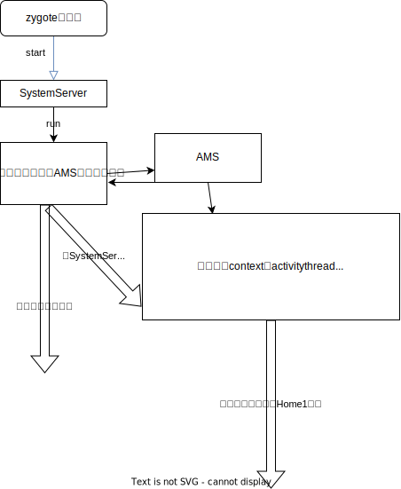

# Base knowledge of Android

通过 intent 的 bundle 的源码可以看到它们都是实现了 Parcelable，其实就是通过序列化来实现通信的. 大小限制 1M.

startActivity 携带的数据会经过 BInder 内核再传递到目标 Activity 中去，因为 binder 映射内存的限制，所以 startActivity 也就会这个限制了

一、写入临时文件或者数据库，通过 FileProvider 将该文件或者数据库通过 Uri 发送至目标. 一般适用于不同进程，比如分离进程的 UI 和后台服务，或不同的 App 之间. 之所以采用 FileProvider 是因为 7.0 以后，对分享本 App 文件存在着严格的权限检查.

二、通过设置静态类中的静态变量进行数据交换. 一般适用于同一进程内，这样本质上数据在内存中只存在一份，通过静态类进行传递. 需要注意的是进行数据校对，以防多线程操作导致的数据显示混乱.

## handler

- 处理器 Handler
- 消息队列 MessageQueue
- 循环器 Looper
- epoll 是如何实现的

```java
    Handler handler = new Handler(getMainLooper(),new Handler.Callback() {
        @Override
        public boolean handleMessage(@NonNull Message msg) {
            // 如果不需要进一步处理，就返回true
            return true;
        }
    });
    handler.removeMessage()// 不用的message, 要移除不然可能有泄漏
```

### looper

```java
Looper.prepare(); 
new Handler(Looper.getMainLooper());
```

Looper 利用的是 Linux 的 pipe/epoll 机制. 在主线程的 MessageQueue 没有消息时，便阻塞在 loop 的 queue.next()中的 nativePollOnce()方法里，此时主线程会释放 CPU 资源进入休眠状态，直到下个消息到达或者有事务发生，通过往 pipe 管道写端写入数据来唤醒主线程工作.

HandlerThread线程，该线程默认提供了getLooper()

Looper的loop方法内的 `Message msg = queue.next();` queue(MessageQueue) 会阻塞操作

handler.dispatchMessage 分发message。

调用Looper的quit或者quitSafely方法，MessageQueue的next方法会返回null消息，在Looper的loop方法内，当检测到msg==null时，Looper的loop方法会退出，线程也会结束。

### 复用Message

```java
Message msg = Message.obtain(mHandler);
Message msg = mHandler.obtainMessage();
```

内部使用栈 存储 Message。Message 里边有个`recycle` 方法， 发送并处理后就会msg.recycle();

### ThreadLocal

```java
// public class ThreadLocal<T> {}
ThreadLocal threadLocal=new ThreadLocal();
// 给当前线程设置变量，而且其它线程不能修改
threadLocal.set("122");
// 完毕后通过调用remove来清理，防止因为GC回收掉key，而value无法被清理，出现内存泄漏问题。
// ThreadLocalMap 存储数据
threadLocal.remove();
```

只能存储一个 `T` 类型变量, 这个 T 可以是线程，也可以是Looper

### MessageQueue

Android消息的管理队列

插入消息 `enqueueMessage`
读取消息 `next`

#### 同步屏障

在所有消息中，遍历，然后优先处理异步消息，同时同步消息会被屏蔽。同步屏障在使用完毕后一定要清理，否则同步消息会无法被处理。

设置同步屏障`postSyncBarrier`
移除同步屏障`removeSyncBarrier`

异步消息和同步消息的区别是`isAsynchronous`方法返回true或false。
异步消息需要手动将标记Message为异步，通过方法setAsynchronous(true)将消息标记为异步(一定要清理)。

### HandlerThread

A Thread that has a Looper. The Looper can then be used to create Handlers.

HandlerThreads 在 Activity 的生命周期之外运行，因此需要正确清理，否则会出现线程泄漏。

作用是可以循环使用一个线程

```java
HandlerThread handlerThread = new HandlerThread("MyHandlerThread");
handlerThread.start();
Looper looper = handlerThread.getLooper();
Handler handler = new Handler(looper, new Handler.Callback() {
    @Override
    public boolean handleMessage(@NonNull Message msg) {
        try {
            Thread.sleep(1000);
        } catch (InterruptedException e) {
            e.printStackTrace();
        }
        if (Looper.myLooper() == null)
            Looper.prepare();
        Toast.makeText(MainActivity.this, "123", Toast.LENGTH_LONG).show();
        //   runOnUiThread(new Runnable() {});
        return true;
    }
});

@Override
protected void onPause() {
    super.onPause();
    handler.removeMessages(MSG_UPDATE_INFO);
}

@Override
protected void onDestroy(){
    super.onDestroy();
    //释放资源
    handlerThread.quit();
}
```

## 自定义 View

measure->layout->draw

### onMeasure()

```java
@Override
protected void onMeasure(int widthMeasureSpec, int heightMeasureSpec) {
        super.onMeasure(widthMeasureSpec, heightMeasureSpec);
        int width = getMySize(100, widthMeasureSpec);
        int height = getMySize(100, heightMeasureSpec);
        setMeasuredDimension(width, height);
}
```

如果自定义属性格式为 dimension 又支持 enum，那么我们在获取属性值的时候，必须使用 getLayoutDimension,不可使用 getDimensionPixelSize.

### onDraw()

不考虑父控件大小，在父控件为空进行测量，

## 点击事件传递

父到子, 子返回 false 最终返回到父

view.dispatchTouchEvent();// 在这里判断 enable
view.onTouch();
view.onTouchEvent();
view.onClick();

按下 View 与抬起 View，会回调两次 onTouch()

```java
@Override
public boolean dispatchTouchEvent(MotionEvent ev) {
    //请求所有父控件不要拦截Touch事件
    getParent().requestDisallowInterceptTouchEvent(true);
    return super.dispatchTouchEvent(ev);
}
```

### 安卓是如何发出 Vsync 信号，并且有哪几个接收者

## APK 打包流程

gradle 打包

`gradlew assembleRelease` 命令打包

### 多 apk 打包

```gradle
 productFlavors {
      aaa {
            applicationId 'com.aaa'
            minSdkVersion 21
            targetSdkVersion 30
            versionCode 1
            versionName "1.0.0"
        }
        bbb {
            applicationId 'com.bbb'
            minSdkVersion 21
            targetSdkVersion 30
            versionCode 1
            versionName "1.0.0"
        }
 }
```

通过下面的步骤创建源集目录:

1. 打开 Project 窗格并从窗格顶端的下拉菜单中选择 Project 视图.
2. 导航至 MyProject/app/src/.
3. 右键点击 src 目录并选择 New > Folder > Java Folder.
4. 从 Target Source Set 旁边的下拉菜单中，选择需要创建源集的 build flavor 名称.
5. 点击 Finish.

Android Studio 将会为我们选择的构建类型创建源集目录，然后在该目录内部创建 java 目录. 或者，也可以让 Android Studio 创建相关目录.

例如:

1. 在该 Project 窗格中，右键点击 src 目录并选择 New > XML > Values XML File; 输入名称
2. 从 **Target Source Set** 旁边的下拉菜单中，选择 aaa.
3. 点击 Finish.

### 多渠道打包

```xml
<meta-data android:value="Channel ID" android:name="UMENG_CHANNEL"/>
<meta-data android:name="UMENG_CHANNEL" android:value="${UMENG_CHANNEL_VALUE}" />
```

````gradle
android {
    productFlavors {
        huawei {
            manifestPlaceholders = [UMENG_CHANNEL_VALUE: "huawei"]
        }
        xiaomi {
            manifestPlaceholders = [UMENG_CHANNEL_VALUE: "xiaomi"]
        }
    }
}

```gradle
//可以批量修改打包渠道配置
android {
    flavorDimensions "version"
    productFlavors {
        huawei {}
        xiaomi {}
        qh360 {}
        baidu {}
        wandoujia {}
    }
    productFlavors.all {
        flavor -> flavor.manifestPlaceholders = [UMENG_CHANNEL_VALUE: name]
    }
}
````

## Dalivk 虚拟机和 java 虚拟机差别

就是 Dalvik 基于寄存器，而 JVM 基于栈

## 工具

Android 扫码工具 ML Kit

## 安全

okhttp 不走系统代理 OkhttpClient.Builder().proxy(Proxy.NO_PROXY);

https 自签名验证证书和双向验证证书

验证 app 证书是否正确

## View 的 invalidate\postInvalidate\requestLayout 方法

invalidate 会调用 onDraw 进行重绘，只能在主线程. 刷新当前 View，使当前 View 进行重绘，不会进行测量、布局流程，因此如果 View 只需要重绘而不需要测量，布局的时候，使用 invalidate 方法往往比 requestLayout 方法更高效

postInvalidate 可以在其他线程

requestLayout 会调用 onLayout 和 onMeasure，不一定会调用 onDraw. 如果子 View 调用了这个方法，其实会从 View 树重新进行一次测量、布局、绘制这三个流程

## 更新 UI 方式

Activity.runOnUiThread(Runnable)
View.post(Runnable),View.postDelay(Runnable,long)
Handler

## javascript java 交互

```java
webView.evaluateJavascript("javascript:saveImage()", new ValueCallback<String>() {
```

## 线性布局 相对布局 效率哪个高

相同层次下，因为相对布局会调用两次 measure，所以线性高;
当层次较多时，建议使用相对布局

RelativeLayout 分别对所有子 View 进行两次 measure，横向纵向分别进行一次，这是为什么呢？首先 RelativeLayout 中子 View 的排列方式是基于彼此的依赖关系，而这个依赖关系可能和布局中 View 的顺序并不相同，在确定每个子 View 的位置的时候，需要先给所有的子 View 排序一下. 又因为 RelativeLayout 允许 A，B 2 个子 View，横向上 B 依赖 A，纵向上 A 依赖 B. 所以需要横向纵向分别进行一次排序测量. mSortedHorizontalChildren 和 mSortedVerticalChildren 是分别对水平方向的子控件和垂直方向的子控件进行排序后的 View 数组.

与 RelativeLayout 相比 LinearLayout 的 measure 就简单的多，只需判断线性布局是水平布局还是垂直布局即可，然后才进行测量:

## 看不到 activity 初启动异常信息

一般是 APP 启动时就奔溃了, 用 loader 加载 activity, activity 崩溃时就会有信息.

新的Logcat 应该不用这么麻烦

## Bitmap

Android 8.0 之后Bitmap像素内存放在native堆

## Glide

发起请求->执行解码任务->加载图片
into->run->onResourceReady

fragment 控制生命周期

TargetTracker

待运行 PENDING
已清除 CLEARED
待测量 WAITING_FOR_SIZE
运行中 RUNNING
已完成 COMPLETE
失败 FAILED

## GPU 加速

```xml
android:hardwareAccelerated="true"
```

## Rtsp 视频播放

NodeMedia:NodeMediaClient

opencv (需要二次开发)

## 打包 arr , 包含依赖的 aar

添加

```gradle
plugins {
    id 'com.android.library'
}
```

按错误修改即可打包`aar`

### 添加依赖的 aar

参考: <https://stackoverflow.com/a/52720958/6631835>

```gradle
configurations {
    customConfig.extendsFrom implementation
}
dependencies {
    implementation 'androidx.appcompat:appcompat:1.2.0'
    implementation 'com.google.android.material:material:1.3.0'
    implementation 'androidx.constraintlayout:constraintlayout:2.0.4'
    implementation 'androidx.navigation:navigation-fragment:2.3.5'
    implementation 'androidx.navigation:navigation-ui:2.3.5'
    testImplementation 'junit:junit:4.+'
    androidTestImplementation 'androidx.test.ext:junit:1.1.2'
    androidTestImplementation 'androidx.test.espresso:espresso-core:3.3.0'
    implementation fileTree( include: ['*.jar','*.aar'],dir: 'libs')
}

// 执行这这
task copyLibs(type: Copy) {
    print(configurations.customConfig)
    from configurations.customConfig
    into 'libs'
}
```

## Okhttp 双向验证

### 证书制作

客户端持有服务端的公钥证书，并持有自己的私钥
服务端持有客户的公钥证书，并持有自己私钥

生成客户端 keystore,证书(cer)

```sh
keytool -genkeypair -alias client -keyalg RSA -validity 3650 -keypass 123456 -storepass 123456 -keystore client.jks
keytool -export -alias client -file client.cer -keystore client.jks -storepass 123456
```

生成服务端 keystore,证书(cer)

```sh
keytool -genkeypair -alias server -keyalg RSA -validity 3650 -keypass 123456 -storepass 123456 -keystore server.keystore
keytool -export -alias server -file server.cer -keystore server.keystore -storepass 123456
```

交换证书  
将客户端证书导入服务端 keystore 中，再将服务端证书导入客户端 keystore 中， 一个 keystore 可以导入多个证书，生成证书列表。

```sh
# 服务端证书导入Android
keytool -import -v -alias server -file server.cer -keystore server.jks -storepass 123456
# 客户端导入服务端
keytool -import -v -alias client -file client.cer -keystore server.keystore -storepass 123456
```

生成 Android 使用的 BKS 库文件 , 工具下载地址<https://sourceforge.net/projects/portecle/>

将证书放在 android 客户端 assert 目录(能读取到的目录就可以)

```java
OkHttpClient okHttpClient = new OkHttpClient.Builder()
    .sslSocketFactory(getSSLCertifcation(context))//为OkHttp对象设置SocketFactory用于双向认证
    .hostnameVerifier(new HostnameVerifier() {
            @Override
            public boolean verify(String hostname, SSLSession session) {
                // TODO 根据实际情况返回
                return true;
            }
        })
    .build();

private final static String CLIENT_PRI_KEY = "client.bks";
private final static String TRUSTSTORE_PUB_KEY = "serve.bks";
private final static String CLIENT_BKS_PASSWORD = "123456";
private final static String TRUSTSTORE_BKS_PASSWORD = "123456";
private final static String KEYSTORE_TYPE = "BKS";
private final static String PROTOCOL_TYPE = "TLS";
private final static String CERTIFICATE_FORMAT = "X509";

public static SSLSocketFactory getSSLCertifcation(Context context) {
  SSLSocketFactory sslSocketFactory = null;
  try {
    // 服务器端需要验证的客户端证书，其实就是客户端的keystore
    KeyStore keyStore = KeyStore.getInstance(KEYSTORE_TYPE);// 客户端信任的服务器端证书
    KeyStore trustStore = KeyStore.getInstance(KEYSTORE_TYPE);//读取证书
    InputStream ksIn = context.getAssets().open(CLIENT_PRI_KEY);
    InputStream tsIn = context.getAssets().open(TRUSTSTORE_PUB_KEY);//加载证书
    keyStore.load(ksIn, CLIENT_BKS_PASSWORD.toCharArray());
    trustStore.load(tsIn, TRUSTSTORE_BKS_PASSWORD.toCharArray());
    ksIn.close();
    tsIn.close();
    //初始化SSLContext
    SSLContext sslContext = SSLContext.getInstance(PROTOCOL_TYPE);
    TrustManagerFactory trustManagerFactory = TrustManagerFactory.getInstance(CERTIFICATE_FORMAT);
    KeyManagerFactory keyManagerFactory = KeyManagerFactory.getInstance(CERTIFICATE_FORMAT);
    trustManagerFactory.init(trustStore);
    keyManagerFactory.init(keyStore, CLIENT_BKS_PASSWORD.toCharArray());
    sslContext.init(keyManagerFactory.getKeyManagers(), trustManagerFactory.getTrustManagers(), null);
    sslSocketFactory = sslContext.getSocketFactory();
  } catch (KeyStoreException e) {
      // TODO 处理异常
  }
  return sslSocketFactory;
}
```

## ANR 在事件分发的那一层处理的。系统层如何进行监听的

## 安卓 art 虚拟机，每个版本的 odex 优化有什么不同

## android 单元测试

## 使用 Android user-feature 限定设备

<https://developer.android.com/guide/topics/manifest/uses-feature-element>

```xml
<uses-feature android:name="android.hardware.bluetooth" />
<uses-feature android:name="android.hardware.camera" />

<uses-feature
android:name="string"
android:required=["true" | "false"]
android:glEsVersion="integer" />
```

## activiyResult

```java
  ActivityResultLauncher<String[]> locationPermissionRequest =
            registerForActivityResult(new ActivityResultContracts
                            .RequestMultiplePermissions(), result -> {


                    }
            );

   locationPermissionRequest.launch(PERMISSIONS_REQUIRED);

```

## FileProvider 打开文件

```java
    // new File(activity.getExternalCacheDir(), "").getPath()
    public static void open(String path, String minType, Activity activity) {
        Uri imageUri;
        File outputImage = new File(path);
        if (Build.VERSION.SDK_INT >= Build.VERSION_CODES.N) {
            imageUri = FileProvider.getUriForFile(activity, activity.getPackageName() + ".activity.fileprovider", outputImage);
        } else {
            imageUri = Uri.fromFile(outputImage);
        }
        /*
         *  对于微信
         *  Uri imageUri = FileProvider.getUriForFile(context, context.getPackageName() + ".activity.fileprovider", file);
         *  String contentPath = imageUri.toString();
         *  activity.grantUriPermission("com.tencent.mm", imageUri, Intent.FLAG_GRANT_READ_URI_PERMISSION);
         *  imgObj.setImagePath(contentPath);
        */
        Intent intent = new Intent(Intent.ACTION_VIEW);
        intent.addFlags(Intent.FLAG_ACTIVITY_NEW_TASK);
        intent.addFlags(Intent.FLAG_GRANT_READ_URI_PERMISSION);
        if (TextUtils.isEmpty(minType)) {
            intent.setData(imageUri);
        } else {
            intent.setDataAndType(imageUri, minType);
        }
        activity.startActivity(intent);
    }
```

manifests 定义

```xml
    <application>
        <provider
            android:name="androidx.core.content.FileProvider"
            android:authorities="com.ztftrue.activity.fileprovider"
            android:enabled="true"
            android:exported="false"
            android:grantUriPermissions="true">
            <meta-data
                android:name="android.support.FILE_PROVIDER_PATHS"
                android:resource="@xml/file_paths"
                android:value="androidx.startup" />
        </provider>
    </application>
```

file_paths.xml 放置 xml 目录, google 文档有解释

```xml

<?xml version="1.0" encoding="utf-8"?>
<paths>
    <external-path
        name="external_files"
        path="." />

    <external-path
        name="camera_photos"
        path="." />
    <external-cache-path
        name="share"
        path="/" />

    <!-- 1.<root-path/> 代表设备的根目录new File("/");
    2.<files-path/> 代表context.getFilesDir()
    3.<cache-path/> 代表context.getCacheDir()
    4.<external-path/> 代表Environment.getExternalStorageDirectory()
    5.<external-files-path>代表context.getExternalFilesDirs()
    6.<external-cache-path>代表getExternalCacheDirs()-->

    <files-path
        name="files"
        path="." />

    <cache-path
        name="cache"
        path="." />

    <external-path
        name="external"
        path="." />

    <external-files-path
        name="external_file_path"
        path="." />

    <external-cache-path
        name="external_cache_path"
        path="." />
</paths>

```

## Gradle 打包

### 包名字重命名

```gradle
    android.applicationVariants.all {
        variant ->
            variant.outputs.all {
                outputFileName = "${variant.name}-${variant.versionName}.apk"
            }
    }
```

### add Flavors

```gradle
android{
    defaultConfig {
        flavorDimensions "qs"
    }
    productFlavors {
        h1 {
            buildConfigField 'String', 'BaseIp', '"http://192.168.10.1:1010"'
        }
        h2 {
            buildConfigField 'String', 'BaseIp', '"http://192.168.10.1:1011"'
        }
    }
}
```

### 默认语言配置

```gradle
android{
    defaultConfig {
        resConfigs "zh-rCN"
    }
}
```

## Databinding

```gradle
    buildFeatures {
        viewBinding = true
        dataBinding = true
    }
```

### RecycleView 示例

item 布局文件

```xml
<?xml version="1.0" encoding="utf-8"?>
<layout xmlns:android="http://schemas.android.com/apk/res/android">

    <data>

        <import type="android.view.View" />

        <import type="android.text.TextUtils" />

        <variable
            name="data"
            type="com.ztftrue.MaterialItem" />
    </data>

    <LinearLayout
        android:layout_width="match_parent"
        android:layout_height="wrap_content"
        android:orientation="vertical">
        <TextView
            android:layout_width="match_parent"
            android:layout_height="wrap_content"
            android:background="#f5f9fc"
            android:padding="@dimen/dp_10"
            android:text="@{data.name}"
            android:textSize="10sp"
            android:visibility="@{data.type!=0?View.VISIBLE:View.GONE}" />
        </LinearLayout>
    </LinearLayout>
</layout>
```

```java
public class MaterialItem extends BaseObservable{
    @Bindable
    String name;
    @Bindable
    int type = 0;
    public void setType(int type) {
        this.type = type;
        this.notifyPropertyChanged(BR.type);
    }
    // 其它参考生成模板
}

public class MaterialAdapter extends RecyclerView.Adapter<MaterialAdapter.ViewHolder>{

    @Override
    public void onBindViewHolder(@NonNull ViewHolder holder, int position) {
        holder.binding.setData(arrayList.get(position));
    }

    public static class ViewHolder extends RecyclerView.ViewHolder {
        MaterialAdapterBinding binding;
        public ViewHolder(@NonNull View itemView) {
            super(itemView);
            binding = DataBindingUtil.bind(itemView);
        }
    }
}
/**
MaterialAdapter adapter = new MaterialAdapter();
adapter.setArrayList(arrayList);
binding.setMyAdapter(adapter);
 */
```

Activity 布局文件

```xml
<?xml version="1.0" encoding="utf-8"?>
<layout xmlns:android="http://schemas.android.com/apk/res/android"
    xmlns:app="http://schemas.android.com/apk/res-auto">
    <data>

        <variable
            name="myAdapter"
            type="com.ztftrue.MaterialAdapter" />

        <variable
            name="viewmodel"
            type="com.ztftrue.MaterialViewModel" />
    </data>

    <LinearLayout
        android:layout_width="match_parent"
        android:layout_height="match_parent"
        android:orientation="vertical">

        <TextView
            android:id="@+id/textView"
            android:layout_width="match_parent"
            android:layout_height="10dp"
            android:onClick="@{viewmodel::clickView}"
            android:text="@{viewmodel.materialData.name}"
        />

        <androidx.recyclerview.widget.RecyclerView
            android:id="@+id/recyclerView"
            android:layout_width="match_parent"
            android:layout_height="match_parent"
            app:adapter="@{myAdapter}"
            app:layoutManager="androidx.recyclerview.widget.LinearLayoutManager" />
    </LinearLayout>
</layout>
```

ViewModel 定义:

```java
public class MaterialViewModel extends ViewModel{
    public final MutableLiveData<MaterialData> materialData = new MutableLiveData<>();
    public void clickView(View view) {
        if (view.getId() == R.id.textView) {
            view.setClickable(false);
        }
    }
}
// activity 绑定  viewDataBinding.setViewmodel(viewModel);
```

## IDE AndroidStudio get and set 模板

### Set

```java
@Bindable
#set($paramName = $helper.getParamName($field, $project))
#if($field.modifierStatic)
static ##
#end
void set$StringUtil.capitalizeWithJavaBeanConvention($StringUtil.sanitizeJavaIdentifier($helper.getPropertyName($field, $project)))($field.type $paramName) {
  #if ($field.name == $paramName)
    #if (!$field.modifierStatic)
      this.##
    #else
      $classname.##
    #end
  #end
  $field.name = $paramName;
  this.notifyPropertyChanged(BR.$field.name);
}
```

### Get

```java
@Bindable
#if($field.modifierStatic)
static ##
#end
$field.type ##
#if($field.recordComponent)
  ${field.name}##
#else
#set($name = $StringUtil.capitalizeWithJavaBeanConvention($StringUtil.sanitizeJavaIdentifier($helper.getPropertyName($field, $project))))
#if ($field.boolean && $field.primitive)
  is##
#else
  get##
#end
${name}##
#end
() {
#if ($field.string)
    return $field.name == null ? "" : $field.name;
#else
#if ($field.list)
    if ($field.name == null) {
        return new ArrayList<>();
    }
    return $field.name;
#else
    return $field.name;
#end
#end
}
```

## 布局或按钮缩放

```java
this.setOnTouchListener((view, event) -> {
    if (event.getAction() == MotionEvent.ACTION_DOWN) {
        float scalingFactor = 0.9f; // scale down to half the size
        view.setScaleX(scalingFactor);
        view.setScaleY(scalingFactor);
    } else if (event.getAction() == MotionEvent.ACTION_UP) {
        float scalingFactor = 1f; // scale down to half the size
        view.setScaleX(scalingFactor);
        view.setScaleY(scalingFactor);
    }
        return false;
    });
} else {
    this.setOnTouchListener(null);
}
```

## 判断用户所在国际

获取时区

## AppCompatSpinner 简单设置下拉

```xml
<androidx.appcompat.widget.AppCompatSpinner
    android:id="@+id/spinner"
    android:layout_width="match_parent"
    android:layout_height="40dp"
    style="@style/SpinnerTheme"
    android:dropDownVerticalOffset="45dp"
    android:spinnerMode="dropdown" />
```

```java
ArrayAdapter<String> adapter = new ArrayAdapter(context,
                        android.R.layout.simple_spinner_item);
List<String> stringList =new ArrayList<>();
adapter.add("全选选项");
adapter.addAll(stringList);
// Specify the layout to use when the list of choices appears
adapter.setDropDownViewResource(android.R.layout.simple_spinner_dropdown_item);
tsSearchEditText.setPrompt("这里设置提示");
tsSearchEditText.setAdapter(adapter);
tsSearchEditText.setOnItemSelectedListener(new AdapterView.OnItemSelectedListener() {
    @Override
    public void onItemSelected(AdapterView<?> parent, View view, int position, long id) {
        String.valueOf(parent.getItemAtPosition(position));
    }
    @Override
    public void onNothingSelected(AdapterView<?> parent) {
    }
});
```

下拉按钮设置 来自stackoverflow

styles.xml

```xml
   <style name="SpinnerTheme" parent="android:Widget.Spinner">
        <item name="android:background">@drawable/bg_spinner</item>
    </style>
```

bg_spinner.xml

```xml
<?xml version="1.0" encoding="utf-8"?>
<selector xmlns:android="http://schemas.android.com/apk/res/android">
    <item>
        <layer-list>
            <item>
                <shape>
                    <gradient android:angle="90" android:endColor="#ffffff" android:startColor="#ffffff" android:type="linear" />
                    <stroke android:width="0.33dp" android:color="#0fb1fa" />
                    <corners android:radius="0dp" />
                    <padding android:bottom="3dp" android:left="3dp" android:right="3dp" android:top="3dp" />
                </shape>
            </item>
            <item android:right="5dp">
                // 找个下拉图片
                <bitmap android:gravity="center_vertical|right" android:src="@drawable/arrow_down_gray" />
            </item>
        </layer-list>
    </item>
</selector>
```

## AMS (ActivityManagerService)、WMS(WindowManagerService)、PMS (PackageManagerService)

### AMS

在Android系统中只有一个AMS的实例，负责管理管理、调度系统中所有的Activity的生命周期。

1. ActivityManagerServices 简称 AMS, 负责管理Activity的生命周期，使用ActivityStack存放所有的Activity。
2. ActivityThread 当开启 App 之后，调用 main()开始运行，开启消息循环队列，也就是 UI 线程`public final class ActivityThread extends ClientTransactionHandler        implements ActivityThreadInternal`
3. ApplicationThread 用来实现 `ActivityManagerServie` 与 `ActivityThread` 之间的交互。 AMS通过`ApplicationThreadProxy`与 `ActivityThread` 进行通信的
4. Instrumentation 每一个应用程序只有一个 Instrumetation 对象，每个 Activity 内都持有一个对该对象的引用；ActivityThread 需要通过 Instrumentation 来进行具体的操作，如：创建暂停。
5. ActivityStack，
6. ActivityRecord 在启动activity时候创建，存储关于Activity组件的相关信息
7. TaskRecord 记录ActivityRecord，每一个`TaskRecord`对应一个app，每一个App是可以有多个TaskRecord， 可以通过启动模式设置。
    - AndroidManifest: standard(A->B->A->A)，singleTop(A->B->A,onNewIntent())，singleTask(B->A, onNewIntent()), singleInstance(A or B)
    - Flag:
        - FLAG_ACTIVITY_NEW_TASK == singleTask
        - FLAG_ACTIVITY_SINGLE_TOP == singleTop
        - FLAG_ACTIVITY_REORDER_TO_FRONT == singleTask
        - ~~FLAG_ACTIVITY_CLEAR_WHEN_TASK_RESET~~
        - FLAG_ACTIVITY_CLEAR_TOP , 原：`A->B->C->D` ， 再次启动B添加该Flag, 先 销毁B/C/D, 然后重新创建 B, 变成 `A->B`. 如果同时添加 `FLAG_ACTIVITY_SINGLE_TOP`，则不销毁B,只销毁C/D,并出发 B 的`onNewIntent`
        - <https://developer.android.com/reference/android/content/Intent>
    - android:allowTaskReparenting <https://developer.android.com/guide/topics/manifest/activity-element>
    - android:clearTaskOnLaunch 启动时清除其它任务
    - android:alwaysRetainTaskState Task切换到后台后太久时，系统会对Task进行清理，设为ture 会阻止清理
    - android:autoRemoveFromRecents
    - ndroid:noHistory
8. `AcitivtyStack`包含`TaskRecord`，包含`ActivityRecord`

位置`/com/android/server/am/ActivityManagerService.java`


### WMS

WindowManagerService 负责管理系统中所有的窗口，包括Activity的窗口、壁纸窗口、输入法窗口、弹窗窗口等，即管理屏幕上展示上的一切窗口。

在Android系统系统的过程中，在SystemServer进程中也把WMS服务启动起来，注册到ServiceManager中。

### PMS

管理着所有跟 package 相关的工作，常见的比如安装、卸载应用。

#### 安装 APK 步骤

1. 解析 Apk, DefaultContainerService.getMinimalPackageInfo. 得到APK的少量信息, 确认安装位置
2. 复制APK 到 /data/app/pkg/
3. dexopt
4. 注册4大组件（PackageManagerService）
5. 安装完毕发送广播

### 总结

在Android系统系统的过程中，在SystemServer进程中把AMS服务启动起来，注册到ServiceManager中。

#### `SystemServer.java`

```java
public final class SystemServer implements Dumpable {

    /**
    *zygote 启动 systemserver：java入层口：
    */
    public static void main(String[] args) {
        new SystemServer().run();
    }

    public SystemServer() {
       // 源码位置 com/android/server/SystemServe.java
    }

     private void run() {
        TimingsTraceAndSlog t = new TimingsTraceAndSlog();
        try {
            // Default to FULL within the system server.
            SQLiteGlobal.sDefaultSyncMode = SQLiteGlobal.SYNC_MODE_FULL;
            // Deactivate SQLiteCompatibilityWalFlags until settings provider is initialized
            SQLiteCompatibilityWalFlags.init(null);
            // Increase the number of binder threads in system_server
            BinderInternal.setMaxThreads(sMaxBinderThreads);

            // Prepare the main looper thread (this thread).
            // 准备SystemServer运行环境:设置线程优先级 ActivityThread
            android.os.Process.setThreadPriority(
                    android.os.Process.THREAD_PRIORITY_FOREGROUND);
            android.os.Process.setCanSelfBackground(false);
            // 创建主线层Looper
            Looper.prepareMainLooper();
            Looper.getMainLooper().setSlowLogThresholdMs(
                    SLOW_DISPATCH_THRESHOLD_MS, SLOW_DELIVERY_THRESHOLD_MS);
            // Initialize native services.
            System.loadLibrary("android_servers");
            // Allow heap / perf profiling.
            initZygoteChildHeapProfiling();
            // Initialize the system context.
            //  创建Systemserver进程上的ActivityThread和SystemContext
            createSystemContext();
            // Call per-process mainline module initialization.
            // ActivityThread，App 的真正入口。当开启 App 之后，调用 main()开始运行， 开启消息循环队列， 也就是 UI 线程或主线程
            ActivityThread.initializeMainlineModules();
            // Sets the dumper service
            ServiceManager.addService("system_server_dumper", mDumper);
            mDumper.addDumpable(this);

            // Create the system service manager.
            mSystemServiceManager = new SystemServiceManager(mSystemContext);
            mSystemServiceManager.setStartInfo(mRuntimeRestart,
                    mRuntimeStartElapsedTime, mRuntimeStartUptime);
            mDumper.addDumpable(mSystemServiceManager);

            LocalServices.addService(SystemServiceManager.class, mSystemServiceManager);
            // Prepare the thread pool for init tasks that can be parallelized
            SystemServerInitThreadPool tp = SystemServerInitThreadPool.start();
            mDumper.addDumpable(tp);
            
            
            
            startBootstrapServices(t);
            startCoreServices(t);
            startOtherServices(t);
            startApexServices(t);
        } finally {
            t.traceEnd();  // InitBeforeStartServices
        }
        // Loop forever.
        Looper.loop();
        throw new RuntimeException("Main thread loop unexpectedly exited");
    }

}
```

启动服务

```java
private void startBootstrapServices(@NonNull TimingsTraceAndSlog t) {
    // 启动看门狗
    final Watchdog watchdog = Watchdog.getInstance();
    watchdog.start();
       // Platform compat service is used by ActivityManagerService, PackageManagerService, and
        // possibly others in the future. b/135010838.
          // 将服务加入到ServiceManager中
         PlatformCompat platformCompat = new PlatformCompat(mSystemContext);
        ServiceManager.addService(Context.PLATFORM_COMPAT_SERVICE, platformCompat);
        ServiceManager.addService(Context.PLATFORM_COMPAT_NATIVE_SERVICE,
                new PlatformCompatNative(platformCompat));
        AppCompatCallbacks.install(new long[0]);
    Installer installer = mSystemServiceManager.startService(Installer.class);
    ActivityTaskManagerService atm = mSystemServiceManager.startService(
                ActivityTaskManagerService.Lifecycle.class).getService();
    // 启动AMS
    mActivityManagerService = ActivityManagerService.Lifecycle.startService(
                mSystemServiceManager, atm);
    // ...
    mWindowManagerGlobalLock = atm.getGlobalLock();
    mDataLoaderManagerService = mSystemServiceManager.startService(
                DataLoaderManagerService.class);
    // ...
    // Power manager needs to be started early because other services need it.
    mPowerManagerService = mSystemServiceManager.startService(PowerManagerService.class);
    // ...
    // Start the package manager service 启动PMS
    mPackageManagerService = PackageManagerService.main();
    // ...
    // Set up the Application instance for the system process and get started.
    // 将SystemServer进程可加到AMS中调度管理
    mActivityManagerService.setSystemProcess();
    // 将相关provider运行在systemserver进程中：SettingsProvider
    mActivityManagerService.getContentProviderHelper().installSystemProviders();
    SQLiteCompatibilityWalFlags.reset();
    Watchdog.getInstance().registerSettingsObserver(context);
    mSystemServiceManager.startService(DropBoxManagerService.class);
    // 启动wms
    mSystemServiceManager.startBootPhase(t, SystemService.PHASE_WAIT_FOR_SENSOR_SERVICE);
    wm = WindowManagerService.main(context, inputManager, !mFirstBoot, mOnlyCore,
                    new PhoneWindowManager(), mActivityManagerService.mActivityTaskManager);
    // 给AMS 设置 WMS对象，与WMS交互
    // AMS和WMS在同一个进程
    mActivityManagerService.setWindowManager(wm);
    inputManager.setWindowManagerCallbacks(wm.getInputManagerCallback());
    mDisplayManagerService.windowManagerAndInputReady();
    wm.displayReady();
    networkPolicy = new NetworkPolicyManagerService(context, mActivityManagerService,
                        networkManagement);
    ServiceManager.addService(Context.NETWORK_POLICY_SERVICE, networkPolicy);
    // 开始启动应用层，和对AMS有依赖的服务
    mActivityManagerService.systemReady(() -> {
        // 准备webview
        // No dependency on Webview preparation in system server. But this should
        // be completed before allowing 3rd party
        final String WEBVIEW_PREPARATION = "WebViewFactoryPreparation";
        Future<?> webviewPrep = null;
        if (!mOnlyCore && mWebViewUpdateService != null) {
            webviewPrep = SystemServerInitThreadPool.submit(() -> {
                Slog.i(TAG, WEBVIEW_PREPARATION);
                TimingsTraceAndSlog traceLog = TimingsTraceAndSlog.newAsyncLog();
                traceLog.traceBegin(WEBVIEW_PREPARATION);
                ConcurrentUtils.waitForFutureNoInterrupt(mZygotePreload, "Zygote preload");
                mZygotePreload = null;
                mWebViewUpdateService.prepareWebViewInSystemServer();
                traceLog.traceEnd();
            }, WEBVIEW_PREPARATION);
        }
        // 启动SystemUI ，c, wms
        startSystemUi(context, windowManagerF);
    });
}
  private void startOtherServices(@NonNull TimingsTraceAndSlog t) {


  }
```

`ActivityManagerService.java` 代码， 3个组件是这里初始化

```java

public ActivityManagerService(Context systemContext, ActivityTaskManagerService atm) {
       
        LockGuard.installLock(this, LockGuard.INDEX_ACTIVITY);
        mInjector = new Injector(systemContext);
        // 系统Context 和 ActivityThread （将systemserver进程作为应用进程管理）
        mContext = systemContext;
        mFactoryTest = FactoryTest.getMode();
        mSystemThread = ActivityThread.currentActivityThread();
        mUiContext = mSystemThread.getSystemUiContext();
        // AMS工作的线程和Handler，处理显示相关的UiHandler
        mHandlerThread = new ServiceThread(TAG,
                THREAD_PRIORITY_FOREGROUND, false /*allowIo*/);
        mHandlerThread.start();
        mHandler = new MainHandler(mHandlerThread.getLooper());
        mUiHandler = mInjector.getUiHandler(this);
        // 组件 Broadcast
        // 广播队列BroadcastQueue初始化：前台广播队列和后台广播队列
        ...
        //  Service 和 Provider 管理
        mServices = new ActiveServices(this);
        // Provider
        mCpHelper = new ContentProviderHelper(this, true);
        mPackageWatchdog = PackageWatchdog.getInstance(mUiContext);
        // 系统数据存放目录
        final File systemDir = SystemServiceManager.ensureSystemDir();
        // 电池状态信息，进程状态 和 应用权限管理
        // TODO: Move creation of battery stats service outside of activity manager service.
        ...
        mProcessStats = new ProcessStatsService(this, new File(systemDir, "procstats"));
        mAppOpsService = mInjector.getAppOpsService(new File(systemDir, "appops.xml"), mHandler);
        // UriGrantsManagerInternal
        mUgmInternal = LocalServices.getService(UriGrantsManagerInternal.class);
        // 用户管理
        mUserController = new UserController(this);
        // 至少33 版本， 已经将一些内容放到了 SystemServer ActivityTaskManagerService
        Watchdog.getInstance().addMonitor(this);
        Watchdog.getInstance().addThread(mHandler);
```

