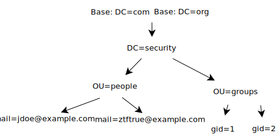

# [Ladp 服务  Lightweight Directory Access Protocol](https://ldap.com/learn-about-ldap/)

<https://www.davidpashley.com/articles/ldap-basics/>

<https://directory.apache.org/apacheds/basic-ug/1.2-some-background.html>

LDAP的一个常用用途是单点登录，用户可以在多个服务中使用同一个密码，通常用于公司内部网站的登录中（这样他们可以在公司电脑上登入一次，便可以自动在公司内部网上登入）。

LDAP是一个轻量级的目录访问协议(支持TCP/IP).
LDAP的标准TCP端口是389用于未加密通信，636用于tls加密通道上的LDAP，尽管LDAP服务器由于各种原因在备用端口上侦听并不少见。

LDAP目录的条目（entry）由属性（attribute）的一个聚集组成，并由一个唯一性的名字引用，即专有名称（distinguished name，DN）.



`DN` 这是一个用于引用树中的特定对象的唯一名称。它由父对象的dn和子对象中的一个唯一的键/值对组成.

```dn
 cn=Bill Gates,ou=People,dc=example,dc=com
```

sn : surname 姓
cn : common name 公共名称
ou : organizational unit 组织单位，是一个容器对象，可以包含其他各种对象
dc : domain component 域名的部分，其格式是将完整的域名分成几部分，如dc=domain,dc=com
uid: User Id  用户ID, 如"test"
rdn: Relative dn 相对辨别名，类似相对路径
c  : Country   国家
o  : Organization   组织名

Directory   目录，用于存放信息的单元
Entry 条目，一个entry就是一条记录，是LDAP中一个基本的存储单元
LDIF：LDAP Interchange Format  用于规范LDAP的配置和目录内容等详细信息的保存
Objectclass  LDAP对象类，是LDAP内置的数据模型。每种objectClass有自己的数据结构

服务端存储数据, LDAP目录与普通数据库的主要不同之处在于数据的组织方式，它是一种有层次的、树形结构。

>服务器下载地址: <https://directory.apache.org/apacheds/>  

安装参考:<https://directory.apache.org/apacheds/basic-ug/1.3-installing-and-starting.html>

__注意__: 可能需要创建对应的Temp文件, Log 位置 `/ApacheDS/instances/default/log`

>访问工具(客户端)下载地址: <https://directory.apache.org/studio/>

连接参考 <https://directory.apache.org/apacheds/kerberos-ug/4.2-authenticate-studio.html>

> If you have installed the ApacheDS package, the simplest way is to start the server, and to connect on it using Studio, using the uid=admin,ou=system user with secret as a password (this password will have to be changed later !).

## [Java 访问Ladp](https://www.baeldung.com/java-ldap-auth)

JNDI provides a standard API for applications to discover and access naming and directory services.

添加依赖

```xml
<dependency>
    <groupId>org.apache.directory.server</groupId>
    <artifactId>apacheds-test-framework</artifactId>
    <version>2.0.0.AM26</version>
    <scope>test</scope>
</dependency>
```

```java
import javax.naming.Context;
import javax.naming.NamingException;
import javax.naming.directory.DirContext;
import javax.naming.directory.InitialDirContext;
import javax.naming.directory.SearchControls;
import java.util.Hashtable;

public class Ldap {

    public static void main(String[] args) {
        // Set up environment for creating initial context
        Hashtable<String, String> environment = new Hashtable<String, String>();
        environment.put(Context.INITIAL_CONTEXT_FACTORY, "com.sun.jndi.ldap.LdapCtxFactory");
        environment.put(Context.PROVIDER_URL, "ldap://localhost:10389");
        environment.put(Context.SECURITY_AUTHENTICATION, "simple");
        // 如果要正式使用, 请修改默认密码
        environment.put(Context.SECURITY_PRINCIPAL, "uid=admin,ou=system");
        environment.put(Context.SECURITY_CREDENTIALS, "secret");
        DirContext context = null;
        try {
            // https://www.baeldung.com/java-ldap-auth
            context = new InitialDirContext(environment);
            String filter = "(&(objectClass=person)(cn=Joe Simms))";
            String[] attrIDs = { "cn" };
            SearchControls searchControls = new SearchControls();
            searchControls.setReturningAttributes(attrIDs);
            searchControls.setSearchScope(SearchControls.SUBTREE_SCOPE);
            System.out.println(context.search("ou=config",filter,searchControls));
            context.close();
         } catch (NamingException e) {
            e.printStackTrace();
        }

    }
}
```
