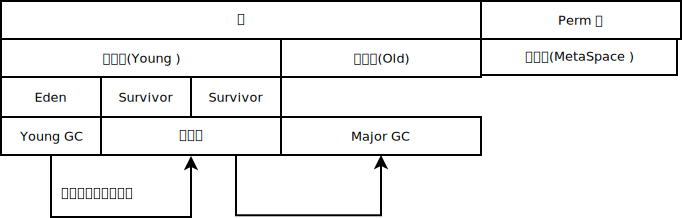

# Java

## ClassLoader

BootstrapClassLoader

## 时间处理

LocalDate
LocalTime
LocalDateTime
Instance 获取秒

## Collections

Collections.emptyList(); 返回的list 无法被修改. 可做为返回空时使用.

## HashMap

基本原理: 一个数组(长度为2次幂),一个链表, 当放入一个值时, Hash这个值,按结果放入数组的某一位置, 如果有多个值都应该放入数组的某一位置, 则其余数据通过链表(链地址法)记录.

哈希冲突的解决方案有多种:开放定址法(发生冲突，继续寻找下一块未被占用的存储地址)，再散列函数法，链地址法;

如果链表节点大于等于8且数组长度大于等于64, 链表就转成红黑树.

扩容需要重新传输数据.

如何计算元素存放位置?

通过(n - 1) & hash的计算方法来得出该元素在集合中的位置(其中n是数组大小)

为什么数组长度是2(扩容)呢?

1. 扩容: 大小指定为2的幂次，当哈希桶扩大2倍时，只需要进行左移操作(2进制)，众所周知，位操作的速度还是超快的
2. Hash算法的均匀分布，减少哈希碰撞几率: 16或者其他2的幂，Length-1的值是后面的二进制位全为1，例如16-1=15二进制1111，32-1=31二进制11111，这种情况下，index = key值HashCode&(length-1)，index的结果等同于key值的HashCode后几位的值. 只要输入的HashCode本身分布均匀，Hash算法的结果就是均匀的.

## Base

重载: 方法名相同而参数列表不同的一组方法就是重载

多态就是同一个接口，使用不同的实例而执行不同操作

抽象函数,抽象类,接口,重写(继承)

 一、使用父类类型的引用指向子类的对象；

二、该引用只能调用父类中定义的方法和变量；

三、如果子类中重写了父类中的一个方法，那么在调用这个方法的时候，将会调用子类中的这个方法；(动态连接、动态调用);

四、变量可以被重写(覆盖).

多态引用时，构造子类对象时的构造方法的调用顺序

1，先调用超类的构造方法，多重超类首先调用最远超类的方法；

2，然后再执行当前子类的构造方法

## 泛型

协变: <? extends >

```java
ArrayList<? extends Number> arrayList=new ArrayList<Integer>();
```

逆变: <? super >

```java
ArrayList<? super Integer> arrayList1=new ArrayList<Number>();
```

## 停止线程

抛异常, 运行判断

[interrupted,isInterrupted](https://docs.oracle.com/javase/tutorial/essential/concurrency/interrupt.html)

interrupted(): 测试当前线程是否已经中断.
当线程通过调用静态方法Thread.interrupted检查中断时，将清除中断状态; 如果连续两次调用该方法，第一次状态清除, 第二次调用返回false.

isInterrupted(): 测试线程是否已经中断； 一个线程用于查询另一线程的中断状态的非静态isInterrupted方法不会更改中断状态标志.

## ConcurrentHashMap 限制条件

如果有多个线程操作,且不能保证操作之间的状态一致, 需要确保需要手动加锁.

例如: size、isEmpty和containsValue等聚合方法，在并发下可能会反映ConcurrentHashMap的中间状态. 因此在并发情况下，这些方法的返回值只能用作参考，而不能用于流程控制. 显然，利用size方法计算差异值，是一个流程控制.

putAll这样的聚合方法也不能确保原子性，在putAll的过程中去获取数据可能会获取到部分数据.

例如, 向Map中补充100条数据进去，当第一个线程看到时是0条,第二个也是0条, 同时补充就会出现问题.

ConcurrentHashMap可以确保多个线程不会互相干扰，但同时插入100条数据的操作不是原子性的，

[比较: computeIfAbsent&putIfAbsent [from:stackoverflow]](https://stackoverflow.com/questions/48183999/what-is-the-difference-between-putifabsent-and-computeifabsent-in-java-8-map)

因此，如果键已经存在，则它们返回相同的内容，但是如果键丢失，则computeIfAbsent返回计算值，而putIfAbsent返回null.

Difference #1

computeIfAbsent takes a mapping function, that is called to obtain the value if the key is missing.

putIfAbsent takes the value directly.

If the value is expensive to obtain, then putIfAbsent wastes that if the key already exists.

A common "expensive" value is e.g. new ArrayList<>() for when you're creating a Map<K, List\<V>>, where creating a new list when the key already exists (which then discards the new list) generates unnecessary garbage.

Difference #2

computeIfAbsent returns "the current (existing or computed) value associated with the specified key, or null if the computed value is null".

putIfAbsent returns "the previous value associated with the specified key, or null if there was no mapping for the key".

So, if the key already exists, they return the same thing, but if the key is missing, computeIfAbsent returns the computed value, while putIfAbsent return null.

Difference #3

Both method define "absent" as key missing or existing value is null, but:

computeIfAbsent will not put a null value if the key is absent.

putIfAbsent will put the value if the key is absent, even if the value is null.

It makes no difference for future calls to computeIfAbsent, putIfAbsent, and get calls, but it does make a difference to calls like getOrDefault and containsKey.

## DefaultUncaughtExceptionHandler  全局异常捕获

## Java  synchronized

[synchronized 并不一定就是悲观锁,JVM 会先尝试基于 CAS 的瘦锁,发现有 Contention 再升级为重量级的悲观锁](https://blog.overops.com/java-8-stampedlocks-vs-readwritelocks-and-synchronized/)

## JIT(Just-In-Time Compiler)

## 多线程、锁，可重入，同步，原子性，可见性，非阻塞算法

1. 什么是Re-entrant Lock
    锁的acquire是per thread 的， 而不是per call的，也就是同一个线程再次申请已经获得的锁，直接成功返回. 如果是非re-entrant的锁，一个线程试图获取已经获得的锁会死锁，因为当前线程会挂起，没有机会release锁  
    synchronized的锁和 ReentrantLock都是 Re-entrant Lock

2. Java synchronized&Lock

    ReentrantLock 和 synchronized有相同的语义，但是有更高的性能，ReentrantLock 使用原子变量来维护等待锁定的线程队列.

    synchronized获取锁的时候只能一直等，没有超时机制，也不能被打断，而且锁的获取和释放必须在一个方法内,
     而ReentrantLock的lock方法和synchronized是等同语义的，还可以通过tryLock等方法有多种选择，并且以接口和类的形式而不是语言feature的形式存在，更好扩展.     lock 可以让等待的线程响应中断,可以知道锁有没或的成功.

    >```java
    >// lock 是一个接口
    >public interface Lock {  
    >    void lock();  
    >    void lockInterruptibly() throws InterruptedException;  
    >    boolean tryLock();  
    >    boolean tryLock(long time, TimeUnit unit) throws InterruptedException;  
    >    void unlock();  
    >    Condition newCondition();  
    >}  
    >```
  
    **Lock的必须在finally块中 unlock, 它不会自己释放**

3. AtomicInteger 主要解决原子性，内部维护的那个int值是用volatile声明的,保证了可见性    >__注意__: 可见性保证只有两个办法，就是synchronized和 volatile
相应 有AtomicReference
4. 一个int 成员变量，一个方法赋值，一个方法读值，多线程环境下，需要同步吗？
    >需要同步，或者用volatile，并且读操作也需要同步. 赋值和读值是原子的，但是依旧有可见性问题，否则也许读方法永远都不到最新的值. 为什么数据库查询也需要事务？也是可见性问题.

5. 用最小的开销实现实现计数器

    ```java
    @ThreadSafe  
    public class CheesyCounter {  
        // Employs the cheap read-write lock trick  
        // All mutative operations MUST be done with the 'this' lock held  
        @GuardedBy("this") private volatile int value;  
        public int getValue() { return value; }  
        public synchronized int increment() {  
            return ++value;  
        }  
    }  
    ```

    ++value是非原子操作(典型的 读取-修改-写回)用synchronized 保证原子性(也可以用ReentrantLock) ，getValue是原子的，可见性问题由volatile保证了. 假如不用volatile那个简单的读取也要用锁

6. volatile的经典应用场景
    > 1)对变量的操作是原子的，(注意原子操作只有赋值和读取，即“=”操作符，++value不是)
    > 2)只有一个线程写，这样就不会产生更新丢失问题，具体的，最经典的应用就是flag，即第一种场景.  比如一个死循环的服务线程，通过外部线程设置 exit 的flag决定是否退出.

7. 用ReentrantLock代替synchronized后， 需要用wait, notify的时候怎么办？
    > 众所周知，wait和notify必须放在synchronized块里，现在用了Lock了怎么办？答案是Lock的Condition，也就是用了不需要用Object.wait()了

8. 锁的等待队列，是先申请的线程先获取吗？
    > ReentrantLock的构造函数有一个参数，指定这个锁是fair的还是unfair的，fair的意思是说按申请锁的先后顺序排队，先到先得，而unfair的锁不保证这一点. 默认是unfair的.  而且，内置的synchronized锁是unfair的，也就是其实先申请锁的线程不一定先执行！  
    > fair的锁比较慢，几种并发模式的性能比较 Fair ReentrantLock < synchronized < Unfair ReentrantLock < 非阻塞算法

9. 非阻塞算法原理
    > 一般基于CAS, (campare and set/swap)，用一个while循环，先读取old value,  然后计算新值，在更新的时候看target 变量的值是否还是oldvalue，如果是，说明没有别的线程干扰，执行更新，否则有别的线程更新过，while回去重新来一遍. 注意这里的“看target 变量是否还是oldvalue并且更新”是一个原子操作CAS.

 _jvm在加载过程中会暂时禁用偏向锁,所以此处只有轻量级锁.
可以在调用test方法之前,先休眠5秒,这样等jym
完全加载完成后,偏向锁才能生效,就能看到效果了. (不用看了)_

CAS(Compare And Swap) : CPU 提供的函数, 在用户态完成锁操作(减少消耗).

锁的状态:

- 无锁状态
- 偏向锁(?)
    访问同步块时, 在置换ThreadID的时候依赖一次CAS原子指令(多线程竞争需要到达全局撤销偏向锁)
- 轻量级锁
    自旋消耗CPU, 响应时间块
- 重量级锁
    不自旋, 吞吐量大.

锁的类型:

- 互斥锁(操作系统实现)
    加锁失败, 释放CPU
- 自旋锁
    加锁失败, 忙等待

悲观锁

乐观锁
实际不加锁, 使用原子操作.

## java 原子操作

## 加锁

<https://howtodoinjava.com/java/multi-threading/how-to-use-locks-in-java-java-util-concurrent-locks-lock-tutorial-and-example/#:~:text=A%20java.util.concurrent.locks.Lock%20is%20a%20thread%20synchronization%20mechanism%20just,implementations%20to%20use%20a%20Lock%20in%20your%20applications>

<http://tutorials.jenkov.com/java-concurrency/locks.html>

synchronized(this) {

synchronized public void syncFunc(String str){

## HashMap 使用 putIfAbsent(key,new Object())

This method returns the existing value mapped to the key and __returns null__ if no value is previously mapped to the key.

## Atomic(Boolean,Integer...) 修饰

```java
  public class NonblockingCounter {  
      private AtomicInteger value;  
      public int getValue() {  
          return value.get();  
      }  
      public int increment() {  
          int v;  
          do {  
              v = value.get();  
          while (!value.compareAndSet(v, v + 1));  
          return v + 1;  
      }  
  }  
```

无锁堆栈

```java
    class ConcurrentStack<E> {  
        AtomicReference<Node> head = new AtomicReference<Node>();  
        public void push(E item) {  
            Node newHead = new Node(item);  
            Node oldHead;  
            do {  
                oldHead = head.get();  
                newHead.next = oldHead;  
            } while (!head.compareAndSet(oldHead, newHead));  
        }  
        public E pop() {  
            Node oldHead;  
            Node newHead;  
            do {  
                oldHead = head.get();  
                if (oldHead == null)
                    return null;  
                newHead = oldHead.next;  
            } while (!head.compareAndSet(oldHead,newHead));  
            return oldHead.item;  
        }  
        class Node {  
            final E item;  
            Node next;  
            public Node(E item) { this.item = item; }  
        }  
    }  
```

## JVM 和内存

JVM 内存划分:

1. 程序私有计数器. 记录当前虚拟机字节码指令.
2. Java 虚拟机栈. 线程私有区域, 记录线程状态.
3. 本地方法栈. 线程私有区域, JIT 技术相关, 用来记录JIT状态.
4. Java 堆. 存放对象(所以是GC最多区域), 线程共享.
5. 方法区. (Meta Space) 存储类信息, 常量, 静态变量. 一般不会收.
6. 堆外内存.  不由JVM 管理, 需要手动管理.

### 对象内存


### 内存回收算法

引用计数法(循环引用时无法回收).

#### 可达性算法

先有一个GC Root 对象, 然后GC Root 对象能够到达其它对象(即被使用或"引用"中), 则这个其它对象不被回收; 否则, 回收.

那些可以认为GC Root 对象:

- 方法中局部变量区中的对象引用
- Java 操作栈中对象引用
- 常量池中的对象引用
- 本地方法栈中的对象引用
- 类的 Class 对象

#### 垃圾收集算法

- 标记-清除法. 扫描全部对象，并标记可回收对象，然后清除. 缺点是回收完会产生很多碎片空间.

- 复制法. 将内存划分为相等的两块，每次只使用其中一块. 当这一块内存用完时，就将还存活的对象复制到另一块上面，然后将已经使用过的内存空间一次清理掉. 缺点是对内存空间消耗较大，并且当对象存活概率较高的时候，复制带来的额外开销也很高.

- 标记-整理法. 标记-清除法升级版, 让所有存活对象都向另一端移动, 然后直接清理掉端边界以外的内存.

#### 对象分代

对象生命周期不一样, 可以采用不同的垃圾回收算法. 比如对寿命较短的对象采用复制法，而对寿命比较长的对象采用标记-整理法.



Perm 区GC 条件:

1. 该类所有的实例都已经被回收
2. 加载该类的 ClassLoader 已经被回收
3. 该类对应的 java.lang.Class 对象没有在任何地方被引用，无法在任何地方通过反射访问该类的方法.

GC指标:

1. 延迟(latency)
2. 吞吐量(Throughput):  单位时间内需要处理完成的操作数量.
3. 系统容量(Capacity):是在达成吞吐量和延迟指标的情况下,对硬件环境的额外约束.

### 查看JVM的使用情况

jps 进程状况
jstat 运行时信息监控
jmap 导出堆文件分析

## java -Xmx512M -Xms512M -Djava.security.egd=/dev/urandom

## 内存

volatile两大作用

1、保证内存可见性(保证从内存中读取)

在java 中为了保证一个变量能够及时的在其它线程可见一个变量, 就需要使用`volatile`, 否则一个线程修改了另为一个线程可能看不到, 因为java 在编译时可能会把另为一个变量放入寄存器中.