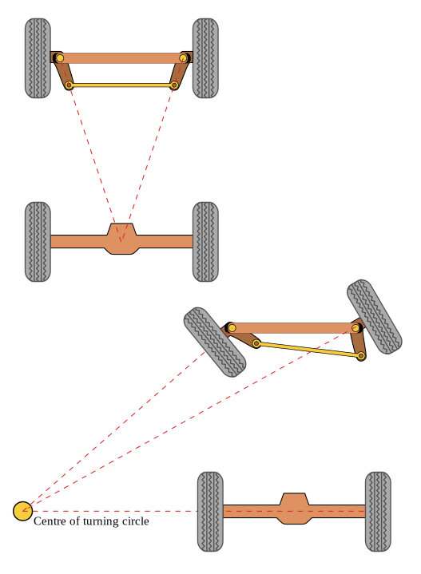

# 机械

## 螺母

### 螺母防松

1. 加平垫圈
2. 加平垫圈和弹簧垫圈
3. 自锁螺母
4. 螺母防松液
5. 双螺母（左右旋）防松
6. 双螺母 薄螺母(先/下，相当于垫片)-厚螺母(后/上)
  上螺母的拧紧力矩必须克服下螺母的拧紧力矩
7. 螺丝螺母钻孔加销固定
8. 棘轮垫圈

## 阿克曼转向几何

阿克曼转向几何（Ackermann Steering Geometry）是一种汽车转向系统设计方法，用于减少转弯时车轮之间的滑动现象，从而提高车辆的操控性和轮胎的使用寿命。该几何设计使得内侧和外侧前轮在转弯时能按照不同的角度转动，确保各车轮都沿着其独特的转向轨迹行驶。

### 基本原理

阿克曼转向几何的基本原理是通过调整转向连杆的角度和位置，使得在车辆转弯时，__内侧前轮的转角大于外侧前轮的转角__。这是因为 __内侧车轮需要沿着一个更小的圆周转动__，而外侧车轮则沿着一个较大的圆周转动。

依据阿克曼转向几何设计的车辆，沿着弯道转弯时，利用四连杆的相等曲柄使内侧轮的转向角比外侧轮大大约2~4度，使四个轮子路径的圆心大致上交会于后轴的延长线上瞬时转向中心，让车辆可以顺畅的转弯。 

### 实现方法

阿克曼几何通常通过以下方式实现：

1. **转向节臂的设计**：转向节臂（steering arms）的位置和角度经过精确设计，使得在转向时，两侧车轮的转向角度符合阿克曼几何的要求。
2. **连杆角度**：转向连杆（tie rod）的长度和连接位置经过调整，以保证转向时内外侧车轮的转角差异。

### 数学模型

阿克曼转向几何可以通过以下公式进行描述：

设车辆的轴距为 $L$，前后轴的轮距为 $ W $，内侧车轮的转角为 $ \theta_{\text{in}} $，外侧车轮的转角为 $ \theta_{\text{out}}$ 。则阿克曼几何要求满足以下关系：

$ \cot(\theta_{\text{in}}) - \cot(\theta_{\text{out}}) = \frac{W}{L} $

其中：

- $\cot(\theta) = \frac{1}{\tan(\theta)}$
- $ \theta_{\text{in}}$ 和  $\theta_{\text{out}} $ 是转向角度。

通过这一关系，可以计算出在特定转弯半径下内外侧车轮应有的转角。

### 优缺点

**优点**：

- 当车辆转弯时，每个车轮都能沿着各自的轨迹行驶，减少轮胎滑动和磨损。减少轮胎滑动，降低轮胎磨损。
- 提高转向稳定性和操控性。

**缺点**：

- 设计和制造成本较高。
- 对悬架系统的设计要求较高，需要精确的几何布局。

阿克曼转向几何是现代汽车设计中一个重要的部分，广泛应用于各种类型的车辆，尤其是在要求高操控性的跑车和赛车中。
