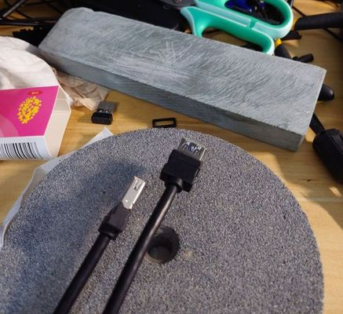
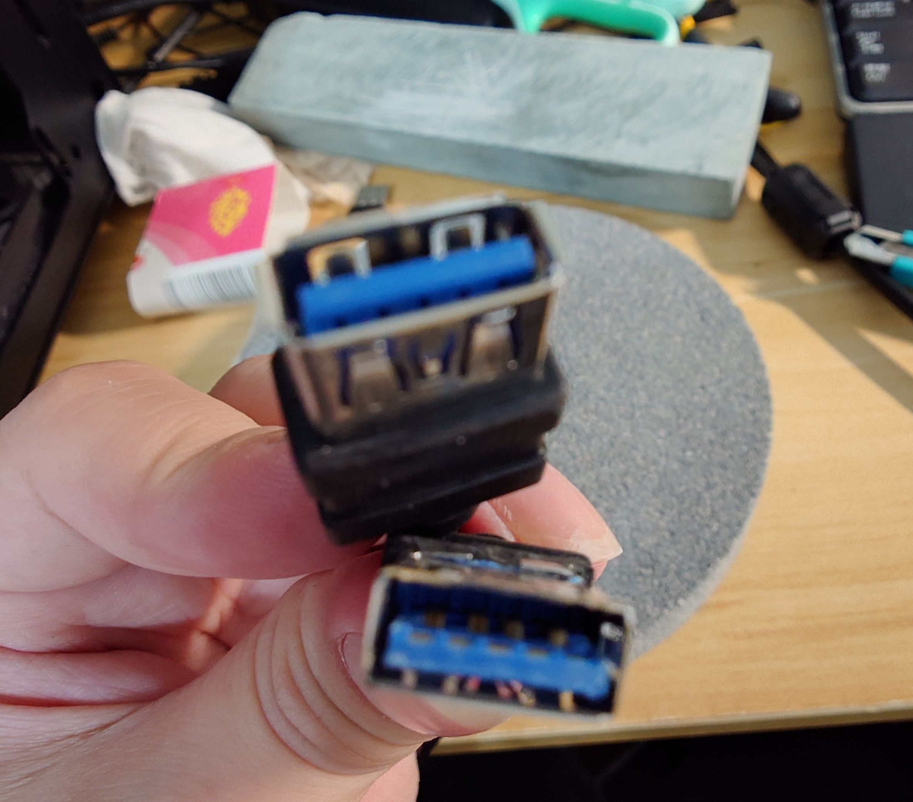
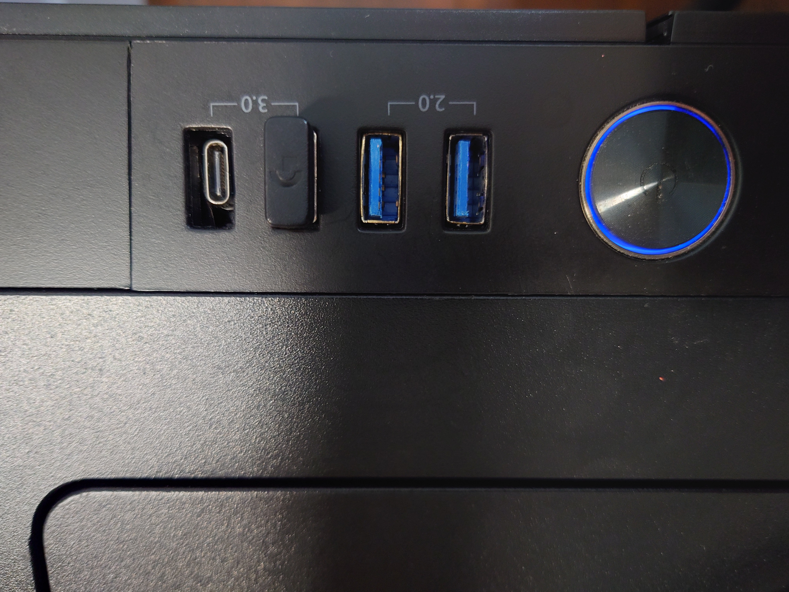

# 装机？

## 机箱前置USB3 供电不足修复

 一直存在供电不足的问题（也可能是绿联本身有问题，因为只有他家的出问题），尝试几个机箱后，决定自己修理。

首先，购买一根前置 `USB3` 线,插在电脑上试。这根线是肯定不能存在问题的，如果存在问题，就换一个牌子，确保买到和合适的线。

因为我的机箱很大，线很长，最后买到的 线 要比原装的短，线只能直接从前边拉。

接下来打磨`usb`接口。把 接口 处的胶皮割掉，适合机箱的接口就可以，如果线的接口太大，可以适当改造机箱的接口。要特别小心，不要割断数据线和外壳接地线。外壳接地线非常容易割断，割断之后会出现`USB`干扰，而且它的焊接点一般是突起来的，割完以后一定要确认无损。

工具展示

用磨石，砂轮磨掉四周的突起（我不知道就什么），主要看机箱和线材，有的可能不用磨。

安装线材，这个过程可以用胶粘，我这个线材正好有两个钩子所有就不用胶粘了。另外还在接口处包了一层铝箔。

usb typec 也是改造的。

## 被忽略的事情

功率计算（搜： 酷冷 功率计算）：<https://www.coolermaster.com/power-supply-calculator/> 。

选择电源和机箱时，注意尺寸，小心机箱太小放不进。

接跳线时看说明书，有的主板会有接跳线的壳子，可以先插到壳子里再接。

cpu 风扇,先决定好用那一款(最好不要用原装的),中途更换拆的时候就费劲了，会焊在一起的，需要先开机考CPU。
