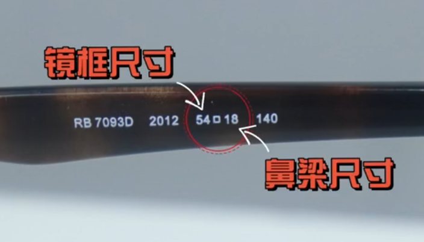

# 眼镜

## 镜框

来自B-up：铁打的郎中。chatGPT

镜片光学中心:
光学中心通常是指透镜或镜子的几何中心，它是镜片对称性的中心点。在一个理想的对称透镜中，光学中心通常与物理中心重合，但在实际制造中可能会有微小的偏差。

眼镜的光学中心通常位于镜片的中央位置，确保在佩戴眼镜时，__视线能够通过镜片的最佳部位__，获得清晰的视觉效果。制造商通常会精确地定位光学中心，以确保眼镜的度数准确，并且避免镜片畸变或视觉不适的问题。

D= (镜框尺寸+鼻梁尺寸)-瞳距

D越小越好，相差推荐在10mm以内。

个人经验：

高度近视，不推荐大镜片。经常戴头戴式耳机，不推荐金属镜框，能变形的都不推荐。