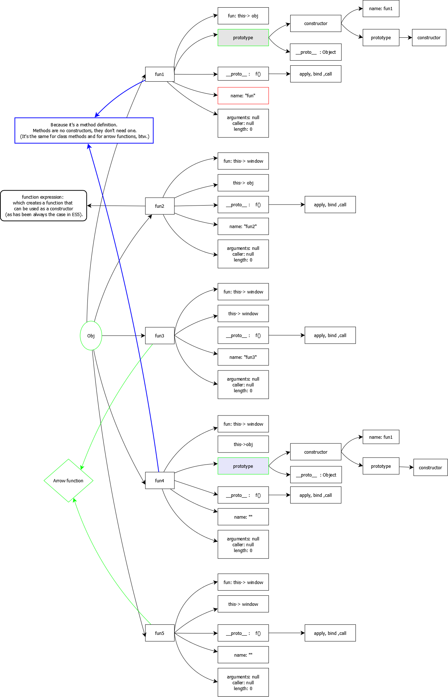

# JavaScript 函数,继承

## 对象 Object

js 万物皆对象,在JavaScript中，几乎所有的对象都是Object类型的实例. 它们都会从Object.prototype(原型)继承属性和方法.

Object 构造函数为给定值创建一个对象包装器. Object构造函数，会根据给定的参数创建对象，具体有以下情况:

1. 如果给定值是 null 或 undefined，将会创建并返回一个空对象
2. 如果传进去的是一个基本类型的值，则会构造其包装类型的对象
3. 如果传进去的是引用类型的值，仍然会返回这个值，经他们复制的变量保有和源对象相同的引用地址

当以非构造函数形式被调用时，Object 的行为等同于 new Object().

Object.assign() 通过复制一个或多个对象来创建一个新的对象, 返回目标对象.  Object.assign(target, ...sources)

Object.create() 使用指定的原型对象和属性创建一个新对象.

Object.defineProperty() 给对象添加一个属性并指定该属性的配置.

```js
var obj = {};
Object.defineProperties(obj, {
  'property1': {
    value: true,
    writable: true
  },
  'property2': {
    value: 'Hello',
    writable: false
  }
  // etc. etc.
});
```

Object.entries() 返回给定对象自身可枚举属性的 [key, value] 数组.

Object.is() 比较两个值是否相同. 所有 NaN 值都相等(这与==和===不同).

Object.seal() 防止其他代码删除对象的属性.

使用Object.freeze()冻结的对象中的现有属性值是不可变的. 用Object.seal()密封的对象可以改变其现有属性值.

delete 可以删除属性

```js
delete obj.foo;
```

Object.values() 返回给定对象自身可枚举值的数组.

### Object.prototype 属性的属性

几乎所有的 JavaScript 对象都是 Object 的实例；一个典型的对象继承了Object.prototype的属性(包括方法)，尽管这些属性可能被遮蔽(亦称为覆盖). 但是有时候可能故意创建不具有典型原型链继承的对象，比如通过Object.create(null)创建的对象，或者通过Object.setPrototypeOf方法改变原型链.

改变Object原型，会通过原型链改变所有对象；除非在原型链中进一步覆盖受这些变化影响的属性和方法. 这提供了一个非常强大的、但有潜在危险的机制来覆盖或扩展对象行为.

Object.prototype.constructor 特定的函数，用于创建一个对象的原型.

Object.prototype.hasOwnProperty() 返回一个布尔值 ，表示某个对象是否含有指定的属性，而且此属性非原型链继承的.

Object.prototype.valueOf() 返回指定对象的原始值.

Object.prototype.propertyIsEnumerable() 判断指定属性是否可枚举

Object.prototype.isPrototypeOf() 返回一个布尔值，表示指定的对象是否在本对象的原型链中.

### 使用 Object 生成布尔对象

```js
// 等价于 o = new Boolean(true);
var o = new Object(true);

// 等价于 o = new Boolean(false);
var o = new Object(Boolean());
```

## 函数

每个 JavaScript 函数实际上都是一个 Function 对象. 运行 (function(){}).constructor === Function // true 便可以得到这个结论.

### 构造函数(Function)

在 JavaScript 中，构造器其实就是一个普通的函数. 当使用 new 操作符 来作用这个函数时，它就可以被称为 __构造方法(构造函数)__.

Function 构造函数可以创建一个新的 Function 对象. 比如:

```js
// 语法
// new Function ([arg1[, arg2[, ...argN]],] functionBody)
// arg1, arg2, ... argN 函数参数
// functionBody 一个含有包括函数定义的 JavaScript 语句的字符串
const sum = new Function('a', 'b', 'return a + b');
console.log(sum(2, 6));
```

这会遇到和 ```eval``` 类似的的安全问题和(相对较小的)性能问题. 然而，与 `eval` 不同的是，`Function` 创建的函数只能在全局作用域中运行.

使用 Function 构造器生成的 Function 对象是在函数创建时解析的, 而使用函数声明或者函数表达式是跟其他代码一起解析的, 所以使用 Function 构造器生成的 Function 对象比函数声明或者函数表达式 在性能上有一点低效.

__重点:__ 每个函数, 也就是每个Fuction 都拥有一个 prototype 属性, 这个属性(Function.prototype) 存储了 Function 的原型对象. 原型就是这个函数的父亲(的属性)

全局的 Function 对象没有自己的属性和方法，但是，因为它本身也是一个函数，所以它也会通过原型链从自己的原型链 Function.prototype 上继承一些属性和方法.

Function.prototype 属性存储了 Function 的原型对象. 因此，Function.prototype 不能被修改.

## 原型链

JavaScript 只有一种结构: 对象.

每个实例对象 ( object ) 都有一个私有属性 (称之为 \__proto__ ) ,  这个私有属性指向它的构造函数的原型对象 (prototype ) ,这个原型(prototype )对象也有一个自己的原型对象 ，层层向上直到一个对象的原型对象为 null. 根据定义，__null 没有原型__ ，并作为这个原型链中的最后一个环节.

几乎所有 JavaScript 中的对象都是位于原型链顶端的 Object 的实例.

对于对象(JavaScript 标准内置(函数对象)对象
 `Object`和`Fuction` 特殊一点)来说是通过 `__proto__` 属性链接原型的.

全局的函数对象 (``Function``,`Object`) 没有自己的属性和方法，但是，因为它本身也是一个函数，所以它也会通过原型链从自己的原型链 Function.prototype 上继承一些属性和方法.

```js
console.log(Object.__proto__) // ƒ () { [native code] }
console.log(Object.prototype) // {constructor: ƒ, __defineGetter__: ƒ, __defineSetter__: ƒ, hasOwnProperty: ƒ, __lookupGetter__: ƒ, …}

console.log(Math.prototype)// undefined
console.log(Math.__proto__)// {constructor: ƒ, __defineGetter__: ƒ, __defineSetter__: ƒ, hasOwnProperty: ƒ, __lookupGetter__: ƒ, …}
console.log(1,this) // 输出window
// 让我们从一个函数里创建一个对象o，它自身拥有属性a和b: 
let f = function () {
    console.log(2,this) // 输出f{},就是函数自己
    this.a = 1;
    this.b = 2;
    console.log(3,this) // 输出f{a: 1, b: 2}
}
/* 这么写也一样
function f() {
  this.a = 1;
  this.b = 2;
}
*/
console.log(4,this) // 输出window, 但是比f内部的输出更快. 原因很简单f没还有被使用

// 创建一个对象o
let o = new f(); // {a: 1, b: 2}
console.log(5,this) // 输出window
// __proto__ 不是Js 标准, 但是浏览器都实现了.
// __proto__ 是每个实例对象 ( object ) 的一个私有属性(仅仅是一个属性). 这个私有属性指向它的构造函数的原型对象 (prototype ) (f的原型)
console.log(6,o.__proto__); // 输出{ constructor: f }
// 如果不设置. 则对象是没有这个属性的, 因为对象已经有了 __proto__  属性. __proto__ 属性会指向构造函数的 prototype
console.log(7,o.prototype); // undefined
console.log(8,f.__proto__); // ƒ () { [native code] }  ; 不建议通过此方法扩展原型链

// Object.prototype 属性表示 Object 的原型对象. 
// 被构造函数创建的实例对象的 [[Prototype]](原型) 指向 func 的 prototype 属性, 即例子中 f.prototype
// 这是函数的一个特殊属性
console.log(9,f.prototype); // { constructor: f }

/* Object.getPrototypeOf() 是从 ECMAScript 6 开始,标准的获取对象的原型的. 等同于 __proto__ */
//  Object.getPrototypeOf() 方法返回指定对象的原型
// Object.prototype 属性表示 Object 的原型对象. 
console.log(9,Object.getPrototypeOf(f)); // ƒ () { [native code] }
console.log(10,Object.getPrototypeOf(o)); // { constructor: f }

// o.[[Prototype]](原型) 有属性 b 和 c , (其实就是 o.__proto__ 或者 o.constructor.prototype)
// o.[[Prototype]].[[Prototype]] 是 Object.prototype.
console.log(7,o.__proto__.__proto__); // {constructor: ƒ, __defineGetter__: ƒ, __defineSetter__: ƒ, hasOwnProperty: ƒ, __lookupGetter__: ƒ, …}

console.log(f.prototype.constructor)
console.log(f === f.prototype.constructor); // true
console.log(o.__proto__ === f.prototype) // true
console.log(f.prototype.constructor === f) // true

// 此时o 有属性 a,b , o.__proto__ 没有属性 a,b

// 在f函数的原型上定义属性
f.prototype.b = 3;
f.prototype.c = 4;

// 此时o 有属性 a,b , o.__proto__ 没有属性 b和c

// 综上，整个原型链如下:
// o{a:1, b:2} ---> {b:3, c:4} ---> Object.prototype---> null
// 修改f , 同时o的原型属性也改变了, 这说明 JavaScript的 继承默认并不会复制对象的属性, 只是在对象之间建立一个连接. 让一个对象就可以通过连接访问另一个对象的属性和函数. 也就是被称作原型链的原因.
console.log(o.__proto__)// {b: 3, c: 4, constructor: ƒ}


// 不要在 f 函数的原型上直接定义 f.prototype = {b:3,c:4};这样会直接打破原型链
// 如果 f.prototype = {b:3,c:4}  则 console.log(9,f.prototype) 输出 {b: 3, c: 4}.  console.log(9,f.prototype.prototype) 输出undefined.
```

## 继承

当继承的函数被调用时，this 指向的是当前继承的对象，而不是继承的函数所在的原型对象.

```js
var o = {
  a: 2,
  m: function(){
    return this.a + 1;
  }
};

console.log(o.m()); // 3
// 当调用 o.m 时，'this' 指向了 o.

var p = Object.create(o);
// p是一个继承自 o 的对象

p.a = 4; // 创建 p 的自身属性 'a'
console.log(p.__proto__); // {a: 2, m: ƒ}
console.log(p.m()); // 5
// 调用 p.m 时，'this' 指向了 p
// 又因为 p 继承了 o 的 m 函数
// 所以，此时的 'this.a' 即 p.a，就是 p 的自身属性 'a' 

var o = {a: 1};

// o 这个对象继承了 Object.prototype 上面的所有属性
// o 自身没有名为 hasOwnProperty 的属性
// hasOwnProperty 是 Object.prototype 的属性
// 因此 o 继承了 Object.prototype 的 hasOwnProperty
// Object.prototype 的原型为 null
// 原型链如下:
// o ---> Object.prototype ---> null

var a = ["yo", "whadup", "?"];

// 数组都继承于 Array.prototype
// (Array.prototype 中包含 indexOf, forEach 等方法)
// 原型链如下:
// a ---> Array.prototype ---> Object.prototype ---> null


function f(){
  return 2;
}

// 函数都继承于 Function.prototype
// (Function.prototype 中包含 call, bind等方法)
// 原型链如下:
// f ---> Function.prototype ---> Object.prototype ---> null

```

ECMAScript6 引入了一套新的关键字用来实现 class. 使用基于类语言的开发人员会对这些结构感到熟悉，但它们是不同的. JavaScript 仍然基于原型. 这些新的关键字包括 class, constructor，static，extends 和 super.

```js
"use strict";

class Polygon {
  constructor(height, width) {
    this.height = height;
    this.width = width;
  }
}

class Square extends Polygon {
  constructor(sideLength) {
    super(sideLength, sideLength);
  }
  get area() {
    return this.height * this.width;
  }
  set sideLength(newLength) {
    this.height = newLength;
    this.width = newLength;
  }
}

var square = new Square(2);
console.log(square)
/**
Square {height: 2, width: 2}
height: 2
width: 2
area: 4
    __proto__: Polygon
    area: 4
    constructor: class Square
    get area: ƒ area()
    set sideLength: ƒ sideLength(newLength)
        __proto__: Object
**/
```

在原型链上查找属性比较耗时，对性能有副作用，这在性能要求苛刻的情况下很重要. 另外，试图访问不存在的属性时会遍历整个原型链.

遍历对象的属性时，原型链上的每个可枚举属性都会被枚举出来. 要检查对象是否具有自己定义的属性，而不是其原型链上的某个属性，则必须使用所有对象从 Object.prototype 继承的 hasOwnProperty 方法. 下面给出一个具体的例子来说明它:

```js
console.log(g.hasOwnProperty('vertices'));
// true

console.log(g.hasOwnProperty('nope'));
// false

console.log(g.hasOwnProperty('addVertex'));
// false

console.log(g.__proto__.hasOwnProperty('addVertex'));
// true
```

hasOwnProperty 是 JavaScript 中一个处理属性并且不会遍历原型链的方法. 另一个是Object.keys().

```js
console.log(Object.keys(square));
/**
 (2) ["height", "width"]
 0: "height"
 1: "width"
 length: 2
    __proto__: Array(0)
**/
```

__注意:__ 检查属性是否为 undefined 是不能够检查其是否存在的. 该属性可能已存在，但其值恰好被设置成了 undefined.

### 错误实践: 扩展原生对象的原型

扩展内置原型的唯一理由是支持 JavaScript 引擎的新特性，如 Array.forEach.

### 用于拓展原型链的方法

#### Object.create

```js
function foo(){}
foo.prototype = {
  foo_prop: "foo val"
};
function bar(){}
var proto = Object.create(
  foo.prototype,
  {
    bar_prop: {
      value: "bar val"
    }
  }
);
bar.prototype = proto;
var inst = new bar;
console.log(inst.foo_prop);
console.log(inst.bar_prop)
```

## [prototype 和 Object.getPrototypeOf](https://developer.mozilla.org/zh-CN/docs/Web/JavaScript/Inheritance_and_the_prototype_chain#prototype_%E5%92%8C_object.getprototypeof)(建议看原文)

你可能已经注意到我们的 function A 有一个叫做 prototype 的特殊属性. 该特殊属性可与 JavaScript 的 new 操作符一起使用.

对原型对象的引用被复制到新实例的内部 [[Prototype]] 属性.

例如，当执行 var a1 = new A(); 时，JavaScript(在内存中创建对象之后，和在运行函数 A() 把 this 指向对象之前)设置 a1.[[Prototype]] = A.prototype;

像上面的例子中，如果你执行 var a1 = new A(); var a2 = new A(); 那么 a1.doSomething 事实上会指向 Object.getPrototypeOf(a1).doSomething，它就是你在 A.prototype.doSomething 中定义的内容. 也就是说: Object.getPrototypeOf(a1).doSomething == Object.getPrototypeOf(a2).doSomething == A.prototype.doSomething(补充: 实际上，执行 a1.doSomething() 相当于执行 Object.getPrototypeOf(a1).doSomething.call(a1)==A.prototype.doSomething.call(a1))

简而言之， `prototype` 是用于类的，而 `Object.getPrototypeOf()` 是用于实例的(instances)，两者功能一致.

因此，当你执行:

```js
var o = new Foo();
```

JavaScript 实际上执行的是:

```js
var o = new Object();
o.__proto__ = Foo.prototype;
Foo.call(o);
```

然后，当你执行:

```js
o.someProp;
```

它检查 o 是否具有 `someProp` 属性. 如果没有，它会查找 `Object.getPrototypeOf(o).someProp`，如果仍旧没有，它会继续查找 `Object.getPrototypeOf(Object.getPrototypeOf(o)).someProp`.

`__proto__` 仅仅是个属性, 指向原型而已.

[下边的代码来自这里](https://github.com/mqyqingfeng/Blog/issues/16)

- 原型链继承 `Child.prototype = new Parent();`,`o.__proto__ = Foo.prototype;`
- 构造函数

```js
function Parent () {
    this.names = ['kevin', 'daisy'];
    console.log(this)
}

function Child () {
    Parent.call(this);
}
```

- 组合继承

```js
function Parent (name) {
    this.name = name;
    this.colors = ['red', 'blue', 'green'];
}

Parent.prototype.getName = function () {
    console.log(this.name)
}

function Child (name, age) {
    Parent.call(this, name);
    this.age = age;
}

Child.prototype = new Parent();
Child.prototype.constructor = Child;

var child1 = new Child('kevin', '18');

child1.colors.push('black');

console.log(child1.name); // kevin
console.log(child1.age); // 18
console.log(child1.colors); // ["red", "blue", "green", "black"]

var child2 = new Child('daisy', '20');

console.log(child2.name); // daisy
console.log(child2.age); // 20
console.log(child2.colors); // ["red", "blue", "green"]
```

## instanceof

`null instanceof null`和`undefined instanceof undefined`会抛出异常.
这是因为instanceof 运算符用来检测 constructor.prototype 是否存在于参数 object 的原型链上.
而 `null`和 `undefined` 就没有 prototype.

```js
// 定义构造函数
function C(){}
function D(){}

var o = new C();


o instanceof C; // true，因为 Object.getPrototypeOf(o) === C.prototype

o.a=1111

o instanceof C; // true

o instanceof D; // false，因为 D.prototype 不在 o 的原型链上

o instanceof Object; // true，因为 Object.prototype.isPrototypeOf(o) 返回 true
C.prototype instanceof Object // true，同上

C.prototype = {};
var o2 = new C();

o2 instanceof C; // true

o instanceof C; // false，C.prototype 指向了一个空对象,这个空对象不在 o 的原型链上.

D.prototype = new C(); // 继承
var o3 = new D();
o3 instanceof D; // true
o3 instanceof C; // true 因为 C.prototype 现在在 o3 的原型链上

o instanceof o // 抛出异常 语法 object instanceof constructor, 右侧必须有 prototype

```

另外

```js
null instanceof Object // false,  Object.prototype.isPrototypeOf(null); 
typeof(null) // "object"
```

~~这其实是一个语言bug. 本质上Null和Object不是一个数据类型，null值并不是以Object为原型创建出来的. 所以null instanceof Object是false. null确实是javascript中用来表示空引用的一个特殊值. 使得它不是instanceof Ojbect，而typeof null是“object”. 在语义上也是可以理解的. ~~

## Fuction 的方法

Function.prototype.apply() 在一个对象的上下文中应用另一个对象的方法；参数能够以数组形式传入.
func.apply(thisArg, [argsArray])

Function.prototype.call()在一个对象的上下文中应用另一个对象的方法；参数能够以列表形式传入.
该方法的语法和作用与 apply() 方法类似，只有一个区别，就是 call() 方法接受的是一个参数列表，而 apply() 方法接受的是一个包含多个参数的数组.

Function.prototype.bind()
bind()方法会创建一个新函数,称为绑定函数.当调用这个绑定函数时,绑定函数会以创建它时传入 bind()方法的第一个参数作为 this,  
传入 bind()方法的第二个以及以后的参数加上绑定函数运行时本身的参数按照顺序作为原函数的参数来调用原函数.

### Function 构造器与函数声明之间的不同

由 Function 构造器创建的函数 __不会创建当前环境的闭包__ ，它们总是被创建于 __全局环境__(顶级作用域)，因此在运行时它们只能访问全局变量和自己的局部变量，不能访问它们被 Function 构造器创建时所在的作用域的变量. 这一点与使用 eval 执行创建函数的代码不同.

### Arguments 对象

arguments对象是所有(非箭头)函数中都可用的局部变量. arguments对象不是一个 Array . 它类似于Array，但除了length属性和索引元素之外没有任何Array属性. 例如，它没有 pop 方法. 但是它可以被转换为一个真正的Array:

```js
// ES2015
const args = Array.from(arguments);
const args = [...arguments];
```

```js
function func1(a, b, c) {
    //  it doesn't have Array's built-in methods like forEach() and map().
  console.log(arguments[0]);
  // expected output: 1

  console.log(arguments[1]);
  // expected output: 2

  console.log(arguments[2]);
  // expected output: 3
}

func1(1, 2, 3);
```

### 休息参数(草案)

// theArgs is an array,

```js
function myFun(a,  b, ...manyMoreArgs) {
  console.log("a", a)
  console.log("b", b)
  console.log("manyMoreArgs", manyMoreArgs)
}

myFun("one", "two", "three", "four", "five", "six")

// Console Output:
// a, one
// b, two
// manyMoreArgs, ["three", "four", "five", "six"]
```

### Reflect.apply()

静态方法 Reflect.apply() 通过指定的参数列表发起对目标(target)函数的调用.

```js

console.log(Reflect.apply(Math.floor, undefined, [1.75]));
// expected output: 1

console.log(Reflect.apply(String.fromCharCode, undefined, [104, 101, 108, 108, 111]));
// expected output: "hello"

console.log(Reflect.apply(RegExp.prototype.exec, /ab/, ['confabulation']).index);
// expected output: 4

console.log(Reflect.apply(''.charAt, 'ponies', [3]));
// expected output: "i"

```

## this 问题

<https://github.com/mqyqingfeng/Blog/issues/7>

2.1 如果 ref 是 Reference，并且 IsPropertyReference(ref) 是 true, 那么 this 的值为 GetBase(ref)

2.2 如果 ref 是 Reference，并且 base value 值是 Environment Record, 那么this的值为 ImplicitThisValue(ref)

2.3 如果 ref 不是 Reference，那么 this 的值为 undefined

```js
function fun() { 
  //  this 由 context 决定
    console.log(this)
}

let obj = {
    fun1: fun,// fun() : this->obj 
    fun2() {
        console.log(this); // this->obj
        fun();// fun1 : this->window
        /**function expression, 
         * which creates a function that can be used as a constructor
         *  (as has been always the case in ES5). */
    },
    fun3:()=>{
        console.log(this); // this->window
        fun(); // fun1 : this->window
    }
};
obj.fun4=function(){
    console.log("------4----------");
    console.log(this); // this->obj
    fun(); // fun1 : this->window
    console.log("------4----------");
};
obj.fun5=()=>{
    console.log(this); // this->window
    fun(); // fun1 : this->window
};
obj.fun1();   
obj.fun2();
obj.fun3();
obj.fun4();
obj.fun5();
console.log(obj);
```

[why does a method using the shorthand method syntax not contain a prototype obje](https://stackoverflow.com/questions/48891399/why-does-a-method-using-the-shorthand-method-syntax-not-contain-a-prototype-obje)



## [闭包](https://developer.mozilla.org/zh-CN/docs/Web/JavaScript/Closures)

一个函数和对其周围状态(lexical environment，词法环境)的引用捆绑在一起(或者说函数被引用包围)，这样的组合就是闭包(closure). 也就是说，闭包让你可以在一个内层函数中访问到其外层函数的作用域. 在 JavaScript 中，每当创建一个函数，闭包就会在函数创建的同时被创建出来.

```js
function makeFunc() {
    var name = "Mozilla";
    function displayName() {
        alert(name);
    }
    return displayName;
}

var myFunc = makeFunc();
myFunc();
```

<https://github.com/mqyqingfeng/Blog/issues/9>

```js
var data = [];
var data2 = [];

// let 是另一个结果
for (var i = 0; i < 3; i++) { // 执行栈的问题
  data2[i] = i;
  data[i] = function () {
    console.log(i);
  };
}

data[0]();
data[1]();
data[2]();

console.log(data2)
```

```js

var data = [];

for (var i = 0; i < 3; i++) {
  data[i] = (function (i) {
        return function(){
            console.log(i);
        }
  })(i);
}

data[0](); // 0
data[1](); // 1
data[2](); // 2
```
