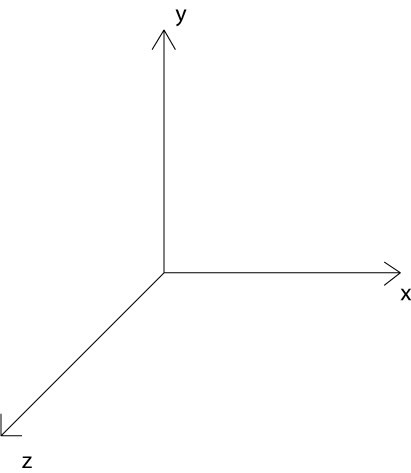

# 加载FBX距离，角度调整

threejs 右手坐标系  


> 其中正对用户的是z方向，向上为y轴正方向

## 关键代码

### 相机

#### 投影透视相机

```js
    /**
    *fov — 视角大小，角度制，通过它可以让物体变大或者变小.
    *aspect — 是照相机水平方向和竖直方向长度的比值，通常设为Canvas的横纵比例，通过它可以改变比例.
    *near — 照相机到景体最近距离.
    *far — 照相机到景体最远的距离.
    */
    let camera=  THREE.PerspectiveCamera( fov : Float, aspect : Float, near : Float, far : Float )
    camera.zoom : number 获取或者修改相机缩放比例，默认是1
    // 调整相机位置也可以让物体变的大或者小
    camera.position.z : number 相机位置 ，包括x,y,z
    camera.position.set(x, y, z); // 应该是这样文档没有查到，可以使用
```

#### 正交透视相机

```js
 THREE.OrthographicCamera(left, right, top, bottom, near, far) // 正交投影相机
```

### 旋转

```js
    //  object 加载的物体
    //  object.rotation 旋转属性，单位为弧度
    //  如下 以z轴为旋转中心，进行旋转π/4个弧度(45度)
    object.rotation.z=Math.PI / 4;
    // 可以以x,y,z 旋转
```

```html
...
<script>
    // 检查webgl 是否可用
    if (WEBGL.isWebGLAvailable() === false) {
        document.body.appendChild(WEBGL.getWebGLErrorMessage());
    }
    var container, stats, controls;
    var camera, scene, renderer, light;
    init();
    animate();
    function init() {
        container = document.getElementById('container');// 容器div
        /**
        *fov — 视角大小，角度制，通过它可以让物体变大或者变小.
        *aspect — 是照相机水平方向和竖直方向长度的比值，通常设为Canvas的横纵比例，通过它可以改变比例.
        *near — 照相机到景体最近距离.
        *far — 照相机到景体最远的距离.
        */
        camera = new THREE.PerspectiveCamera(35, container.clientWidth / window.innerHeight, 1, 2000);
        camera.position.set(-15, -60,-15);
        controls = new THREE.OrbitControls(camera);
        // controls.target.set(0, 12, 0);
        controls.update();
        scene = new THREE.Scene();
        // light = new THREE.HemisphereLight(0xffffff, 0x444444);
        // light.position.set(0, 1, 0);
        // scene.add(light);
        // light = new THREE.DirectionalLight(0xffffff);
        // light.position.set(0, 1, 0);
        // scene.add(light);
        light = new THREE.AmbientLight(0xffffff); // soft white light
        scene.add(light);
        // 加载modal
        var loader = new THREE.FBXLoader();
        loader.load("file_url", function(object) {
            //  object 加载的物体
            //  object.rotation 旋转属性，单位为弧度
            //  如下 以z轴为旋转中心，进行旋转π/4个弧度(45度)
            object.rotation.z=Math.PI / 4;
            object.rotation.x=Math.PI * 1.5;
            // object.rotation.y=Math.PI /1;
            scene.add(object);
        });
        renderer = new THREE.WebGLRenderer({
            antialias: true,
            alpha: true
        });
        renderer.setPixelRatio(window.devicePixelRatio);
        renderer.setSize(window.innerWidth, window.innerHeight);
        renderer.setClearColor(0x000000, 0); // the default
        // renderer.setViewport ( 100, 100, container.clientWidth , height );
        renderer.setPixelRatio(window.devicePixelRatio);
        renderer.setSize(container.clientWidth, window.innerHeight);
        container.appendChild(renderer.domElement);
        window.addEventListener('resize', onWindowResize, false);
    }
    function onWindowResize() {
        camera.aspect = container.clientWidth / window.innerHeight;
        camera.updateProjectionMatrix();
        renderer.setSize(container.clientWidth, window.innerHeight);
    }
    function animate() {
        requestAnimationFrame(animate);
        renderer.render(scene, camera);
    }
    </script>
...
```