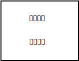

#

## 需求

reactjs 路由更新, 页面不重新绘制.

## 原理



在一个页面上,路由组件更改,不会影响"普通组件". 监听路由动态修改"普通组件", 隐藏"路由组件"

## 监听路由

组件中添加一个路由.

例如:在index.js 中添加一个路由

```tsx
ReactDOM.render(

  <React.StrictMode>
    <Provider store={store}>
      <HashRouter>
        <App />
      </HashRouter>
    </Provider>
  </React.StrictMode>,
  document.getElementById('root')
);
```

子组件中监听路由变化

```tsx
// 对第一次运行做标记
const views = {};
const [activeKey, setActiveKey] = useState('/WelcomePage')
React.useEffect(() => {
      let activityK = location.pathname;
      // 这个判断是对路由名字进行处理, 不理解可先注释调
      if (activeKey.lastIndexOf('/') > 0) {
          activityK = location.pathname.substring(0, location.pathname.lastIndexOf('/'))
      }
      setActiveKey(activityK);
      views[activeKey] = location.pathname;
  }, [activeKey, location]);
```

## 路由页面处理

```tsx
  return (
        <div className="App">
             {/*隐藏路由页面*/}
            <div className="hide-router"> 
             
                <HashRouter>
                    {
                        routes.map((route, key) => {
                            if (route.exact) {
                                return <Route key={key} exact path={route.path}
                                    render={props => (
                                          {/*NullRender 渲染一个空页面即可, 构建路由防止整个页面跳转到404*/}
                                        <NullRender notifyParent={(value) => {
                                        }} />
                                    )}
                                />
                            } else {
                                return (
                                    <Route key={key} path={route.path}
                                        render={props => (
                                            <NullRender notifyParent={(value) => {
                                            }} />
                                        )}
                                    ></Route>)
                            }
                        })
                    }
                </HashRouter>
            </div>
            {/*主体内容显示,这里才是本体*/}
            <div className="body-content">
                {
                    routes.map((route, key) => {
                        let path = route.path;
                            {/*此处时路由传参, 这一块我暂时不懂如何解决(无法获取props)*/}
                        if (route.path.indexOf(':') >= 0) {
                            return (
                                <Route key={key} path={route.path}
                                    render={props => (
                                        <route.component {...props} data-path={path} routes={route.routes} key={"route" + key} />
                                    )}
                                ></Route>)
                        }
                        return <div className={activeKey === path ? 'show-view-parent' : 'hide-view'}>
                            {views[path] === undefined ? <div ></div> : <route.component {...props} data-path={path} routes={route.routes} key={"route" + key} />}
                        </div>
                    })
                }
            </div>
        </div>
    );
```

```css
.body-content {
  height: 100vh;
}
/* 隐藏路由 */
.hide-router {
  height: 0px;
  width: 0px;
  display: none;
  visibility: hidden;
}
/* 隐藏界面, 如果有嵌套, 使用visibility会无效,所以使用transform,position 会更好*/
.hide-view {
  visibility: hidden;
  top: -1000px;
  left: -1000px;
  transform: translateX(-1000);
  position: fixed;
}

.show-view-parent {
  visibility: visible;
}
```

## 在这里发现了一个思路和我的思路差不多的代码

<https://github.com/AielloChan/KeepAliveRoute/blob/master/index.tsx>

```tsx
import React from 'react'
import { Route, matchPath, RouteProps } from 'react-router-dom'

interface KeepAliveRouteProps extends RouteProps {
  keepAlive: boolean
}

let cached = false

const KeepAliveRoute = ({
  keepAlive = true,
  component: Component,
  ...rest
}: KeepAliveRouteProps) => {
  if (keepAlive) {
    const matched = matchPath(window.location.pathname, rest)
    if (matched || cached) {
      cached = true
      return (
        <Route
          {...rest}
          path="/"
          render={props => {
            return (
              <div
                style={{
                  display: matched ? 'block' : 'none',
                }}
              >
                {Component && <Component {...props} />}
              </div>
            )
          }}
        />
      )
    }
    return <i />
  }
  cached = false
  return <Route {...rest} component={Component} />
}

export default KeepAliveRoute
```
