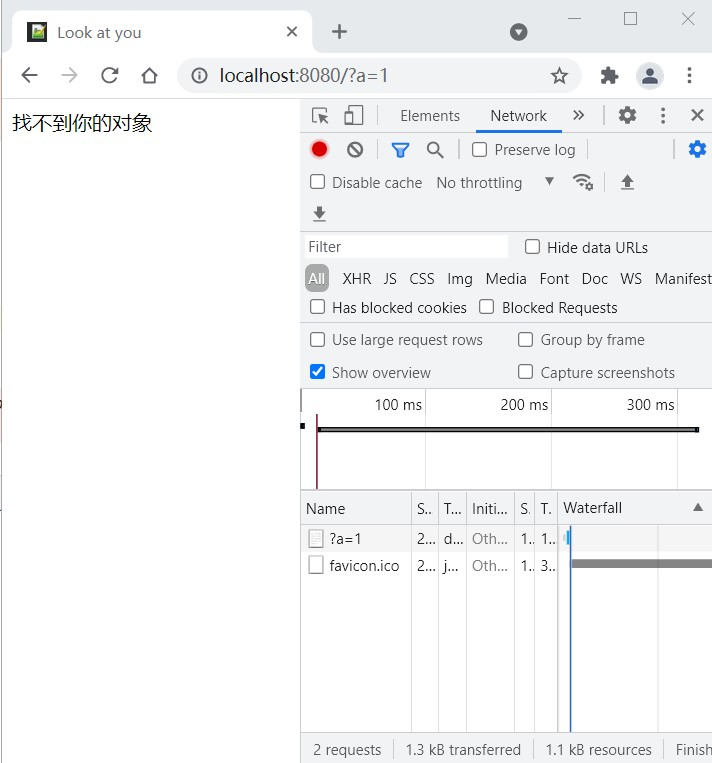

# 使用 TCP 解释 http 是怎么回事

消息内容就是普通的二进制内容(或文本)

换行为一行内容

空一行是HTTP请求头和体的区分

Java version : 16

运行项目, 并在浏览器打开<http://localhost:8080/> 就能看到效果了.

这个是 `post` 输出示例

可以看到请求的基本信息:

```http
请求方法 url 协议版本\r\n
请求头字段:值\r\n
\r\n
请求体
```

```http
POST / HTTP/1.1
Content-Type: application/json
User-Agent: PostmanRuntime/7.28.4
Accept: */*
Postman-Token: d6463e1f-3239-4330-92ce-6b0f5b46b0c5
Host: localhost:8080
Accept-Encoding: gzip, deflate, br
Connection: keep-alive
Content-Length: 12

{"hi": "hi"}
```

```http
POST /favicon.ico HTTP/1.1
User-Agent: PostmanRuntime/7.28.4
Accept: */*
Postman-Token: 970b04e3-8b3f-4a90-8726-2d548a0d5fea
Host: localhost:8080
Accept-Encoding: gzip, deflate, br
Connection: keep-alive
Content-Type: multipart/form-data; boundary=--------------------------347480335502652689484105
Content-Length: 263

----------------------------347480335502652689484105
Content-Disposition: form-data; name="good"

1
----------------------------347480335502652689484105
Content-Disposition: form-data; name="bad"

0
----------------------------347480335502652689484105--
```



## https

s 就是加了一个SSL/TSL,  验证证书(公钥)是否正确(找第三方服务), 协商加密算法,采用对称加密正式传输数据.

验证证书(公钥)是否正确 对于客户端可能是一个耗时过程.

过程:

## [how to reduce ssl time of website](https://stackoverflow.com/questions/36672261/how-to-reduce-ssl-time-of-website)

许多因素都会影响SSL耗时, 包括:

1. 标准网络问题(您的服务器与客户端之间有多远，网络之间有多快...等等), 由于SSL/TLS 需要多长握手. 除了更改托管服务提供商和/或使用CDN之外，您对这些几乎没有控制权.  根据我的经验，AWS速度很快，您只要求改善SSL而不是一般的访问时间，所以现在暂时跳过这一点.

    Network round trip times

    Request queueing times (especially when load testing)

    DNS resolution issues

2. 服务响应时间. Is the server under powered in CPU, Ram or disk? (电压是否足够?). Are you sharing this host?(你正在分享这个主机?). 同样, 这是一个普通的问题, 因此也许可以跳过. 但是SSL/TLS 确实会消耗一定的电量, 虽然在现在对于现代服务器几乎不那么明显了.

3. 服务操作系统. 如果运行的是`Red Hat Linux 4` 那么预计它会比`Red Hat Linux` 有着更慢的速度. `Hat Linux 7` 提高了网络栈, 并且有着更新版本的关键软件.

SSL set up (run your site through <https://www.ssllabs.com/ssltest> and you should get a state of health of this):

1. Ciphers(密码) used. There are older and slower ciphers and faster and new ones.Can get complicated(复杂的) here really quickly but generally you should be looking for ECDHE ciphers for most clients (and preferable ECDHE...GCM ones) and want to specify that server order should be used so you get to pick the cipher used rather than the client.

2. Certificate(证书) used. You'll want a RSA 2048 cert.   Anything more is overkill and slow.  Some sites (and some scanning tools) choose RSA 4096 certificates but these do have a noticeable impact on speed with no real increase in security (at this time - that may change). There are newer __ECDSA certs__ (usually shown as 256 EC cert in ssllabs report) but _these faster __ECDSA__ certs_ are not supplied by all CAs and are not universally supported by all clients, so visitors on older hardware and software may not be able to connect with them.   Apache (and very recently Nginx from v 1.11.0) supports dual certs to have best of both worlds but at the expense of having two certs and some complexity of setting them up.

3. Certificate Chain. You'll want a short certificate chain (ideal(理想的) 3 cert long: your server, intermediary(中间人) and the CAs root certificate). Your server should return everything but the last cert (which is already in browsers certificate store). If any of the chain is missing, some browsers will attempt to look the musing(沉思?) ones but this takes time.

4. Reliable(可信赖的) cert provider. _As well as_ shorter cert chains, better __OCSP__ responders, their intermediaries(中间人) also are usually cached in users browsers as they are likely to be used by other sites.

5. __OCSP__ Stapling(钉?) saves network trip(网络循环) to check cert is valid, using OCSP or CRL. Turning it on won't make a difference for Chrome as they don’t check for revocation (废止) (mostly but EV certificates do get checked). It can make a noticeable difference to IE so should be turned on if your server supports them but do be aware(意识到的) of some implementation((新政策的)实施) issues - particularly(特别) nginx’s first Request after restart always fails when OCSP Stapling is turned on.

6. TLSv1.2 should be used and possibly(可能地) TLSv1 .0 for older clients but no SSLv2 and SSLv3. TLSv1.1 is kind of pointless (pretty much everyone that supports that also supports the newer and better TLSv1.2). TLSv1.3 is currently being worked on and has some good performance improvements but has not been fully standardised(已标准化的) yet as there are some known compatibility(兼容性) issues. Hopefully these will be resolved soon so it can be used. Note PCI compliance(服从) (if taking credit cards on your site) demands(要求) TLSv1.2 or above on new sites, and on all sites by 30th June 2018.

Repeat visits - while above will help with the initial connection, most sites require several resources to be downloaded and with bad set up can have to go through whole handshake each time (this should be obvious if you're seeing repeated SSL connection set ups for each request when running things like webpagetest.org):(多次合成一次)

- HTTP Keep-Alives should be turned on so the connection is not dropped after each HTTP Request (this should be the default for HTTP/1.1 implementations).

- SSL caching and tickets(标签) should be on in my opinion. Some disagree for some obscure(不清楚的) security reasons that should be fixed in TLSv1.3 but for performance reasons they should be on. Sites with highly sensitive(敏感的) information may choose the more complete security over performance , but in my opinion the security issues are quite(相当) complex(复杂的) to exploit(利用), and the performance gain(受益) is noticeable(明显的).

- HTTP/2 should be considered(考虑), as it only opens one connection (and hence(因此) only one SSL/TLS setup) and has other performance improvements.

I would really need to know your site to see which if above (if any) can be improved. If not willing to give that, then I suggest you run ssllabs test and ask for help with anything it raises(增加) you don't understand, as it can require a lot of detailed knowledge to understand.

What about ECDSA certificates ?

Mentioned(提到) them as "256 EC" certificate. Will edit to note the ECDSA name though. They are not commonly available nor universally supported yet though.

[Nginx SSL Buffer Size 设置](https://nginx.org/en/docs/http/ngx_http_ssl_module.html#ssl_buffer_size)
