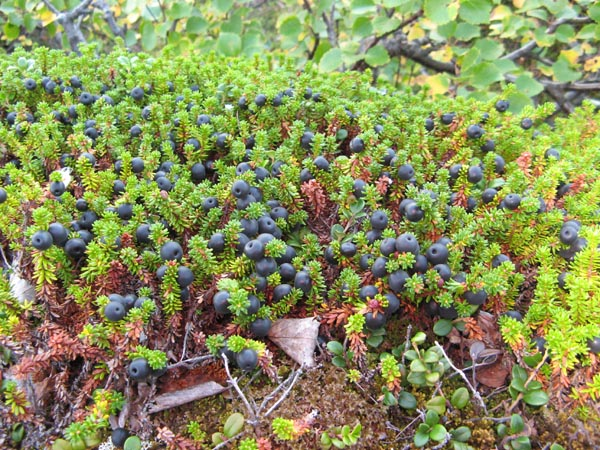

#

## 中国植物物种名录

<https://www.cvh.ac.cn/species/taxon_tree.php>

## 土壤修复

盐地碱蓬

盐角草

## 植物

### 问荆


多年生草本。暗褐色或黑色的根茎很长，有节，匍匐生根。淡褐色的孢子囊茎，无叶绿素；绿色的营养茎有分枝，直立，下部光滑，上部有微小的疣状突起。厚膜质漏斗状叶鞘。

这种物种不易多服用，因为有微小的毒性对身体不好。

"问荆"指的是木贼科（Equisetaceae）植物中的一种，通常指木贼（Equisetum hyemale）。这种植物也叫做问荆草或扫帚草。它具有以下几个特点：

1. **外观**：问荆草是多年生草本植物，茎直立，细长，呈绿色，有明显的节间分隔。茎表面有硬质的硅质细胞，使得它摸起来有粗糙感。

2. **生态环境**：这种植物通常生长在潮湿的地方，如河边、湿地和沼泽地带。

3. **药用价值**：在中医药学中，问荆草被用作药材，具有利尿、止血和解毒的功效。常用于治疗水肿、淋证、痔疮和创伤出血等症。

4. **其他用途**：由于其茎部含有硅质，问荆草在古代也被用作擦亮金属器具的工具。

5. **栽培与管理**：问荆草适应性强，易于生长，但在园林中要注意控制其蔓延，因为它可以快速扩散并侵占其他植物的生长空间。

问荆草在园艺中也有观赏价值，因其独特的外形和绿色的茎常被用于装饰庭院和花坛。

### 岩高兰



岩高兰，又名石兰、金盏银盘，学名为**Astilbe**，是虎耳草科（Saxifragaceae）的一属植物。以下是关于岩高兰的一些详细信息：

1. **外观**：
   - **叶子**：岩高兰的叶子呈羽状复叶，叶色多为绿色，叶片边缘有锯齿。
   - **花朵**：花序为顶生的圆锥花序，花朵小而密集，花色丰富，有白色、粉色、红色、紫色等，开花时非常美丽，花期通常在夏季。

2. **生态环境**：
   - 岩高兰喜欢凉爽、湿润的环境，适合在半阴或全阴的地方生长。
   - 它常见于山地、林缘和溪边等湿润环境。

3. **栽培与管理**：
   - **土壤**：岩高兰适合种植在排水良好的肥沃壤土中，土壤保持湿润，但不能积水。
   - **光照**：适合半阴至全阴环境，避免强光直射。
   - **浇水**：生长期需要保持土壤湿润，夏季干燥时需要增加浇水频率。
   - **施肥**：在生长期可以适当施用有机肥料，以促进生长和开花。

4. **用途**：
   - **观赏价值**：由于其美丽的花序和叶片，岩高兰常用于花坛、边界和林下花园的装饰，也可以作为切花使用。
   - **园艺设计**：岩高兰常与其他耐阴植物如蕨类、玉簪等搭配，形成层次丰富的植物景观。

5. **繁殖**：
   - **分株繁殖**：在早春或晚秋进行，将母株挖出后分成数株，每株带有芽和根。
   - **播种繁殖**：虽然也可通过播种繁殖，但发芽率相对较低且生长较慢。

岩高兰因其独特的美丽花朵和对环境适应性的广泛应用，深受园艺爱好者的喜爱，是一种非常受欢迎的观赏植物。

### 夹竹桃

夹竹桃（学名：Nerium oleander）是一种常见的观赏植物，原产于地中海地区和亚洲的部分地区。以下是夹竹桃的详细信息：

#### 植物特征

1. **外观**：
   - **叶子**：夹竹桃的叶子为长披针形，革质，对生或轮生，深绿色，光滑有光泽。
   - **花朵**：花朵呈漏斗状，花瓣五片，颜色多样，包括粉红色、红色、白色和黄色等。花期长，一般在夏季和秋季开花。
   - **果实**：果实为长角果，成熟后会裂开，释放出带有绒毛的种子。

2. **生长环境**：
   - 夹竹桃适应性强，耐旱、耐热，喜欢阳光充足的环境。
   - 对土壤要求不严，在贫瘠的土壤中也能生长良好，但以排水良好的砂质土壤为佳。

#### 观赏价值

夹竹桃因其美丽的花朵和长久的花期，被广泛用于园林绿化、道路两旁的绿化带和庭院装饰。它的常绿特性和密集的枝叶也使其成为良好的屏障植物和背景植物。

#### 有毒性

夹竹桃全株有毒，尤其是其汁液、叶子和种子中含有的夹竹桃苷（oleandrin）、皂苷（saponin）等有毒物质。误食或接触其汁液可能引起中毒症状，包括恶心、呕吐、腹泻、心律不齐等，严重时可致命。因此，应避免误食，处理夹竹桃时也要小心，避免皮肤直接接触其汁液。

#### 药用价值

尽管夹竹桃有毒，但在中药和传统医学中，夹竹桃也有一定的药用价值。经过适当处理后，可用于治疗皮肤病、心脏病等，但使用时需谨慎，必须在专业医师指导下进行。

#### 栽培与管理

1. **繁殖**：主要通过扦插繁殖。在春季或夏季，将健康的枝条剪下，插入湿润的沙土中，保持土壤湿润，几周后即可生根。
2. **管理**：
   - **浇水**：生长期需保持土壤湿润，但避免积水。
   - **修剪**：定期修剪可以促进植株分枝，保持良好的株形和花量。
   - **病虫害防治**：夹竹桃较少受病虫害侵扰，但在高温高湿的环境下，可能会受到蚜虫、白粉病等的影响。

#### 环境影响

夹竹桃不仅能美化环境，还具有一定的抗污染能力，能够吸收空气中的有害物质，如二氧化硫、氟化氢等。因此，常被种植在工业区和交通繁忙的道路两旁。

总之，夹竹桃是一种美丽且适应性强的观赏植物，但因其有毒性，在栽培和管理过程中需注意安全。

## 沃尔夫定律

沃尔夫定律（Wolff's Law）是骨科学中的一个基本原理，由19世纪德国解剖学家和外科医生尤利乌斯·沃尔夫（Julius Wolff）提出。该定律描述了骨组织如何响应机械负荷而改变其内部结构和外部形态。具体内容如下：

1. **基本原理**：
   - 沃尔夫定律指出，骨组织会根据其所承受的机械应力和负荷进行适应性重建。如果骨骼受到的应力增加，它会变得更密实、更强壮；反之，如果应力减少，骨骼则会变得更疏松、更脆弱。

2. **适应性重建**：
   - 骨骼的重建是通过骨形成（成骨细胞活动）和骨吸收（破骨细胞活动）来实现的。在机械负荷的刺激下，成骨细胞会增加骨基质的沉积，从而增强骨的强度；而在缺乏机械负荷的情况下，破骨细胞会增加骨基质的吸收，导致骨质密度下降。

3. **临床意义**：
   - **运动与锻炼**：定期的体重负荷运动（如跑步、跳跃、举重等）能够促进骨质形成，预防骨质疏松症。
   - **康复治疗**：在骨折愈合过程中，适当的机械刺激有助于骨痂的形成和骨折的愈合。
   - **空间医学**：宇航员在微重力环境中长期生活，会因为缺乏机械负荷而导致骨质流失，因此需要进行专门的锻炼以维持骨密度。

4. **现代研究**：
   - 现代生物力学和骨生物学的研究进一步证实了沃尔夫定律的有效性，并揭示了骨组织对机械应力的响应机制，包括细胞信号传导途径和基因表达变化。

5. **实例**：
   - **骨骼重塑**：在力量训练中，负重骨骼部位（如长骨和脊椎）的骨密度增加，骨小梁的排列会沿着应力方向重新组织。
   - **长期卧床**：长期卧床患者由于缺乏体重负荷，骨密度会显著下降，容易导致骨质疏松和骨折。

沃尔夫定律的提出为理解骨组织的动态适应性提供了理论基础，对于运动医学、康复治疗以及预防和治疗骨质疏松症等方面具有重要的指导意义。

### 小球藻

小球藻，又称为微小球藻，是一种微型单细胞藻类植物。它们属于浮游植物，通常生活在淡水或海水中，也可以在湖泊、河流、池塘等水域中找到。小球藻的直径一般在10微米到100微米之间，因此需要显微镜才能观察到。

这些微小的藻类在水体中扮演着重要的角色，它们是生态系统中的重要成员之一。小球藻是光合作用的主要生产者之一，通过光合作用将太阳能转化为化学能，释放氧气并吸收二氧化碳。它们也是许多水生生物的食物来源，如浮游动物、某些鱼类和其他水生生物。

然而，如果水体中的小球藻数量过多，就可能会引发问题。大量的小球藻可以导致水体富营养化，引起蓝藻水华，这可能对水生生物和整个生态系统造成负面影响。因此，监测和管理小球藻的数量在水资源管理中是非常重要的。

## 高原

绿绒蒿
报春
龙胆
杜鹃

## 医学自学书籍

医学是一个广阔而复杂的领域，自学医学需要系统性的学习和大量的时间投入。以下是一些适合自学的医学书籍，它们涵盖了医学的各个领域，从基础知识到专业领域的深入研究：

1. **《Harrison's Principles of Internal Medicine》** - 《哈里森内科学》是一本权威的内科学教材，覆盖了内科学的各个方面，是医学生和医生的常用参考书。

2. **《Gray's Anatomy for Students》** - 《格雷解剖学》是一本经典的解剖学教材，适合初学者。它以易懂的语言和清晰的插图展示了人体解剖结构。

3. **《Robbins Basic Pathology》** - 这本书是病理学的经典教材，详细介绍了疾病的病理生理学基础，对理解疾病的发生和发展非常重要。

4. **《Basic and Clinical Pharmacology》** - 这本书介绍了药理学的基础知识以及常见药物的临床应用，对理解药物的作用机制和药物治疗非常有帮助。

5. **《Netter's Atlas of Human Anatomy》** - 《内特人体解剖图谱》是一本图解人体解剖学的经典教材，提供了清晰的解剖图谱和简明的解释。

6. **《Clinical Microbiology Made Ridiculously Simple》** - 这本书以幽默的方式介绍了临床微生物学的基本概念和常见病原体，适合初学者。

7. **《Current Medical Diagnosis and Treatment》** - 这本书是一本综合性的临床医学参考书，提供了诊断和治疗各种常见疾病的最新信息。

8. **《Basic Clinical Neuroscience》** - 这本书介绍了神经科学的基础知识，包括神经解剖学、神经生物学和神经药理学等内容。

9. **《Principles of Biochemistry》** - 《生物化学原理》是一本介绍生物化学基本概念和分子生物学的教材，对理解人体生物化学过程和相关疾病机制非常有帮助。

10. **《Medical Physiology》** - 这本书介绍了人体生理学的基本概念和机制，对理解人体各系统的功能和调节至关重要。

以上书籍只是医学自学的起点，要系统地学习医学需要参考多种资源，包括教科书、学术期刊、在线课程等。同时，建议配合实践和临床经验，以加深对医学知识的理解和应用能力。

## 消毒

### 对氯间二甲苯酚

一般购买时颜色是棕色

"对氯间二甲苯酚" 是一种化学物质的名称，也称为PCMX，是一种对氯间二甲苯酚。它是一种常用的杀菌剂和防腐剂，常用于医疗、个人护理产品以及工业用途中。PCMX 在抗菌和抗真菌性能上表现出色，因此在医院、医疗设施和日常个人护理产品中广泛应用。

这种化合物通常以粉末或溶液的形式存在，用于制备各种洗手液、皮肤清洁剂、护发产品、口腔护理产品等。在医疗领域，它常用于外科手术前的皮肤消毒、手术室和医疗器械的清洁消毒等方面。

PCMX 是一种有效的抗菌剂，但在使用时应谨慎，避免过量使用或长时间接触，因为它可能对皮肤造成刺激或过敏反应。在医疗环境中，使用PCMX时需要遵循相关的安全操作规程，并确保充分洗净以避免残留物对患者或医护人员的不良影响。

对氯间二甲苯酚（PCMX）具有一定的腐蚀性，特别是对于某些金属。虽然PCMX通常在溶液中使用，并且在适当稀释的情况下可能对大多数金属表面没有明显的影响，但在高浓度下可能会引起腐蚀。

在实际使用中，如果PCMX溶液浓度很高或接触时间很长，它可能会对一些金属表面产生腐蚀作用，特别是对于铝、镁和锌等活泼金属。此外，如果金属表面存在损伤或腐蚀已经开始，PCMX的使用可能会加速金属的腐蚀过程。

因此，在使用PCMX时，尤其是在工业和医疗设施中，需要注意对金属表面的保护，可以选择使用耐腐蚀性较好的材料制成的容器或设备，或者采取其他措施来保护金属表面免受腐蚀的影响。

### 十二烷基二甲基苄基氯化铵（Dodecyl Dimethyl Benzyl Ammonium Chloride

十二烷基二甲基苄基氯化铵（Dodecyl Dimethyl Benzyl Ammonium Chloride，简称DDBAC 或者Benzalkonium Chloride）是一种季铵盐类化合物，广泛用于各种消毒和防腐应用中。它是一种阳离子表面活性剂，具有良好的抗菌、抗病毒和抗真菌性能。

#### 主要特点和应用

1. **抗菌性能**：
   DDBAC 对革兰氏阳性菌和革兰氏阴性菌都有效，同时也能有效对抗某些病毒和真菌。因此，它常被用作广谱消毒剂。

2. **应用领域**：
   - **医疗卫生**：用于医院、诊所等医疗场所的表面消毒，医疗器械的消毒，以及外科手术中的皮肤消毒剂。
   - **个人护理**：用于配制抗菌洗手液、沐浴露、洗发水等产品。
   - **食品工业**：用于食品加工设备和环境的消毒。
   - **水处理**：用于游泳池、水族馆和工业循环水系统中的水处理，防止藻类和细菌的滋生。

3. **表面活性剂**：
   DDBAC 作为阳离子表面活性剂，还具有良好的去污和乳化能力，因此在清洁产品中也常见。

#### 安全和注意事项

- **刺激性**：DDBAC 对皮肤和黏膜有一定的刺激性，因此使用时需要注意防护，避免直接接触皮肤和眼睛。
- **环境影响**：DDBAC 对水生生物有一定的毒性，因此使用后需要妥善处理废水，避免对环境造成污染。

#### 化学性质

- **分子式**：C₂₁H₃₈ClN
- **分子量**：340.99 g/mol
- **外观**：通常为无色至淡黄色液体或固体，具有特征性的气味。

#### 化学结构

DDBAC 的化学结构可以表示为：

```Chemical
         CH₃
          |
CH₃-(CH₂)₁₁-N⁺-(CH₃)₂-CH₂-C₆H₅ Cl⁻
```

这个结构显示了一个长链烷基（十二烷基）连接到一个季铵盐基团（N⁺），该基团又连接到一个苄基（C₆H₅-CH₂）和两个甲基（CH₃）。

总结来说，十二烷基二甲基苄基氯化铵（DDBAC）是一种有效的抗菌剂和表面活性剂，广泛应用于多个领域，但在使用时需要注意安全和环境保护。

### 亚硝酸钠

亚硝酸钠（Sodium Nitrite，化学式 NaNO₂）是一种无机化合物，常用作食品防腐剂、染料和药物的合成中间体、以及在工业领域中用作防腐剂和氧化还原反应的试剂。以下是关于亚硝酸钠的详细介绍：

#### 主要特性

- **外观**：白色至淡黄色的结晶粉末。
- **溶解性**：易溶于水，水溶液呈碱性。
- **化学性质**：在空气中稳定，但易潮解，具有强氧化性，在高温或酸性条件下分解产生有毒的氮氧化物气体。

#### 主要用途

1. **食品工业**：
   - **防腐剂**：亚硝酸钠用于肉类制品（如火腿、香肠、培根等）的腌制，可以抑制肉毒杆菌的生长，延长食品的保质期。
   - **发色剂**：它能够与肉中的肌红蛋白反应生成红色的亚硝基肌红蛋白，赋予肉制品鲜艳的红色。

2. **工业用途**：
   - **染料和药物的合成**：亚硝酸钠用作合成染料和药物的中间体。
   - **防腐剂**：在冷却系统中用作防腐剂，防止金属腐蚀。
   - **化学试剂**：在实验室中用于氧化还原反应。

3. **医疗用途**：
   - **抗氰化物中毒**：亚硝酸钠可用于治疗氰化物中毒，它能与血红蛋白反应生成高铁血红蛋白，从而将氰化物从细胞色素氧化酶中释放出来。

#### 安全性和注意事项

- **毒性**：亚硝酸钠具有一定的毒性，过量摄入可导致中毒，症状包括头痛、头晕、恶心、呕吐和腹痛，严重时可导致呼吸困难、昏迷甚至死亡。
- **致癌性**：亚硝酸钠在体内可以与胺类物质反应生成亚硝胺，亚硝胺是已知的致癌物，因此在食品中的使用量受到严格限制。
- **安全使用**：
  - **储存**：应储存在阴凉、干燥、通风良好的地方，避免与酸类、易燃物和还原剂接触。
  - **操作**：在处理亚硝酸钠时应穿戴适当的防护装备，如手套和护目镜，避免吸入粉尘和接触皮肤。

#### 化学反应

- **分解反应**：在加热条件下，亚硝酸钠分解生成氮气和氧气：
  \[
  2 NaNO_2 \rightarrow Na_2O + N_2 + O_2
  \]

- **氧化还原反应**：亚硝酸钠可作为氧化剂或还原剂参与多种化学反应。例如，它可以被氧化为硝酸钠（NaNO₃），也可以还原为一氧化氮（NO）。

总的来说，亚硝酸钠是一种用途广泛但具有一定危险性的化学品，在使用过程中需要谨慎操作并遵循相关的安全规程。

#### 亚硝酸钠 中毒剂量

亚硝酸钠（Sodium Nitrite，NaNO₂）具有较高的毒性，摄入过量会导致严重的中毒症状甚至死亡。以下是关于亚硝酸钠中毒剂量及其相关信息：

##### 中毒剂量

- **致死剂量（LD₅₀）**：
  - 人类的致死剂量大约为 **0.2 - 0.5 克**。这个范围内的剂量取决于个体的体重和健康状况。
  - 对于大鼠的口服致死剂量（LD₅₀）约为 **180 毫克/千克** 体重。

- **中毒剂量**：
  - 中毒的最小剂量约为 **0.02 - 0.1 克**，摄入后可能引起中毒症状，如恶心、呕吐、头痛、头晕、低血压和呼吸困难。

##### 中毒症状

1. **急性中毒**：
   - 恶心、呕吐、腹痛
   - 头痛、头晕、乏力
   - 面色苍白或发青（由于高铁血红蛋白血症）
   - 呼吸急促或困难
   - 低血压、心动过速或心动过缓
   - 严重时可导致昏迷、抽搐和死亡

2. **慢性中毒**：
   - 长期摄入低剂量的亚硝酸钠可能导致慢性健康问题，包括甲状腺功能减退、贫血和癌症风险增加（由于亚硝酸钠在体内与胺类物质反应生成亚硝胺，后者为致癌物）。

##### 处理和急救

- **如有摄入**：
  1. **立即就医**：如果怀疑有人摄入了亚硝酸钠，应立即送医。
  2. **催吐**：在专业医务人员的指导下，可进行催吐。
  3. **给予活性炭**：活性炭可以吸附未被吸收的亚硝酸钠。
  4. **对症治疗**：医疗人员可能会进行氧疗、静脉输液以维持血压，并使用亚甲蓝治疗高铁血红蛋白血症（亚甲蓝可以将高铁血红蛋白还原为正常的血红蛋白）。

##### 安全使用和预防

- **食品工业**：在食品中的使用量受到严格限制，通常不超过 **200 ppm**（百万分之二百）。
- **储存**：应储存在阴凉、干燥、通风良好的地方，避免与酸类、易燃物和还原剂接触。
- **操作**：在处理亚硝酸钠时应穿戴适当的防护装备，如手套和护目镜，避免吸入粉尘和接触皮肤。

总之，亚硝酸钠是一种具有高毒性的化合物，应谨慎使用，并采取适当的防护措施以防止中毒。

### 碘伏

碘伏（Povidone-iodine），也称为聚维酮碘，是一种广泛使用的消毒剂和杀菌剂。它是通过将碘和聚维酮（PVP，即聚乙烯吡咯烷酮）结合形成的络合物，其主要成分是单质碘。碘伏因其广谱抗菌性质和低毒性，被广泛应用于医疗、家庭和工业领域。以下是关于碘伏的详细介绍：

#### 主要特性

- **外观**：通常呈深棕色或红棕色液体。
- **溶解性**：易溶于水，溶液呈酸性。
- **杀菌性能**：碘伏对细菌、病毒、真菌、原生动物等多种病原微生物具有强大的杀灭作用。

#### 主要用途

1. **医疗用途**：
   - **皮肤消毒**：用于手术前的皮肤消毒、注射前的皮肤消毒，以及外伤处理时的消毒。
   - **伤口处理**：用于浅表伤口、割伤、烧伤等的消毒，防止感染。
   - **医疗器械消毒**：用于手术器械、医疗设备等的表面消毒。

2. **家庭用途**：
   - **小伤口处理**：用于家庭中处理小伤口、割伤等。
   - **个人卫生**：用于手部清洁和消毒。

3. **工业用途**：
   - **食品工业**：用于食品加工设备的消毒和清洁。
   - **农业和畜牧业**：用于动物皮肤消毒和环境消毒，防止疾病传播。

#### 使用方法

1. **外用**：碘伏一般作为外用消毒剂直接涂抹于皮肤、伤口或物体表面。
2. **稀释**：根据需要，可以将碘伏稀释到适当浓度后使用。例如，在手术消毒时，通常使用1%至10%的稀释液。

#### 安全性和注意事项

- **皮肤反应**：有些人可能对碘伏过敏，使用时应先进行小面积测试。如果出现红肿、瘙痒或其他过敏反应，应立即停止使用。
- **避光保存**：碘伏应避光保存，防止分解失效。
- **孕妇和哺乳期妇女**：应慎重使用碘伏，因其可能影响甲状腺功能。
- **避免与其他消毒剂混用**：避免与过氧化氢、银离子等其他消毒剂混用，以免发生化学反应。

#### 化学性质

- **化学成分**：碘伏中的活性成分是单质碘，其与聚维酮结合形成络合物，稳定性好，释碘缓慢。
- **杀菌机制**：碘伏中的碘通过氧化作用破坏微生物的蛋白质和细胞膜，从而杀死病原体。

#### 优点和局限性

- **优点**：
  - 广谱抗菌性能，适用于多种病原体。
  - 对皮肤刺激性小，适合用于皮肤和黏膜消毒。
  - 低毒性，相对安全。

- **局限性**：
  - 可能引起过敏反应，特别是对碘过敏的人群。
  - 某些情况下可能引起皮肤染色，但通常是暂时的。

总的来说，碘伏是一种安全有效的广谱消毒剂，广泛应用于各种消毒场合。但在使用时需注意防护，特别是对碘过敏的人群应慎重使用。

#### 保存

碘伏开瓶后会逐渐失效，其失效速度受多种因素影响。以下是关于碘伏开瓶后失效的详细信息及注意事项：

#### 失效原因

1. **空气接触**：开瓶后，碘伏暴露在空气中，碘挥发性较高，长时间暴露会导致碘含量减少，降低其消毒效果。
2. **光照影响**：碘伏对光敏感，暴露在光线下会加速其分解，失去杀菌能力。
3. **温度影响**：高温会加速碘伏的分解和挥发，因此在高温环境下保存时间会缩短。
4. **污染**：开瓶后可能受到微生物和其他污染物的污染，影响其稳定性和有效性。

#### 保存方法

为了延长开瓶后碘伏的有效期，可以采取以下措施：

1. **密闭保存**：使用后立即将瓶盖拧紧，减少碘与空气的接触。
2. **避光保存**：将碘伏存放在避光的地方，避免阳光直射。可以存放在棕色瓶子中以减少光照影响。
3. **低温保存**：存放在阴凉处，避免高温环境。
4. **避免污染**：使用干净的工具取用碘伏，避免将使用过的棉签或其他工具再次插入瓶内，防止交叉污染。

#### 有效期和使用期限

- **未开封的碘伏**：通常在其原包装上标明了有效期，一般为1至3年，具体取决于产品和制造商的规定。
- **开瓶后的碘伏**：开瓶后的有效期较短，通常建议在开瓶后__6个月内__使用完毕，以确保其最佳的杀菌效果。如果保存得当（如密闭、避光、低温），可能会稍微延长这一时间，但最好遵循产品说明和制造商的建议。

#### 判断失效

如果碘伏变色（如颜色明显变淡），出现沉淀或异味，可能表明其已经部分或完全失效。这时建议不再使用，换新瓶。

#### 使用建议

- **定期检查**：定期检查碘伏的颜色和气味，发现异常及时更换。
- **记录开瓶日期**：在瓶子上记录开瓶日期，便于掌握使用期限。

总的来说，碘伏开瓶后会逐渐失效，但通过适当的保存方法可以延长其使用寿命。为了确保消毒效果，建议在开瓶后尽早使用完毕，并遵循制造商的使用和保存指南。

## 肌肉中为什么有乳酸

乳酸在肌肉中的产生主要与能量代谢有关，特别是在缺氧条件下的代谢过程。以下是乳酸在肌肉中存在的原因及其过程：

### 乳酸的产生过程

1. **有氧呼吸**：
   - 在有氧条件下（充足的氧气供应），肌肉细胞通过有氧呼吸产生能量（ATP）。
   - 葡萄糖通过糖酵解生成丙酮酸，丙酮酸进入线粒体，在有氧条件下被彻底氧化成二氧化碳和水，同时产生大量的ATP。

2. **无氧呼吸（乳酸发酵）**：
   - 在剧烈运动或氧气供应不足的情况下，肌肉细胞不能获得足够的氧气来支持有氧呼吸。
   - 为了迅速提供能量，肌肉细胞通过无氧呼吸途径（即乳酸发酵）来产生ATP。
   - 在此过程中，葡萄糖仍然通过糖酵解生成丙酮酸，但由于缺乏氧气，丙酮酸不能进入线粒体进行有氧代谢，而是被还原为乳酸。

### 乳酸的作用与代谢

1. **短期能量供应**：
   - 乳酸发酵是肌肉在短时间内迅速产生能量的重要途径，特别是在高强度运动或紧急情况下。
   - 尽管无氧呼吸产生的ATP数量较少，但速度快，能够满足肌肉快速收缩的能量需求。

2. **酸性环境**：
   - 乳酸积累会导致肌肉内环境的酸性增加（降低pH值），这通常与肌肉疲劳和酸痛有关。
   - 不过，乳酸并不是唯一导致肌肉酸痛的因素，其他代谢副产物和微小的肌肉损伤也会引起酸痛。

3. **乳酸的清除与利用**：
   - 乳酸并不是废物，而是可以被进一步利用的能量储备。
   - 通过血液循环，乳酸可以被运送到肝脏，在肝脏中通过“糖异生”途径重新转化为葡萄糖，供肌肉再次使用。
   - 肌肉在运动结束后，随着氧气供应的恢复，乳酸可以被转化为丙酮酸，并进入有氧呼吸途径彻底氧化。

## 肉类排酸

“冷鲜肉”和“排酸肉”是现代肉类加工和储存中的两个重要概念，主要区别在于处理和储存方法。

个人认为其实没必要追求这些，极有可能是商业概念。

### 冷鲜肉

**冷鲜肉**指的是在屠宰后经过短时间冷却处理，然后保持在0-4℃低温环境下储存和运输的肉类。这种处理方法能够最大程度地保持肉的鲜度和营养。冷鲜肉的主要特点包括：

1. **新鲜度高**：因为处理和运输时间短，肉的鲜度和口感得到很好的保持。
2. **营养丰富**：低温处理可以最大程度地保留肉类中的营养成分。
3. **安全性高**：在冷链运输过程中，可以有效防止微生物的繁殖，降低食品安全风险。

### 排酸肉

**排酸肉**是指在屠宰后，将肉类在一定温度和湿度条件下悬挂数小时至数天，使其在自然状态下经过排酸过程（即乳酸的分解过程），以达到更好的肉质和口感。排酸肉的主要特点包括：

1. **肉质更嫩**：排酸过程中，肌肉中的乳酸会分解，使肌肉纤维变得更加柔嫩，肉质口感更好。
2. **风味更佳**：经过排酸处理，肉的风味会更加浓郁，有利于烹饪和食用。
3. **延长保鲜期**：排酸过程有助于抑制微生物的生长，从而延长肉类的保鲜期。

### 区别与联系

- **处理方式**：冷鲜肉主要是通过低温处理来保持新鲜，而排酸肉则通过自然排酸过程来改善肉质和风味。
- **储存和运输**：冷鲜肉需要全程冷链运输和储存，而排酸肉在排酸完成后也需要低温储存。
- **肉质和口感**：排酸肉因为乳酸分解，通常肉质更加细嫩，风味更佳，而冷鲜肉则保持了肉的原始新鲜度。

总的来说，冷鲜肉和排酸肉各有优点，消费者可以根据自己的需求和口味偏好选择合适的肉类产品。在购买时，可以注意肉类的标签和说明，了解其处理和储存方式，以保证购买到符合自己期望的产品。

### 排酸肉的处理

排酸肉的处理过程中，通过在特定的温度和湿度条件下悬挂肉类，肌肉中的乳酸会逐渐分解，缓解肉的酸性环境，提升肉质和风味。这个过程对改善肉的口感和延长保鲜期有重要作用。

总的来说，乳酸在肌肉中的存在和代谢过程是肌肉能量代谢的一部分，特别是在缺氧条件下提供短期能量供应。在肉类加工和储存中，通过适当的处理方法，可以改善肉的品质和口感。

### 僵直和解僵

在肉类加工中，"肉僵直"和"解僵"是两个重要的过程，涉及到肉质的变化和处理方式。理解这些过程有助于解释肉类的品质、口感和保鲜方法。

#### 肉僵直（Rigor Mortis）

**肉僵直**是指动物屠宰后，肌肉在一段时间内逐渐变得僵硬的过程。这一过程的主要机制如下：

1. **肌肉收缩**：
   - 屠宰后，动物的心脏停止跳动，血液循环停止，导致肌肉缺氧。
   - 缺氧条件下，肌肉细胞中的能量（ATP）迅速耗尽，导致肌肉纤维中的肌球蛋白与肌动蛋白结合，形成交联，使肌肉收缩并变硬。

2. **钙离子作用**：
   - ATP的耗尽导致钙离子不能被重新泵回肌质网，钙离子积累在肌肉细胞内，进一步促进肌球蛋白和肌动蛋白的交联，使肌肉持续收缩，形成僵直。

3. **酸性积累**：
   - 缺氧状态下，乳酸发酵产生乳酸，导致肌肉内pH值降低，进一步促进僵直过程。

#### 解僵（Rigor Resolution）

**解僵**是指肉僵直状态逐渐消失，肌肉变得柔软的过程。这一过程涉及到肌肉中蛋白质的分解和其他生化变化：

1. **酶解作用**：
   - 在解僵过程中，肌肉中的蛋白质逐渐被蛋白酶分解，尤其是钙依赖性蛋白酶（如钙激活蛋白酶）和溶酶体蛋白酶（如组织蛋白酶）。
   - 这些酶的作用使肌肉纤维的结构逐渐松散，肌球蛋白和肌动蛋白的交联被破坏，肌肉变得柔软。

2. **乳酸分解**：
   - 随着解僵过程的进行，肌肉中的乳酸逐渐被代谢，pH值回升至接近中性，缓解了酸性环境对肌肉纤维的影响。

3. **水分重新分布**：
   - 解僵过程中，肌肉中的水分重新分布，改善了肉质的多汁性和口感。

#### 排酸肉（Aged Meat）

排酸肉通常指经过适当解僵处理的肉类，这种处理有助于改善肉质和口感。具体过程如下：

1. **悬挂储存**：
   - 屠宰后的肉类通常在0-4℃的低温环境下悬挂储存数小时到数天，确保排酸和解僵过程顺利进行。
   - 低温储存可以减缓微生物的繁殖，确保肉类的安全性。

2. **排酸过程**：
   - 在排酸过程中，肌肉中的乳酸逐渐被代谢，酶解作用使肉质变得更加柔软，风味得到提升。
   - 排酸处理通常会延长肉的保鲜期，提高食用品质。

#### 总结

肉僵直和解僵是肉类从僵硬到柔软的自然过程，涉及到肌肉中ATP的消耗、乳酸的积累和蛋白质的酶解作用。通过适当的排酸处理，可以改善肉的品质，使其更具柔嫩性和风味。冷鲜肉和排酸肉的处理方式有所不同，但都是为了确保肉类的安全性和食用质量。

## 敷料：透明胶质酸钠和重组胶原蛋白

透明胶质酸钠和重组胶原蛋白敷料是两种常用于皮肤护理和医疗领域的材料。

1. **透明胶质酸钠（Sodium Hyaluronate）**：
   - **性质**：透明质酸钠是透明质酸（Hyaluronic Acid, HA）的盐形式。它是一种天然存在于人体结缔组织、皮肤和眼睛中的多糖，具有高度保湿和润滑的特性。
   - **用途**：广泛应用于护肤品、保湿剂、眼科手术（如白内障手术中的粘弹剂）、关节炎的治疗（作为关节润滑剂）等。透明质酸钠因其优越的保湿性能，常用于美容和护肤产品中，以保持皮肤的水分和平滑度。

2. **重组胶原蛋白（Recombinant Collagen）**：
   - **性质**：胶原蛋白是人体皮肤、骨骼、肌腱和其他结缔组织的重要组成部分。重组胶原蛋白是通过基因工程技术在实验室中生产的，与天然胶原蛋白具有相似的结构和功能。
   - **用途**：重组胶原蛋白常用于医疗和美容领域，包括伤口敷料、软组织修复、皮肤填充剂等。它具有良好的生物相容性，可以促进细胞生长和组织再生。
3. 透明质酸：

   玻尿酸是透明质酸的俗称。透明质酸（Hyaluronic Acid，HA），是一种天然存在于人体组织中的多糖，具有显著的保湿和润滑功能。以下是关于玻尿酸的一些重要信息：
   玻尿酸是透明质酸的俗称。透明质酸（Hyaluronic Acid，HA），是一种天然存在于人体组织中的多糖，具有显著的保湿和润滑功能。以下是关于玻尿酸的一些重要信息：
   - **化学结构**：透明质酸是一种高分子多糖，由重复的二糖单位（葡萄糖醛酸和N-乙酰葡糖胺）组成。
   - **存在部位**：天然存在于皮肤、关节、眼睛和结缔组织中。
   - **功能**：主要功能是保持水分，提供润滑，促进细胞间的营养交换，并具有抗氧化和抗炎特性。

   1. **护肤和美容**：
      - **保湿剂**：玻尿酸能吸收和锁住自身重量数百倍的水分，是非常有效的保湿成分。
      - **填充剂**：注射用玻尿酸常用于面部填充，如消除皱纹、丰唇和面部轮廓重塑。
   2. **医用**：
      - **关节润滑**：用于治疗骨关节炎，通过注射玻尿酸缓解关节疼痛和改善活动能力。
      - **眼科手术**：作为粘弹剂，在白内障手术和角膜移植等眼科手术中使用。
   3. **伤口护理**：
      - **敷料成分**：在烧伤、创伤和术后伤口护理中，玻尿酸可促进伤口愈合和减少疤痕形成。

   - **高保湿性**：具有强大的保湿能力，能显著改善皮肤的水合作用。
   - **生物相容性**：天然存在于人体内，安全性高，过敏反应少。
   - **多功能性**：不仅用于护肤和美容，还广泛应用于医疗领域。
