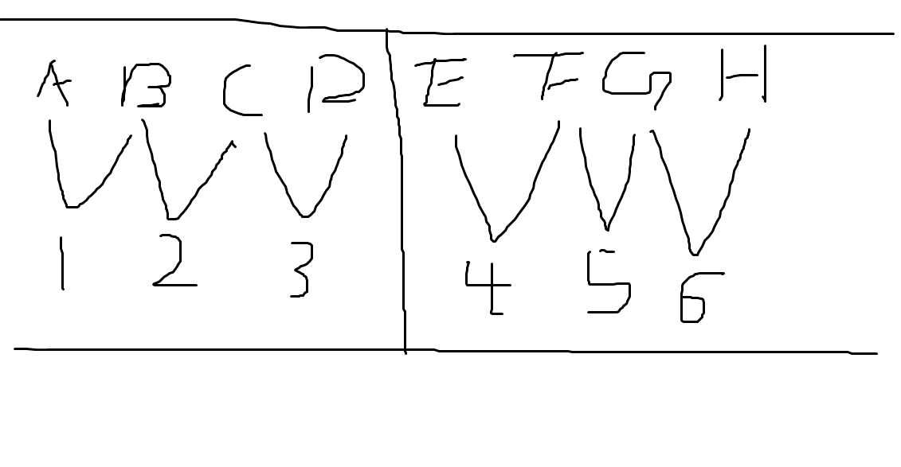

# 

[我看到的地址](https://v2ex.com/t/771969?p=2)

题目: 8 瓶水 2 瓶有毒 6 个耗子 要求单次检验出结果

## 我的解法

### 解法1

将8瓶水编号 A B C D E F G H , 然后将它分成两组. A B C D 和 E F G H.

将A和B 混合 , B和C 混合  C 和 D 混合. 编号1,2,3
对于第二组, 也 按同样的方式混合, 编号4,5,6

这个时候就有6 瓶水, 正好对应6只老鼠
                                         
先判断第一组, 如果编号1 死了, 2,3, 正常 那么确定 A 有问题, B C D 安全. 
1 正常, 2 死亡 ,3 正常, 这种情况是不可能存在的.
负责情况是1 正常, 2, 3死亡 . 如果1 正常. 说明 A,B安全. 2死亡 可以确定 C有问题. 3 死亡, 不能确定D 安全与否.  根据下一组判断. 下一组的判断同第一组, 因为只有两个有毒, 所以可以很轻松得出结果.

但是 如果1,2,3 全部死亡, 就没有解了

### 解法2

二进制解法

|-|-|-|-|-|-|-|
|-|-|-|-|-|-|-|
|1|0|0|0|0|0|1|
|1|1|0|0|0|0|2|
|1|1|1|0|0|0|3|
|0|1|1|1|0|0|4|
|0|0|1|1|1|0|5|
|0|0|0|1|1|1|6|
|0|0|0|0|1|1|7|
|0|0|0|0|0|1|8|
|-|-|-|-|-|-|-|
|1|2|3|4|5|6|-|

死亡超过3(包括3) 就判断不了了.

PS: 人类有多恨老鼠啊, 所有试毒问题都是用老鼠试.
